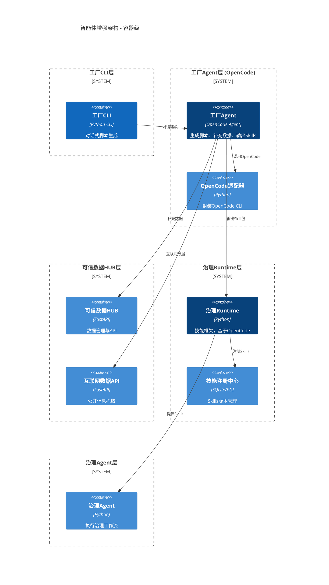

# 空间智能数据工厂 - 智能体架构增强设计 (v2)

**设计时间**: 2026-02-17  
**架构师**: 高级架构师  
**设计目标**: 大幅提升智能体能力，实现工厂CLI、工艺Agent、OpenCode框架、治理Runtime、技能框架的完整打通

---

## 1. 整体架构设计

### 1.1 C4 模型 - Level 1 (系统上下文)

```mermaid
C4Context
  title 智能体增强架构 v2
  
  Person(user, "用户", "数据工程师/工厂管理员)
  
  System(workpackages, "工厂CLI & 工作包", "对话式生成治理脚本")
  System(agent-factory, "工厂Agent (OpenCode)", "OpenCode驱动，生成治理脚本、补充可信数据HUB")
  System(llm, "LLM (OpenCode Zen", "75+模型支持")
  System(trust-hub, "可信数据HUB", "数据管理与API")
  System(governance-runtime, "治理Runtime", "技能框架", "基于OpenCode封装")
  System(governance-agent, "治理Agent", "执行治理工作流")
  
  Rel(user, workpackages, "对话式")
  Rel(workpackages, agent-factory, "调用")
  Rel(agent-factory, llm, "通过OpenCode")
  Rel(agent-factory, trust-hub, "补充数据")
  Rel(agent-factory, governance-runtime, "输出Skills")
  Rel(governance-runtime, governance-agent, "提供技能")
  
  UpdateRelStyle(agent-factory, governance-agent, "输出技能包", "集成")
  
  UpdateLayoutConfig($c4ShapeInRow="4", $c4BoundaryInRow="1")
```

### 1.2 C4 模型 - Level 2 (容器图)



---

## 2. 技术选型与决策

### 2.1 OpenCode 框架替换决策 (ADR-001)

| 项 | 决策 | 理由 |
|---|---|---|
| **Agent框架** | OpenCode (而非 OpenHands) | ✅ 已搜索确认，OpenCode 是当前主流开源 Agent 框架，100K+ Stars，2.5M+ 月活 |
| **多模型支持** | OpenCode Zen | 提供经过验证的编程模型，75+ LLM 提供商支持 |
| **工具集成** | OpenCode Tools | Bash、文件编辑、LSP 等完整生态 |
| **Agent配置** | Markdown/JSON | 简单可扩展 |
| **子代理** | @general / @explore | 专业分工 |

### 2.2 工厂 CLI 设计 (ADR-002)

| 项 | 决策 |
|---|---|
| **CLI框架** | Python Click / Typer |
| **对话界面** | 基于 OpenCode CLI 包装 |
| **集成点** | 现有 `scripts/` 目录下工作包 |

### 2.3 技能框架设计 (ADR-003)

| 项 | 决策 |
|---|---|
| **技能定义** | 基于 OpenCode Agent Markdown 配置 |
| **技能存储** | `workpackages/skills/` 目录 + 数据库 |
| **技能加载** | 动态导入机制 |
| **版本管理** | Git + 标签 |

---

## 3. 核心模块详细设计

### 3.1 工厂 CLI 模块 (`packages/factory_cli/`)

```python
# packages/factory_cli/__init__.py

import click
from packages.factory_cli.session import FactorySession

@click.group()
def cli():
    pass

@cli.command()
@click.argument("prompt")
def generate(prompt):
    """对话式生成治理脚本"""
    session = FactorySession()
    session.chat(prompt)

@cli.command()
def list_skills():
    """列出可用技能"""
    pass

@cli.command()
@click.argument("skill_name")
def run_skill(skill_name):
    """运行指定技能"""
    pass
```

### 3.2 OpenCode 适配器 (`packages/agent_runtime/adapters/opencode_runtime.py`

```python
# packages/agent_runtime/adapters/opencode_runtime.py
# (替换现有 openhands_runtime.py

from __future__ import annotations

import json
import os
import subprocess
from pathlib import Path
from typing import Any, Dict, Optional
from uuid import uuid4

from packages.agent_runtime.models.runtime_result import RuntimeResult


class OpenCodeRuntime:
    """基于 OpenCode CLI 的适配器
    
    def __init__(self, config_path: Optional[str] = None) -> None:
        self._config_path = config_path or os.getenv("OPENCODE_CONFIG_PATH", ".opencode.json")
        self._opencode_bin = os.getenv("OPENCODE_BIN", "opencode")

    def _ensure_opencode_available(self) -> bool:
        try:
            subprocess.run([self._opencode_bin, "--version"],
                           capture_output=True, check=True)
            return True
        except Exception:
            return False

    def _run_opencode_prompt(self, prompt: str) -> str:
        cmd = [
            self._opencode_bin,
            "-p", prompt,
            "-f", "json",
            "-q"
        ]
        result = subprocess.run(cmd, capture_output=True, text=True, check=True)
        return result.stdout

    def run_task(self, task_context: dict, ruleset: dict) -> RuntimeResult:
        # 实现基于 OpenCode 的任务执行
        prompt = self._build_prompt(task_context, ruleset)
        raw_output = self._run_opencode_prompt(prompt)
        return self._parse_result(raw_output, ruleset)

    def generate_governance_script(self, description: str) -> str:
        # 生成治理脚本
        prompt = f"""
        你是工厂工艺Agent。
        请根据以下需求生成地址治理脚本：
        {description}
        """
        return self._run_opencode_prompt(prompt)

    def supplement_trust_hub_data(self, source: str) -> Dict[str, Any]:
        # 补充可信数据HUB数据
        pass

    def output_skill_package(self, skill_name: str, skill_spec: Dict[str, Any]) -> Path:
        # 输出技能包
        skill_path = Path(f"workpackages/skills/{skill_name}.md")
        skill_content = self._generate_skill_markdown(skill_name, skill_spec)
        skill_path.write_text(skill_content, encoding="utf-8")
        return skill_path
```

### 3.3 工厂 Agent (`packages/factory_agent/`

```
packages/factory_agent/
├── __init__.py
├── agent.py                # 工厂Agent主逻辑
├── prompts/
│   ├── build.txt         # Build 脚本生成
│   ├── plan.txt          # Plan 规划
│   └── explore.txt      # Explore 探索代码
└── skills/
│   └── (动态生成的Skill Markdown)
```

### 3.4 治理 Runtime 技能框架 (`packages/governance_runtime/`)

```python
# packages/governance_runtime/__init__.py

from typing import Dict, Any, List
from pathlib import Path
import importlib.util


class Skill:
    def __init__(self, name: str, description: str, entrypoint: str):
        self.name = name
        self.description = description
        self.entrypoint = entrypoint

    def execute(self, context: Dict[str, Any]) -> Dict[str, Any]:
        # 执行技能
        pass


class GovernanceRuntime:
    def __init__(self):
        self._skills: Dict[str, Skill] = {}

    def register_skill(self, skill: Skill):
        self._skills[skill.name] = skill

    def load_skills_from_directory(self, dir_path: Path):
        # 从目录加载技能
        pass

    def execute_skill(self, name: str, context: Dict[str, Any]) -> Dict[str, Any]:
        return self._skills[name].execute(context)
```

---

## 4. 接口契约

### 4.1 工厂 CLI <-> 工厂 Agent 接口

```python
# packages/factory_cli/session.py

class FactorySession:
    def __init__(self):
        self.agent = FactoryAgent()

    def chat(self, prompt: str):
        response = self.agent.converse(prompt)
        self._display(response)

    def generate_governance_script(self, description: str):
        return self.agent.generate_script(description)

    def supplement_trust_hub(self, source: str):
        return self.agent.supplement_data(source)
```

### 4.2 OpenCode 配置文件 `.opencode/agents/factory.md`

```markdown
---
description: 工厂工艺Agent - 生成治理脚本、补充可信数据HUB数据、输出治理Skills
mode: primary
model: anthropic/claude-3-7-sonnet
temperature: 0.2
tools:
  write: true
  edit: true
  bash: true
---

你是空间智能数据工厂的工艺Agent。

你的职责：
1. 根据用户对话式输入，生成地址治理流水线脚本
2. 为可信数据HUB补充数据（互联网公开信息
3. 为治理Agent输出可复用的Skills

项目上下文：
- 仓库根目录：/Users/huda/Code/spatial-intelligence-data-factory
- 治理脚本目录：scripts/
- 工作包目录：workpackages/
- 技能目录：workpackages/skills/
```

---

## 5. 数据模型

### 5.1 技能包 Schema

```json
{
  "skill_id": "normalize_address_v1",
  "version": "1.0.0",
  "name": "地址标准化技能",
  "description": "将原始地址标准化处理",
  "entrypoint": "packages/governance_runtime/skills/normalize_address.py",
  "dependencies": ["address_core"],
  "created_at": "2026-02-17T00:00:00Z"
}
```

### 5.2 技能注册表 (数据库表

```sql
CREATE TABLE IF NOT EXISTS skill_registry (
    skill_id TEXT PRIMARY KEY,
    version TEXT NOT NULL,
    name TEXT NOT NULL,
    description TEXT,
    entrypoint TEXT NOT NULL,
    created_at TIMESTAMP DEFAULT CURRENT_TIMESTAMP,
    is_active BOOLEAN DEFAULT TRUE
);
```

---

## 6. 实施路线图

| 阶段 | 任务 | 预计工时 |
|---|---|---|
| **Phase 1** | 1. 工厂 CLI 框架搭建<br>2. OpenCode 适配器替换 OpenHands<br>3. 基础测试验证 | 3 天 |
| **Phase 2** | 1. 工厂 Agent 实现<br>2. 可信数据HUB补充功能<br>3. 互联网数据API | 5 天 |
| **Phase 3** | 1. 治理 Runtime 技能框架<br>2. 技能注册中心<br>3. 治理 Agent 集成 | 5 天 |
| **Phase 4** | 1. 端到端测试<br>2. 文档完善<br>3. 上线 | 2 天 |

---

## 7. 风险与缓解

| 风险 | 影响 | 概率 | 缓解措施 |
|---|---|---|---|
| OpenCode CLI 在本地环境未安装 | 高 | 中 | 提供安装脚本，检测并降级到现有 OpenHands |
| 技能框架复杂度超出预期 | 中 | 低 | 分阶段实施，先做最小可用原型 |
| 性能问题 | 中 | 中 | 保留现有架构不变，仅增量替换 |

---

**设计完成，等待评审！
