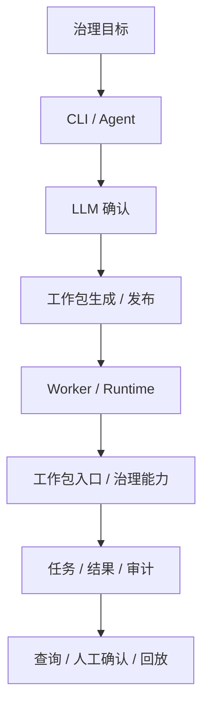

# 地址治理MVP架构刷新（历史参考）

> 文档状态：历史参考
> 当前正式归口：`docs/03_数据处理工艺/地址治理处理架构.md`
> 使用规则：仅用于追溯地址治理 MVP 阶段的收敛背景，不再作为当前正式设计基线

## 1. 文档信息

- 文档版本：v1.1
- 创建日期：2026-02-27
- 上游输入：`docs/研发过程管理/地址治理MVP/主题说明.md`
- 关联基线：`docs/02_总体架构/架构索引.md`
- 文档语言：中文（遵循仓库 AGENTS 规则）

## 2. 本次架构刷新目标

本次 `/architecture` 聚焦 MVP 闭环与持久化一致性，补齐以下约束：

1. CLI/Agent/LLM 对话确认链路必须可审计，不允许 fallback。
2. 治理任务与工作包发布记录以数据库为准；可信能力与标准查询数据以 `trust_meta / trust_data` 为正式口径，`trust_db` 仅作为过渡物理底座说明。
3. 关键阻塞事件必须进入人工确认链路并留下结构化证据。

## 3. 目标边界（MVP）

### 3.1 In Scope

1. 地址治理最小流水线（输入、治理、产物、证据）。
2. 工作包发布与版本状态持久化（含 evidence 引用）。
3. Trust Hub 能力注册与可信样例数据落库、查询。
4. LLM 调用状态审计（`success/error/blocked`）与人工确认回写。

### 3.2 Out of Scope

1. 多租户权限体系与企业级 HA 编排。
2. 全地区规则一次性纳管。

## 4. 组件与职责（刷新后）

图说明：这张图只看 MVP 主链路里的责任分工，重点看“Factory Agent 负责编排、Runtime 负责执行、数据库负责留痕”三条边界。

1. `packages/factory_cli`
- 负责交互入口、命令编排、用户确认收集。
- 只负责请求编排，不承载治理领域逻辑。

2. `packages/factory_agent`
- 负责需求解析、方案确认、工作包生成决策。
- 对 LLM 响应进行 schema 强校验，校验失败即阻塞。

3. `services/governance_api`
- 负责任务受理、状态查询、审核决策接口。
- 对外暴露统一状态语义与审计字段。

4. `services/governance_worker`
- 负责异步执行治理任务与结果持久化。
- 严格执行任务状态机与失败语义。

5. 工作包 Bundle / 入口执行器
- Runtime 只按 `workpackage_id@version` 装载 bundle 并执行入口。
- 地址治理能力优先封装在 bundle 内；`address_core` 仅保留为过渡共享原语层，不作为 Worker 直连入口。

6. Trust Hub / Trust Data Hub（`trust_meta / trust_data`）
- 统一能力注册、来源快照、可信样例与标准查询数据。
- `trust_db` 仅用于解释过渡物理底座，不再作为现行正式查询口径。

7. Runtime 发布域
- 负责工作包注册、版本发布状态、执行证据引用。
- 支持按 `workpackage_id + version` 查询发布记录。

## 5. 关键链路与控制点

### 5.1 对话确认链路

`CLI -> Agent -> LLM -> Schema Validator -> Confirmation Store`

控制点：

1. LLM 结果必须结构化并通过 schema 校验。
2. 任一关键字段缺失时状态写入 `blocked`，进入人工确认。
3. 人工确认必须记录确认人、结论、时间戳、原因。

### 5.2 治理执行链路

`API -> Worker -> Address Core -> Repository(DB) -> API Query`

控制点：

1. 执行控制态以 Runtime 状态机为准：`SUBMITTED -> PLANNED -> APPROVAL_PENDING/APPROVED -> CHANGESET_READY -> EXECUTING -> EVALUATING -> COMPLETED/FAILED/NEEDS_HUMAN/ROLLED_BACK`。
2. 查询链路以 DB 为准，禁止依赖内存态兜底。
3. 失败必须输出 machine-readable 错误语义与证据。

### 5.3 工作包发布链路

`Agent/CLI -> Runtime Publisher -> Publish Repository(DB) -> Runtime Loader`

控制点：

1. 发布记录最少包含 `workpackage_id/version/status/evidence_ref`。
2. 发布失败不允许 silent success，必须阻塞并记录原因。

### 5.4 Trust Hub 链路

`Capability Registry -> Trust Data Store -> Query API`

控制点：

1. 至少支持两类外部能力注册。
2. 能力元数据与样例数据都可查询、可审计。
3. 正式查询口径统一使用 `trust_meta.*` 和 `trust_data.*`；解释历史底座时才补充 `trust_db.*` 来源，不得把它写成当前实现入口。

## 6. 数据模型最小契约

1. 治理任务与结果
- `task_id`、`raw_id`、`ruleset_version`、`status`、`error_code`、`evidence_ref`。

2. LLM 调用审计
- `session_id`、`request_hash`、`status(success/error/blocked)`、`blocked_reason`、`confirmed_by`、`confirmed_at`。

3. 工作包发布记录
- `workpackage_id`、`version`、`status`、`published_at`、`evidence_ref`。

4. Trust Hub 能力与数据
- `source_id`、`interface_id`、`capability_type`、`sample_id`、`source`、`quality_tag`。

## 7. 架构决策（增量 ADR）

1. ADR-MVP-001：禁止 fallback，关键环节只允许 `success/error/blocked`。
2. ADR-MVP-002：读路径统一以 DB 为事实来源。
3. ADR-MVP-003：工作包发布域纳入持久化与审计统一模型。
4. ADR-MVP-004：Trust Hub 元数据定义收敛为单一演进路径。

## 8. 与 Story 的映射关系

1. MVP-A4（地址治理流水线）
- 对应第 5.2 链路与结果契约控制点。

2. MVP-A5（Trust Hub 能力沉淀）
- 对应第 5.4 链路与能力/样例数据模型。

3. MVP-A6（数据库模型与持久化）
- 对应第 6 节全部契约与第 7 节增量 ADR。

## 9. 实施门禁与验收

1. 测试先行：新增失败用例覆盖 `blocked`、发布查询、DB 读写一致性。
2. 契约门禁：核心输出字段缺失即失败，不可降级通过。
3. 证据门禁：每条关键链路必须产出可追踪证据路径。
4. 查询验收：重启后仍可按关键索引查询任务、发布、Hub 数据。

## 10. 风险与缓解

1. 风险：无 fallback 可能导致短期阻塞频率提升。
- 缓解：建立人工确认 SLA 与阻塞原因分类统计。

2. 风险：存量 SQL 与 migration 历史不一致。
- 缓解：以统一 migration 为准，补一次性校验脚本与回归测试。

3. 风险：发布与治理域跨服务事务一致性不足。
- 缓解：采用幂等写入 + 状态补偿任务，确保最终一致。
