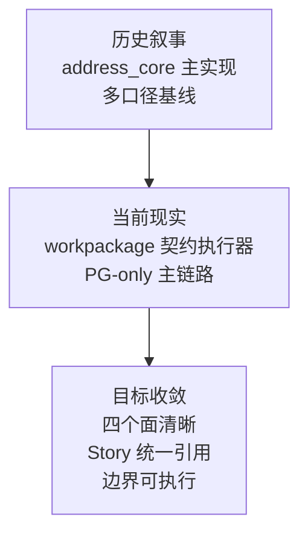

# 架构增量收敛（历史参考）

> 文档状态：历史参考
> 当前正式归口：`docs/02_总体架构/数据工厂技术架构.md`
> 使用规则：仅用于追溯 2026-03-06 前后的收敛背景，不再作为当前正式架构真相源

## 1. 文档信息

- 文档版本：v1.0
- 创建日期：2026-03-06
- 文档类型：增量架构刷新
- 适用范围：当前主仓代码架构与模块边界收敛
- 文档语言：中文
- 关联基线：
  - `docs/02_总体架构/系统总览.md`
  - `docs/02_总体架构/模块边界.md`
  - `docs/02_总体架构/依赖关系.md`
  - `archive/docs/architecture/architecture-spatial-intelligence-data-factory-2026-02-27.md`（历史基线）

## 2. 本次刷新目标

本次 A-ARC 不重新定义整个平台，而是解决“当前代码现实”与“既有架构叙事”之间的偏差，形成后续 Story 拆分与实现收敛依据。

目标如下：

1. 明确当前主仓的真实架构形态。
2. 识别现有边界冲突与知识基线冲突。
3. 形成可执行的增量 ADR，而非重新起草一份平行总架构。
4. 为后续 Linear Story 拆分提供统一输入。

## 3. 收敛图

图说明：本图用于帮助读者理解本节的核心结构、流程或关系。

## 4. 当前代码架构判断（As-Is）

### 4.1 主体结构

当前仓库是一个多职责共仓系统，核心可分为四个面：

1. 控制面
- `packages/factory_cli`
- `packages/factory_agent`
- `services/governance_api`

2. 执行面
- `services/governance_worker`
- `services/governance_worker/app/runtime/workpackage_executor.py`

3. 资产面
- `workpackage_schema`
- `workpackages/bundles`
- `packages/trust_hub`
- `packages/address_core`

4. 证据面
- `output/*`
- `output/runtime_traces/*`
- observability API 与相关审计事件

### 4.2 当前主执行链

当前主链已经基本呈现为：

`factory_cli / API -> factory_agent -> publish/dryrun workflow -> runtime workpackage record -> governance_worker -> WorkpackageExecutor -> bundle entrypoint`

这说明下游运行时的核心方向已经收敛到“按 `workpackage_id@version` 执行工作包入口”，而不是由 worker 主链路直接绑定具体治理算法。

### 4.3 当前优势

1. `worker` 主链路已经通过 `WorkpackageExecutor` 执行 bundle 入口，符合契约执行器方向。
2. `factory_agent` 已具备较完整的编排、trace、memory、dryrun/publish 结构。
3. `governance_api` 已形成任务、观测、人工确认等统一 northbound 面。
4. No-Fallback、审计、观测、证据产物等治理型约束已进入代码与文档。

## 5. 核心架构冲突

### 5.1 `address_core` 归属冲突

当前存在两套并行叙事：

1. 历史架构文档将 `packages/address_core` 视为平台稳定治理能力库。
2. 当前仓库规则与边界文档要求“治理算法应封装在工作包 bundle 内，worker 不得直接调用 `address_core`”。

这意味着 `address_core` 的角色未完成硬切，容易造成新功能归属分叉。

### 5.2 API 与 worker 的边界穿透

当前 `services/governance_api/app/services/governance_service.py` 直接依赖：

1. `services.governance_worker.app.core.queue`
2. `services.governance_worker.app.jobs.review_reconcile_job`

这让 API service 知道了 worker 的内部组织方式，削弱了服务边界独立演进能力。

### 5.3 `trust_hub` 真相源未完全收敛

`packages/trust_hub` 当前同时支持：

1. PostgreSQL 持久化
2. 本地 JSON 文件持久化

这对测试和本地工具有价值，但与 PG-only 主链路叙事存在冲突。

### 5.4 架构真相源分裂

当前至少存在两类并行有效的架构资产：

1. 旧总架构文档，仍将 `address_core` 视作主实现载体。
2. 新边界文档与仓库规则，强调 workpackage 契约执行器模型。

如果不指定真相源，后续 Story、评审和实现会继续各自引用不同基线。

### 5.5 仓库职责过宽

当前主仓同时承载：

1. 上游编排
2. 下游执行
3. 算法/能力
4. 对外 API
5. 测试样例
6. 运行证据
7. 架构与 Story 文档

这并非立即错误，但必须靠明确职责模型维持稳定，否则目录会持续漂移。

## 6. 增量 ADR

### ADR-INC-001：`address_core` 调整为过渡共享原语层

决策：

1. 自本增量架构生效后，新增治理算法能力默认进入 `workpackages/bundles/*`。
2. `packages/address_core` 不再承载新的主线治理算法实现。
3. `packages/address_core` 仅保留可复用、弱业务绑定的基础原语或迁移中资产。

原因：

1. 当前 worker 执行模型已围绕 bundle entrypoint 建立。
2. 继续把新算法放入 `address_core` 会与现行边界规则冲突。

影响：

1. 新 Story 需显式声明算法落点为 bundle 而非 `address_core`。
2. `address_core` 在文档中应重新命名为“过渡共享原语层”或“迁移中共享层”。

### ADR-INC-002：引入 runtime application boundary，切断 API 对 worker 内部实现的直接依赖

决策：

1. `governance_api` 不再直接依赖 `services.governance_worker.app.jobs.*` 与 `app.core.queue`。
2. 引入统一 runtime application service / gateway 作为 API 到执行面的唯一内部边界。

原因：

1. API 与 worker 需要独立演进。
2. 现有直接 import 方式会让 worker 内部重构变成 API 破坏性修改。

影响：

1. Router -> Service -> Runtime Boundary 分层将成为代码事实，而不仅是文档表述。
2. review reconcile、enqueue、runtime submit 等动作需经统一应用边界发起。

### ADR-INC-003：`trust_hub` 默认真相源收敛为 PostgreSQL

决策：

1. 生产链路、验收链路、主运行链路以 PostgreSQL 作为默认真相源。
2. 本地 JSON 文件模式仅保留给测试、隔离工具或显式开发场景。

原因：

1. 当前主架构目标已明确 PG-only 收敛方向。
2. 文件模式如果保持默认，会弱化环境一致性与审计口径。

影响：

1. 文档中需标注文件模式为 `test-only/tool-only`。
2. 主链路测试不得依赖 `data/trust_hub.json` 作为默认来源。

### ADR-INC-004：架构真相源统一

决策：

以下文档构成当前有效架构真相源：

1. `docs/02_总体架构/系统总览.md`
2. `docs/02_总体架构/模块边界.md`
3. `docs/02_总体架构/依赖关系.md`
4. 本文档 `docs/02_总体架构/架构增量收敛.md`

以下文档降级为历史阶段参考：

1. `archive/docs/architecture/architecture-spatial-intelligence-data-factory-2026-02-27.md`
2. 其他未显式继承到当前边界模型的旧总架构文档

原因：

1. 当前最严重的问题是知识基线分裂，而不是缺少架构文档。

影响：

1. 新 Story、评审、实现对齐应以上述真相源为准。
2. 历史文档保留，但不再作为新开发默认依据。

### ADR-INC-005：主仓按“四个面”声明职责边界

决策：

主仓架构职责统一解释为四个面：

1. 控制面：CLI、Agent、API
2. 执行面：worker、runtime executor
3. 资产面：schema、bundles、可信能力、共享原语
4. 证据面：observability、audit、output artifacts、验收产物

原因：

1. 当前仓库无法仅靠目录自然增长维持清晰边界。
2. 只有把职责模型固定下来，后续拆仓、拆模块、拆 Story 才有一致依据。

影响：

1. 新增模块必须声明所属“面”。
2. PR 评审和 Story 模板应增加“所属面/允许依赖/禁止依赖”字段。

## 7. To-Be 收敛路线

### 7.1 第一阶段：冻结真相源

目标：先统一知识基线。

动作：

1. 将本文档纳入当前架构真相源。
2. 统一 Story、PRD、评审引用路径。
3. 明确 `address_core` 的过渡性定位。

### 7.2 第二阶段：拆除危险穿透依赖

目标：让边界在代码中成立。

动作：

1. 抽离 runtime application boundary。
2. 切断 `governance_api -> governance_worker.app.*` 直接依赖。
3. 为 review reconcile、enqueue、runtime submit 建立统一入口。

### 7.3 第三阶段：完成能力归属收敛

目标：让算法归 bundle 成为工程事实。

动作：

1. 新增治理算法仅进入 bundle。
2. `address_core` 逐步只保留共享基础原语。
3. 调整相关测试与文档，防止新能力回流主仓共享库。

### 7.4 第四阶段：默认持久化与运行模式收敛

目标：主运行面默认一致。

动作：

1. `trust_hub` 默认走 PG。
2. 文件持久化模式显式降级为测试/工具模式。
3. 主链路测试与验收移除文件真相源隐式依赖。

## 8. Story 拆分建议（用于 Linear）

### 主题 1：架构真相源收敛

Story 建议：

1. 发布 A-ARC 增量架构刷新文档并更新引用清单。
2. 梳理旧架构文档的“当前/历史”标签与引用修正。
3. 更新 Story 模板，增加“所属面/允许依赖/禁止依赖”字段。

### 主题 2：API 与执行面解耦

Story 建议：

1. 为 runtime submit / enqueue 引入统一 application boundary。
2. 为 review reconcile 引入统一 application boundary。
3. 补边界守卫测试，禁止 `governance_api` 直接依赖 worker 内部模块。

### 主题 3：算法归属收敛

Story 建议：

1. 为新增治理算法定义 bundle-first 开发规范。
2. 盘点 `address_core` 现有模块，标注“保留/迁移/冻结”状态。
3. 增加仓库卫生检查，阻止新主线算法继续进入 `packages/address_core`。

### 主题 4：Trust Hub 真相源收敛

Story 建议：

1. 明确主链路 PG-only 模式并调整配置默认值。
2. 为 JSON 文件模式添加显式 test/tool 标识。
3. 增加主链路测试，确保不依赖本地文件真相源。

## 9. 验收标准

1. 新架构真相源可被明确列举，且团队不再并行引用旧总架构作为当前基线。
2. 新增 Story 能明确声明模块所属面与依赖边界。
3. `governance_api` 不再直接 import worker 内部 queue/job 实现。
4. 新增治理算法默认进入 bundle，而不是 `packages/address_core`。
5. `trust_hub` 在主链路默认使用 PostgreSQL，文件模式仅作为显式例外存在。

## 10. 本次结论

当前仓库的主方向已经收敛到“上游编排 + 下游契约执行 + 审计与观测闭环”，问题不在方向错误，而在迁移尚未完成硬切。

本次 A-ARC 的任务不是推翻现有架构，而是完成三件事：

1. 统一真相源。
2. 切断危险穿透依赖。
3. 将算法归 bundle、PG-only、契约执行器模型从规则变成代码事实。
