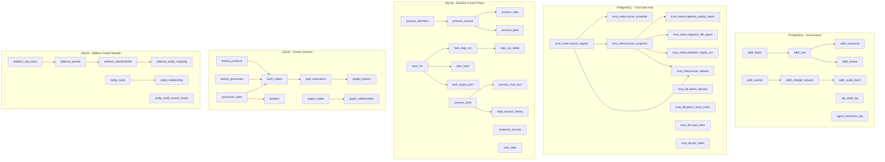

# 数据库表结构设计文档与实库核对报告（2026-02-16）

## 1. 目标与范围
本报告覆盖三部分：
1. 表结构设计文档（按系统分层梳理）
2. 架构图（逻辑分层 + 关键关系）
3. SQL/建表代码与“实际测试数据库”的结构与数据一致性核对

本次核对基于本地代码仓实际可访问数据源：
- SQLite 实库（5个）：
  - `database/agent_runtime.db`
  - `database/entity_graph.db`
  - `database/factory.db`
  - `database/factory_demo_runtime.db`
  - `database/tc06_line_execution.db`
- PostgreSQL 定义文件：
  - `database/postgres/sql/002_init_tables.sql`
  - `database/postgres/sql/003_init_indexes.sql`
  - `database/trust_meta_schema.sql`
- PostgreSQL 实库（可连接情况）：
  - `127.0.0.1:5432/addr_governance`：可连接（用户 `huda`）
  - `127.0.0.1:5442/trust_meta`：端口未就绪（`Connection refused`）

## 2. 数据库分层设计

### 2.1 治理核心层（PostgreSQL）
来源：`database/postgres/sql/002_init_tables.sql`

- 批次与任务：`addr_batch`, `addr_task_run`
- 原始与标准化：`addr_raw`, `addr_canonical`, `addr_review`
- 规则与变更：`addr_ruleset`, `addr_change_request`, `addr_audit_event`
- API/执行审计：`api_audit_log`, `agent_execution_log`

关键关系：
- `addr_raw.batch_id -> addr_batch.batch_id`
- `addr_canonical.raw_id -> addr_raw.raw_id`
- `addr_review.raw_id -> addr_raw.raw_id`
- `addr_change_request.from_ruleset_id/to_ruleset_id -> addr_ruleset.ruleset_id`

### 2.2 Trust Data Hub 元数据与可信索引层（PostgreSQL）
来源：`database/trust_meta_schema.sql`

- 元数据 schema：
  - `trust_meta.source_registry`
  - `trust_meta.source_schedule`
  - `trust_meta.source_snapshot`
  - `trust_meta.snapshot_quality_report`
  - `trust_meta.snapshot_diff_report`
  - `trust_meta.active_release`
  - `trust_meta.audit_event`
  - `trust_meta.validation_replay_run`
- 可信索引 schema：
  - `trust_db.admin_division`
  - `trust_db.place_name_index`
  - `trust_db.road_index`
  - `trust_db.poi_index`

关键关系：
- `source_schedule/source_snapshot` 依赖 `source_registry`
- 质量报告、差异报告、回放运行依赖 `source_snapshot`
- `active_release` 指向 `source_registry` + `source_snapshot`

### 2.3 运行时控制层（SQLite）
来源：`database/agent_runtime_store.py` + `src/runtime/state_store.py` + `src/runtime/evidence_store.py`

- 编排定义：`process_definition`, `process_version`, `process_step`, `process_gate`
- 执行追踪：`task_run`, `task_input`, `task_step_run`, `task_output_json`, `step_run_detail`
- 迭代与草稿：`process_iteration_event`, `process_draft`, `process_chat_turn`, `draft_version_history`, `draft_comparison`
- 控制与审计：`confirmation_record`, `operation_audit`, `schema_registry`, `parsing_event`
- 外部能力：`external_api_cache`, `api_call_log`, `api_capability_registry`
- 轻量状态/证据：`task_state`, `evidence_records`

### 2.4 工厂业务层（SQLite）
来源：`database/factory_db.py`

- 生产主链路：`factory_products`, `factory_processes`, `production_lines`, `workers`, `work_orders`, `task_executions`, `quality_checks`, `factory_metrics`
- 图谱数据：`graph_nodes`, `graph_relationships`

### 2.5 地址图谱样例层（SQLite）
来源：`database/init_sqlite.py`

- 地址标准化链路：`address_raw_input -> address_parsed -> address_standardized -> address_entity_mapping`
- 字典与规则：`address_admin_division`, `address_component`, `address_standardization_rule`
- 图谱实体：`entity_node`, `entity_relationship`, `entity_multi_source_fusion`

## 3. 架构图



## 4. 实库核对方法

### 4.1 结构核对
- 通过 `sqlite_master` 获取实库表清单
- 与对应定义源中的“期望表集合”逐一比对（missing/unexpected）
- 对可连通 Postgres，使用 `information_schema.tables` 与 `pg_indexes` 做同等核对

### 4.2 数据核对
- `PRAGMA integrity_check`
- `PRAGMA foreign_key_check`
- 关键业务链路左连接缺失检查（订单/任务/质检、地址标准化链路、回放链路）
- 对可连通 Postgres，补充关键关系左连接缺失检查与行数快照

## 5. 核对结果

### 5.1 结构一致性结果

| 数据库 | 结果 |
|---|---|
| `postgres://huda@127.0.0.1:5432/addr_governance` | `public` 下已落表：`addr_batch, addr_raw, addr_canonical, addr_review, addr_ruleset, addr_task_run, api_audit_log, agent_execution_log`；缺少 `addr_change_request, addr_audit_event`（即迁移 `20260215_0002` 未落库） |
| `database/agent_runtime.db` | 表结构与期望集合一致（missing=0, unexpected=0） |
| `database/entity_graph.db` | 表结构与期望集合一致（missing=0, unexpected=0） |
| `database/factory.db` | 表结构与期望集合一致（missing=0, unexpected=0） |
| `database/factory_demo_runtime.db` | 表结构与期望集合一致（missing=0, unexpected=0） |
| `database/tc06_line_execution.db` | 与期望一致（含测试扩展表 `failure_queue`, `replay_runs`） |
| `postgres://trust@127.0.0.1:5442/trust_meta` | 当前未监听，未完成 `trust_meta_schema.sql` 对实库核对 |

### 5.2 数据完整性结果

完整性检查：
- 5个 SQLite 库 `PRAGMA integrity_check` 均为 `ok`

外键与业务一致性：
- `addr_governance`（Postgres）：
  - 关系检查：`addr_raw -> addr_batch`、`addr_canonical/review -> addr_raw` 缺失均为 `0`
  - 索引检查：`idx_addr_raw_hash/idx_addr_raw_text_trgm/idx_addr_canonical_text_trgm/idx_addr_task_run_status` 存在
  - `pg_trgm` 扩展已安装
  - 因缺表，`idx_addr_change_request_status`、`idx_addr_audit_event_change` 未落
- `agent_runtime.db`：
  - 编排主链（`process_version -> process_definition`, `process_step/process_gate -> process_version`）无缺失
  - 发现 `process_chat_turn` 中有 `6` 条记录的 `draft_id` 在 `process_draft` 中不存在（孤儿引用）
- `entity_graph.db`：
  - `address_parsed -> address_raw_input`、`address_standardized -> address_parsed`、`address_entity_mapping -> address_standardized` 缺失均为 `0`
- `factory.db`、`factory_demo_runtime.db`、`tc06_line_execution.db`：
  - 业务链路左连接检查（订单-产品/工艺、执行-工人/工单、质检-执行/工单）全部为 `0` 缺失
  - 但 `PRAGMA foreign_key_check` 显示 `workers.line_id -> production_lines.line_id` 存在大量违例：
    - `factory.db`: `428` 条
    - `factory_demo_runtime.db`: `4` 条
    - `tc06_line_execution.db`: `660` 条

### 5.3 数据量快照（用于判断是否“有实测数据”）
- `addr_governance`（Postgres）：`addr_batch=2`, `addr_raw=3`, `addr_canonical=3`, `addr_review=2`, `addr_task_run=2`
- `agent_runtime.db`：`process_definition=7`, `process_draft=21`, `evidence_records=141`
- `entity_graph.db`：`address_raw_input=50`, `address_parsed=50`, `address_standardized=50`, `address_entity_mapping=50`
- `factory.db`：`factory_products=607`, `work_orders=1890`, `task_executions=5166`, `quality_checks=5166`
- `factory_demo_runtime.db`：小样本演示数据（`work_orders=2`, `task_executions=6`）
- `tc06_line_execution.db`：含测试辅助表（`failure_queue=2`, `replay_runs=2`）

## 6. 是否符合预期（结论）

结论分层如下：
1. **表结构层面：部分符合预期**
   - SQLite：实库表集合与对应建表定义匹配。
   - Postgres(`addr_governance`)：缺少 `addr_change_request`、`addr_audit_event` 两张预期表。
2. **数据关系层面：部分符合预期**
   - 主业务链路多数关系正常；但存在两类偏差：
   - 偏差A：`workers.line_id` 与 `production_lines.line_id` 外键不一致（3个工厂库均存在）
   - 偏差B：`process_chat_turn.draft_id` 存在孤儿引用（6条）
3. **PostgreSQL 实库核验：已部分执行**
   - `addr_governance` 已核验并发现迁移未完全落库。
   - `trust_meta`（5442）当前服务未启动，尚未核验。

## 7. 修复建议（按优先级）

1. 修复工厂库外键主问题（P0）
   - 统一 `workers.line_id` 的生成策略，确保只引用 `production_lines.line_id` 既有值。
   - 在写入路径启用并验证 `PRAGMA foreign_keys=ON`。
2. 修复运行时聊天记录孤儿引用（P1）
   - 对 `process_chat_turn.draft_id` 增加写入前校验；或在业务允许场景下明确设为 `NULL`。
3. 增加数据库一致性 CI 检查（P1）
   - 固化 `integrity_check`、`foreign_key_check`、关键 left join 缺失检查为测试脚本。
4. 补齐 Postgres 实库核验（P1）
   - 启动 `trust-meta-postgres` 后，对 `trust_meta/trust_db` 全表执行结构+索引+行数抽样比对。

## 8. 复核命令（可直接复跑）

```bash
# 1) 列出表
sqlite3 database/agent_runtime.db "SELECT name FROM sqlite_master WHERE type='table' AND name NOT LIKE 'sqlite_%' ORDER BY name;"

# 2) 行数统计
sqlite3 database/factory.db "SELECT 'work_orders', COUNT(*) FROM work_orders UNION ALL SELECT 'task_executions', COUNT(*) FROM task_executions;"

# 3) 完整性与外键
sqlite3 database/factory.db "PRAGMA integrity_check;"
sqlite3 database/factory.db "PRAGMA foreign_key_check;"

# 4) 关键业务链路检查
sqlite3 database/entity_graph.db "SELECT 'std_missing_parsed', COUNT(*) FROM address_standardized s LEFT JOIN address_parsed p ON s.parsed_id=p.parsed_id WHERE p.parsed_id IS NULL;"
```
