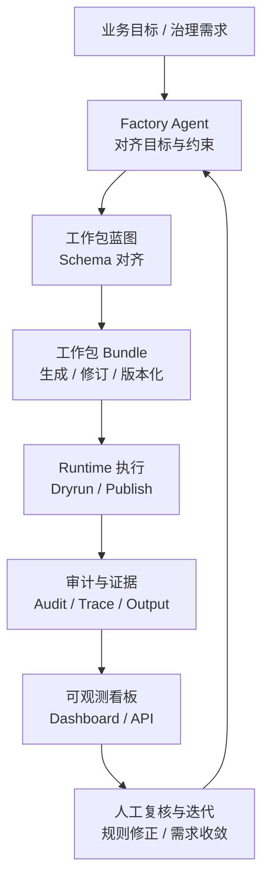
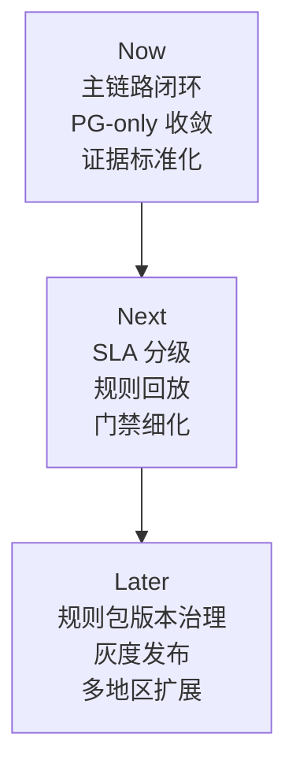

# 产品简述

> 文档状态：当前有效
> 角色：产品层总入口
> 关联文档：
> - `docs/01_产品与业务/产品需求文档.md`
> - `docs/02_总体架构/架构索引.md`

## 1. 一句话定义

空间智能数据工厂是一套面向数据治理与空间智能场景的生产系统。它把“需求确认、工作包生成、运行执行、审计回放、业务看板”串成一条可执行、可追踪、可复盘的闭环。

## 2. 当前阶段为什么要做

当前最现实的产品问题有三类：

1. 治理链路长，但责任分散，业务方难以判断一条任务卡在什么环节。
2. 历史存储路径和运行路径并存，导致契约、测试和发布口径不一致。
3. 结果可见性不足，业务方只能看到“成或败”，看不到原因、证据和回放入口。

本阶段不追求一次做成“全行业空间智能平台”，而是先把地址治理这一条主链路做成稳定样板。

## 3. 产品闭环图

图说明：这张图强调产品闭环的八个关键阶段，重点看“需求确认、工作包生成、运行执行、证据回流、人工复核”如何首尾闭环。

这张图强调的是产品价值链，而不是代码实现细节。用户真正买单的是“闭环能力”，不是其中某一个模块。

## 4. 本阶段产品策略

| 方向 | 本阶段要做到什么 | 为什么现在做 |
|---|---|---|
| 主链路闭环 | 打通需求确认、工作包生成、dryrun、发布、回放 | 先保证端到端能跑通 |
| PG-only 收敛 | 统一主链路持久化与审计口径 | 降低双栈复杂度和回归成本 |
| 可观测与证据 | 每次执行都留下 trace、audit、evidence | 支撑人工复核和问题定位 |
| Story 约束 | 新需求必须声明所属面、允许依赖、禁止依赖 | 防止架构边界继续漂移 |

## 5. 本阶段范围与非目标

| 包含范围 | 非目标 |
|---|---|
| 地址治理主链路 | 全行业规则库一次性铺开 |
| 工作包驱动的治理执行 | 新增多数据库混合方案 |
| 人机协同门禁与人工确认 | 大规模 UI 平台重构 |
| 运行指标沉淀与业务看板 | 脱离真实依赖的 mock 成功链路 |

## 6. 关键角色

| 角色 | 关注点 | 他们需要从产品里得到什么 |
|---|---|---|
| 业务运营 / 治理团队 | 覆盖率、处理效率、失败原因 | 看得懂的结果、可复核的证据 |
| 数据工程 / 平台研发 | 契约一致性、交付效率、回归风险 | 稳定接口、清晰边界、低返工 |
| 质量 / 审计角色 | 可追踪、可回放、可解释 | 每次执行都有记录和证据 |

## 7. 成功指标

| 指标 | 当前目标 |
|---|---|
| 主链路闭环成功率 | `>= 99%` |
| 契约违规率 | 持续下降，且可归因到模块 |
| PG-only 回流问题 | `0` |
| 关键看板更新 | 按日更新，可用于周/月复盘 |
| 人工复核可解释性 | 每次执行均可关联 trace、evidence、audit |

## 8. 阶段路线图

图说明：这张图只看阶段优先级，不展开技术细节；重点是 Now 先做主链路闭环和 PG-only 收敛，Next/Later 再扩展治理能力。

当前优先级按影响与成本综合排序：

1. 契约漂移拦截硬门。
2. 治理漏斗看板。
3. 证据标准化卡片与抽样复核模板。

## 9. 主要风险

| 风险 | 影响 | 缓解方式 |
|---|---|---|
| 历史路径残留 | PG-only 收敛不彻底 | CI 硬门 + 全仓扫描阻断回流 |
| 跨模块改造 | 产生隐藏回归 | Story 级契约测试 + 验收门禁 |
| 指标口径不一致 | 业务侧无法复盘 | 文档、看板、证据统一定义 |
| 依赖不可用 | 无法形成真实闭环 | 明确 `blocked`，禁止伪造成功 |

## 10. 下一步

1. 继续把地址治理样板链路维持为当前正式可验收主链。
2. 在样板稳定前提下推进“行业数据工厂”产品规划与能力抽象。
3. 后续主题继续执行 `code-review`、验收和指标复核，避免产品口径与实现边界再次漂移。
