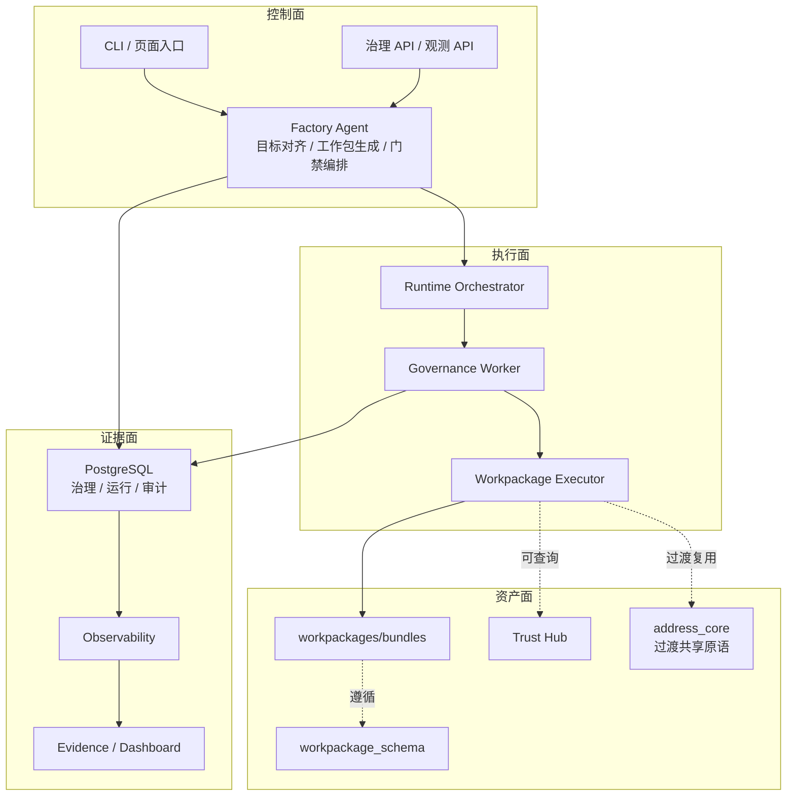
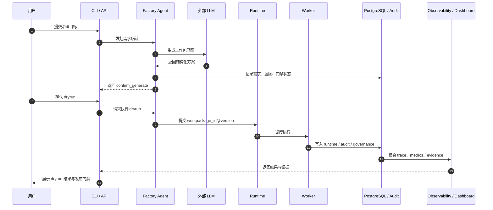

# 产品需求文档

> 文档状态：当前有效
> 角色：正式 PRD
> 关联文档：
> - `docs/01_产品与业务/产品简述.md`
> - `docs/01_产品与业务/系统场景与业务流程设计.md`
> - `docs/02_总体架构/架构索引.md`
> - `docs/06_前端与交互设计/前端与交互总览.md`

## 1. 文档目的

本 PRD 只回答三个问题：

1. 这个产品当前阶段到底要交付什么。
2. 哪些能力必须先做成可运行、可验收、可扩展的正式能力。
3. 需求如何映射到当前的架构面、模块和验收口径。

## 2. 产品定位

空间智能数据工厂不是单一数据平台，而是一套围绕“工作包驱动治理”构建的生产系统。它的当前定位是：

1. 用 Factory Agent 把需求收敛成可执行工作包。
2. 用 Runtime/Worker 按契约执行工作包。
3. 用 PostgreSQL、审计和观测系统沉淀结果、证据和回放入口。
4. 用 Dashboard 和 API 把执行状态、质量和风险反馈给业务方。

## 3. 产品能力地图

图说明：这张图把产品能力拆成控制面、执行面、资产面、证据面四块，重点看每一面如何支撑“工作包驱动治理”的完整交付。

这张图表达的是产品能力版图，不是代码目录图。对产品来说，最重要的是四个面协同，而不是某个单独服务。

## 4. 核心使用场景

### 4.1 场景一：需求确认与工作包生成

用户给出治理目标后，系统需要：

1. 收敛目标、约束和验收口径。
2. 识别当前可用能力与依赖。
3. 生成符合 `workpackage_schema.v1` 的工作包蓝图。
4. 对无法自动判断的歧义明确进入人工介入状态。

### 4.2 场景二：dryrun 试运行与证据回传

工作包生成后，系统需要：

1. 以 `workpackage_id@version` 触发 dryrun。
2. 记录结果摘要、证据、trace 和 audit。
3. 在门禁前向用户展示“为什么能发布”或“为什么被阻塞”。

### 4.3 场景三：发布与运行可观测

发布后，系统需要：

1. 按契约执行工作包入口。
2. 汇总运行态指标、失败原因、人工确认记录。
3. 让业务方可以按任务、工作包、trace 回放执行过程。

## 5. 核心场景时序图

图说明：这张图按一次典型治理请求展开，重点看用户请求如何经过 Agent、LLM、Runtime，最终沉淀为数据库记录和证据。

## 6. 功能需求

### 6.1 控制面需求

1. 提供统一入口接收治理目标、约束和确认动作。
2. 提供 Factory Agent 作为唯一目标对齐与工作包生成编排器。
3. 支持 `confirm_generate`、`confirm_dryrun_result`、`confirm_publish` 三个门禁动作。
4. 对无法自动解决的歧义进入 `WAIT_USER_INPUT`，不得伪造成功。

### 6.2 执行面需求

1. 运行时必须仅按 `workpackage_id@version` 装载工作包。
2. Worker 必须只执行 `entrypoint.sh` 或 `entrypoint.py`。
3. dryrun 和 publish 的执行证据必须可回放。
4. 失败时必须返回 `blocked/error`，不得静默 fallback。

### 6.3 资产面需求

1. 工作包必须遵循 `workpackage_schema.v1`。
2. 工作包必须声明输入输出格式与协议 binding。
3. 新增治理算法默认封装在 bundle 内，而不是直接进入 worker 主链路。
4. Trust Hub 提供可信能力目录和可信数据查询入口。

### 6.4 证据面需求

1. PostgreSQL 作为主链路默认真相源。
2. 每次执行必须留下 audit、trace、evidence。
3. Dashboard/API 必须能展示任务状态、结果摘要和关键指标。
4. 人工确认、阻塞原因和恢复点必须可追踪。

## 7. 非功能要求

| 类别 | 要求 | 验收口径 | 数据来源 |
|---|---|---|---|
| 一致性 | 主链路以 PG-only 为准，禁止隐式双栈 | 正式实现和正式文档不再把 SQLite、`trust_db.*`、`public.addr_*` 写成主入口 | CI、仓库扫描、数据库边界文档 |
| 可审计性 | 关键动作必须写入 audit 与 timeline | 需求确认、发布、执行、人工确认均可追溯到操作人和时间 | `audit.*`、`control_plane.evidence_records` |
| 可解释性 | 结果需可关联 strategy、confidence、evidence | 任一任务详情页均可回看结构化结果摘要和证据引用 | `governance.canonical_record`、观测 API |
| 可扩展性 | 新能力优先通过工作包和 schema 扩展 | 新能力进入主链路时，不引入 Worker 直连算法模块 | 工作包 Schema、架构评审 |
| 安全性 | 分级权限、脱敏、审计留痕 | 敏感字段默认脱敏，关键导出和人工确认有审计记录 | API 契约、审计日志 |
| 稳定性 | 不允许 fallback 掩盖真实失败 | 关键依赖失败时返回 `blocked/error`，不得伪造成功 | Runtime、Agent、验收报告 |

## 8. 成功指标

| 指标 | 目标 | 统计窗口 | 数据来源 | 未达标处理 |
|---|---|---|---|---|
| 主链路闭环成功率 | `>= 99%` | 7 天滚动窗口 | Runtime / Observability 聚合 | 进入发布门禁复查，停止扩大上线面 |
| 数据自动化率 | `>= 80%` | 月度 | `governance.*` 结果与人工复核统计 | 回看规则缺口和人工介入原因 |
| AI 参与比例 | `>= 50%` | 月度 | Agent / 工作包生成与执行记录 | 回看可自动化场景和提示词约束 |
| 项目能力复用率 | `>= 60%` | 季度 | 工作包、技能、能力目录统计 | 回看能力封装方式和重复开发情况 |
| 新场景支撑周期 | 相比当前基线下降 `>= 60%` | 季度 | 需求立项到首个可运行工作包的交付记录 | 回看协议缺口和构建瓶颈 |
| 问题回放可定位率 | `>= 95%` | 月度 | trace、audit、evidence 抽样复核 | 对缺证据任务补门禁和埋点 |

## 9. 里程碑

| 阶段 | 重点交付 |
|---|---|
| 阶段一 | 架构收敛、工作包协议、主链路 MVP、PG-only 收敛 |
| 阶段二 | 多模态加工、语义沉淀、AI 参与生产 |
| 阶段三 | 业务反馈闭环、数据飞轮、规模化复用 |

## 10. 交付物

1. 产品文档与架构真相源。
2. 工作包协议与示例。
3. 研发主题 / Story / Acceptance / Testing 正式文档。
4. 审计、观测和 Dashboard 能力。
