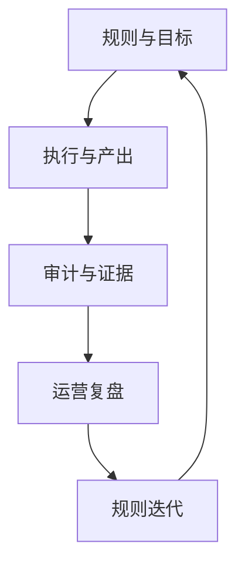

# 数据工厂整体价值

> 角色：价值说明
> 来源：`docs/01_产品与业务/产品简述.md`

## 1. 一句话价值

数据工厂的价值，不是“有一个平台”，而是把治理工作从项目型交付，变成可重复执行、可审计、可扩展的生产体系。

## 2. 价值闭环

图说明：本图用于帮助读者理解本节的核心结构、流程或关系。

## 3. 价值拆解

| 价值点 | 说明 |
|---|---|
| 可执行 | 需求可收敛为工作包，并进入正式执行链 |
| 可审计 | 每次执行都有审计、证据和回放入口 |
| 可复用 | 规则、脚本、工作包、可信能力可以复用 |
| 可扩展 | 新能力优先通过工作包和 schema 扩展 |
| 可运营 | Dashboard 能支撑周/月级复盘 |

## 4. 对不同角色的价值

| 角色 | 主要收益 |
|---|---|
| 业务运营 | 看见覆盖率、失败原因、处理效率 |
| 数据治理团队 | 统一流程、减少手工追溯成本 |
| 研发团队 | 边界更清晰，返工更少 |
| 质量与审计 | 能回放、能归因、能复查 |
