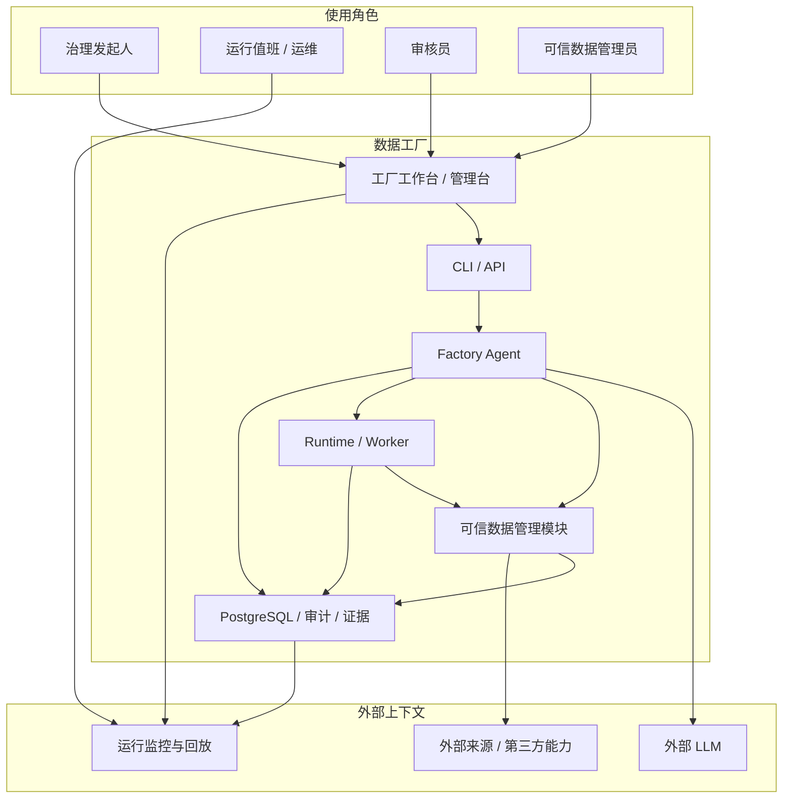
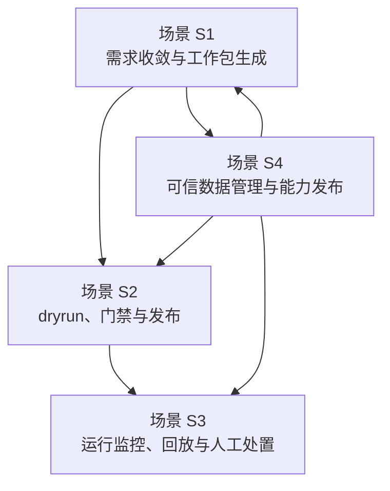
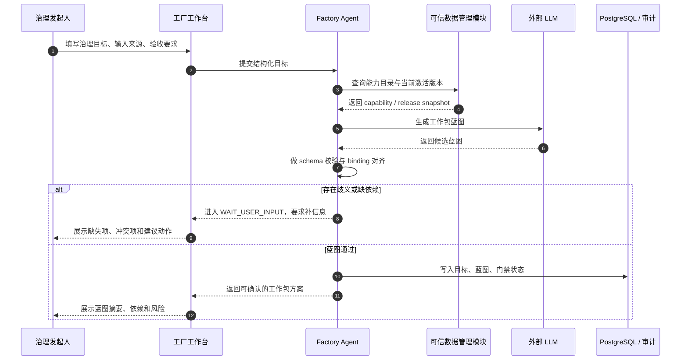
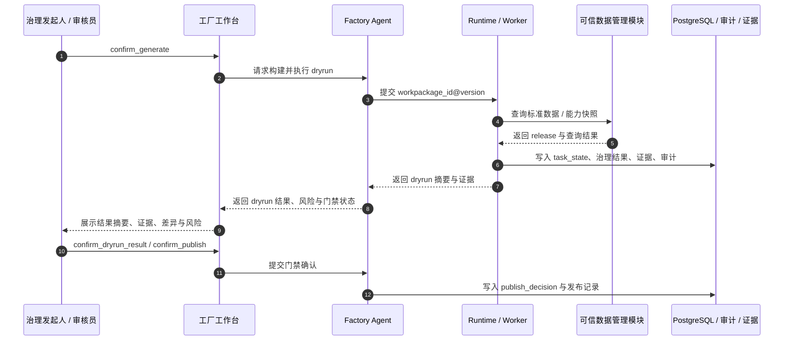
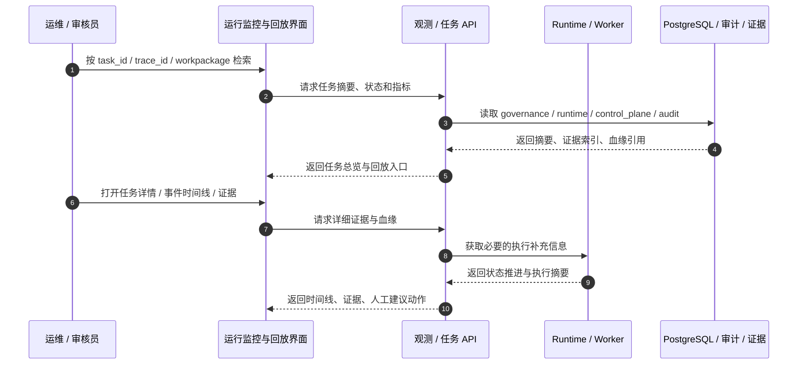
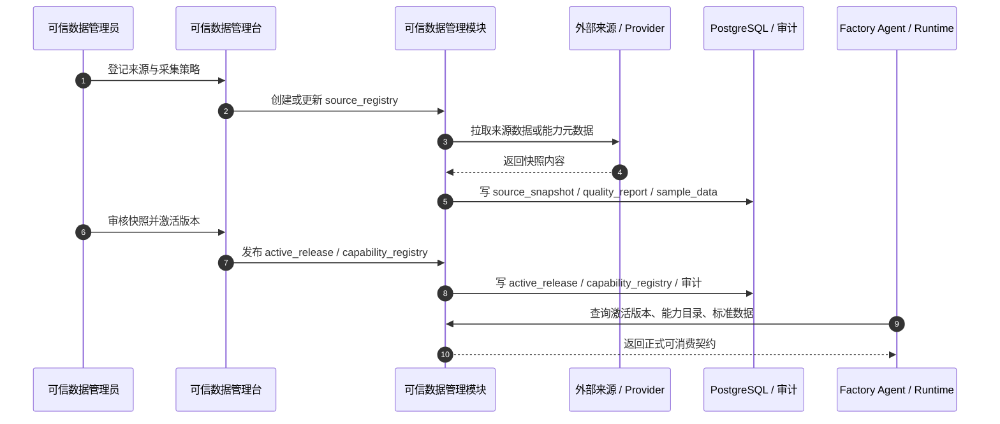

# 系统场景与业务流程设计

> 文档状态：当前有效
> 角色：系统级场景设计入口
> 适用范围：系统上下文、核心场景、跨上下文交互流程、前端与交互设计输入
> 关联文档：
> - `docs/01_产品与业务/产品需求文档.md`
> - `docs/02_总体架构/系统总览.md`
> - `docs/04_系统组件设计/01_工厂Agent编排/工厂Agent编排系统.md`
> - `docs/04_系统组件设计/03_Runtime执行/Runtime调度与任务系统.md`
> - `docs/04_系统组件设计/04_数据与人工介入/可信数据管理模块设计.md`
> - `docs/06_前端与交互设计/前端与交互总览.md`

## 1. 这份文档回答什么

原来的“核心应用场景”和“典型业务流程”分开写，会把“用户到底在做什么”和“系统到底怎么协作”拆散。

这份文档把两者收敛成一份正式设计，统一回答：

1. 系统处在什么上下文里。
2. 当前最重要的核心场景有哪些。
3. 每个核心场景由哪些上下文协同完成。
4. 后续前端、交互、API、测试应该围绕哪些正式流程展开。

## 2. 系统上下文

### 2.1 系统上下文图

图说明：这张图先回答“谁在用系统、系统和哪些上下文打交道”。重点不是代码模块，而是业务角色、核心系统上下文和外部依赖。

### 2.2 上下文职责表

| 上下文 | 核心职责 | 不是它的职责 |
|---|---|---|
| 工厂工作台 / 管理台 | 承载目标输入、门禁确认、结果查看、可信数据管理 | 直接执行治理算法、直连数据库 |
| Factory Agent | 目标收敛、蓝图生成、门禁编排、发布驱动 | 直接运行治理算法 |
| Runtime / Worker | 按 `workpackage_id@version` 执行工作包，沉淀状态与证据 | 决定需求范围、改写可信数据目录 |
| 可信数据管理模块 | 管理来源、快照、激活版本、能力目录、标准查询数据 | 直接写治理业务结果 |
| PostgreSQL / 审计 / 证据 | 作为结果、控制态、可信数据和审计的正式真相源 | 提供页面编排逻辑 |

## 3. 核心场景地图

### 3.1 场景全景图

图说明：这张图只表达“当前正式系统要支撑的四条主路径”。它既是业务场景图，也是后续页面信息架构的顶层输入。

### 3.2 场景总表

| 场景 | 主要发起人 | 目标 | 成功结果 |
|---|---|---|---|
| `S1` 需求收敛与工作包生成 | 治理发起人 | 把自然语言目标收敛为符合协议的工作包蓝图 | 形成可校验蓝图与可构建工作包 |
| `S2` dryrun、门禁与发布 | 治理发起人 / 审核员 | 验证工作包执行结果，完成门禁确认与发布 | 获得 dryrun 证据并发布到 Runtime |
| `S3` 运行监控、回放与人工处置 | 运维 / 审核员 / 治理发起人 | 看执行状态、下钻证据、人工修正或阻塞恢复 | 任务可定位、可回放、可人工接管 |
| `S4` 可信数据管理与能力发布 | 可信数据管理员 | 管理来源、快照、激活版本和能力目录 | 可信数据与能力可被 Agent / Runtime 正式消费 |

## 4. 场景 S1：需求收敛与工作包生成

### 4.1 场景目标

把“用户要做什么”转成“系统知道要构建什么”。

这一阶段的正式产物不是脚本，而是：

1. 结构化目标与约束
2. 能力快照
3. `workpackage_schema.v1` 蓝图

### 4.2 上下文交互流程

图说明：这张图重点看 Agent 如何把用户目标、可信能力和 LLM 方案收敛成工作包蓝图；出现歧义时必须回到用户，而不是继续猜。

### 4.3 场景约束

1. Agent 必须先读可信能力目录，再调用 LLM 生成蓝图。
2. `input_schema / output_schema / input_bindings / output_bindings` 必须在此阶段闭合。
3. 任何缺失的 key、能力、输入协议都必须显式回到用户。

## 5. 场景 S2：dryrun、门禁与发布

### 5.1 场景目标

把“生成了工作包”推进到“验证过、被确认、可发布”。

### 5.2 上下文交互流程

图说明：这张图重点看三个门禁：`confirm_generate`、`confirm_dryrun_result`、`confirm_publish`。系统不能在缺证据时直接进入发布。

### 5.3 场景约束

1. 页面展示必须以统一的结果摘要和证据引用为准，不能让前端自行拼装主结论。
2. 发布门禁只认正式证据，不认临时截图、临时文件或口头说明。
3. `blocked / failed / waiting_user_gate / waiting_user_input` 必须在页面上被区分。

## 6. 场景 S3：运行监控、回放与人工处置

### 6.1 场景目标

让值班、审核和业务方可以从“任务现状”下钻到“证据与责任域”，再决定是否人工处置或恢复。

### 6.2 上下文交互流程

图说明：这张图强调“查状态 -> 查结果 -> 查证据 -> 查血缘 -> 做处置”的连续路径，而不是单纯的 Dashboard 看板。

### 6.3 场景约束

1. 运行监控页面不能把 `control_plane.*` 当治理结果主表。
2. 回放入口至少能串起 `workpackage_id@version -> publish_id -> task_id -> trace_id -> evidence_ref`。
3. 人工处置动作必须回写正式状态或审核对象，不能只留页面备注。

## 7. 场景 S4：可信数据管理与能力发布

### 7.1 场景目标

维护系统可依赖的可信来源、快照、标准查询数据和能力目录，支撑 Agent 生成与 Runtime 执行。

### 7.2 上下文交互流程

图说明：这张图只看可信数据管理主线：来源登记、快照导入、质量校验、激活发布、能力对外可见。它是可信数据管理台和模块设计的共同基础。

### 7.3 场景约束

1. `trust_meta` 和 `trust_data` 的写入所有权属于可信数据管理模块，不属于 Agent、Runtime、页面。
2. 页面只能通过管理 API 管来源、快照、发布和能力，不能直连数据库。
3. `trust_db.*` 只作为过渡物理底座存在，不能继续出现在新页面、新 API 和新 Story 的正式入口中。

## 8. 跨上下文交互规则

| 规则 | 正式要求 |
|---|---|
| 用户目标进入系统 | 先进入 Agent 对齐链路，不直接进入 Runtime |
| 可信能力进入系统 | 先进入可信数据管理模块，再被 Agent / Runtime 消费 |
| 页面展示主结论 | 必须通过正式 API / 聚合服务读取，不直连数据库 |
| 人工确认与人工修正 | 必须回写正式状态、审核对象或发布对象 |
| 回放与排障 | 必须依赖正式血缘和证据链，不依赖临时日志拼接 |

## 9. 对后续设计的输入

这份文档是后续三类设计的直接输入：

1. 前端与交互设计
   - 页面信息架构必须围绕 `S1~S4` 展开。
2. 模块设计
   - 特别是 `Factory Agent`、`Runtime`、`可信数据管理模块`。
3. 测试设计
   - E2E、集成测试和前端交互测试都应覆盖 `S1~S4` 的正式路径。
