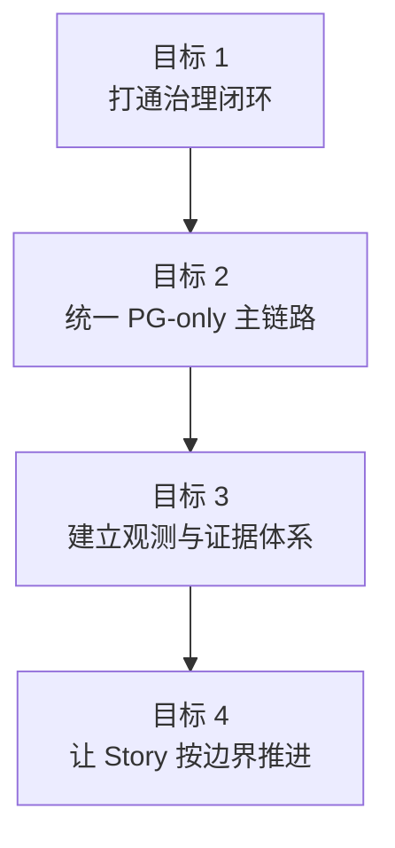

# 系统背景与目标

> 角色：产品背景入口
> 来源：`docs/01_产品与业务/产品简述.md`、`docs/01_产品与业务/产品需求文档.md`

## 1. 为什么现在做

当前数据治理主链路存在三个直接问题：

1. 需求确认、治理执行、人工复核和发布之间存在断点。
2. 历史双栈路径让持久化、验收和回放口径不一致。
3. 业务方只能看到结果，难以看到执行过程和证据。

因此，本阶段的目标不是扩张功能边界，而是先把“数据工厂主链路”做稳。

## 2. 当前阶段目标

图说明：本图用于帮助读者理解本节的核心结构、流程或关系。

具体来说：

1. 打通需求确认、工作包生成、dryrun、发布、回放。
2. 统一以 PostgreSQL 作为主链路真相源。
3. 每次运行都留下 trace、audit、evidence。
4. 后续研发必须显式声明所属面、允许依赖、禁止依赖。

## 3. 当前阶段不做什么

1. 不一次性覆盖全部行业规则。
2. 不引入新的多数据库混合主链路。
3. 不做大规模 UI 平台重构。
4. 不用 fallback 或 mock 伪造主链路成功。
