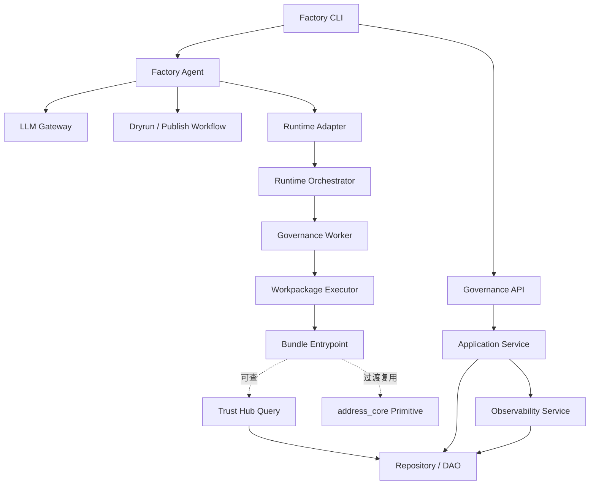
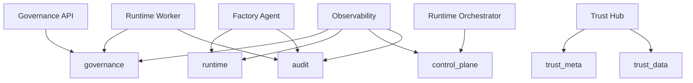
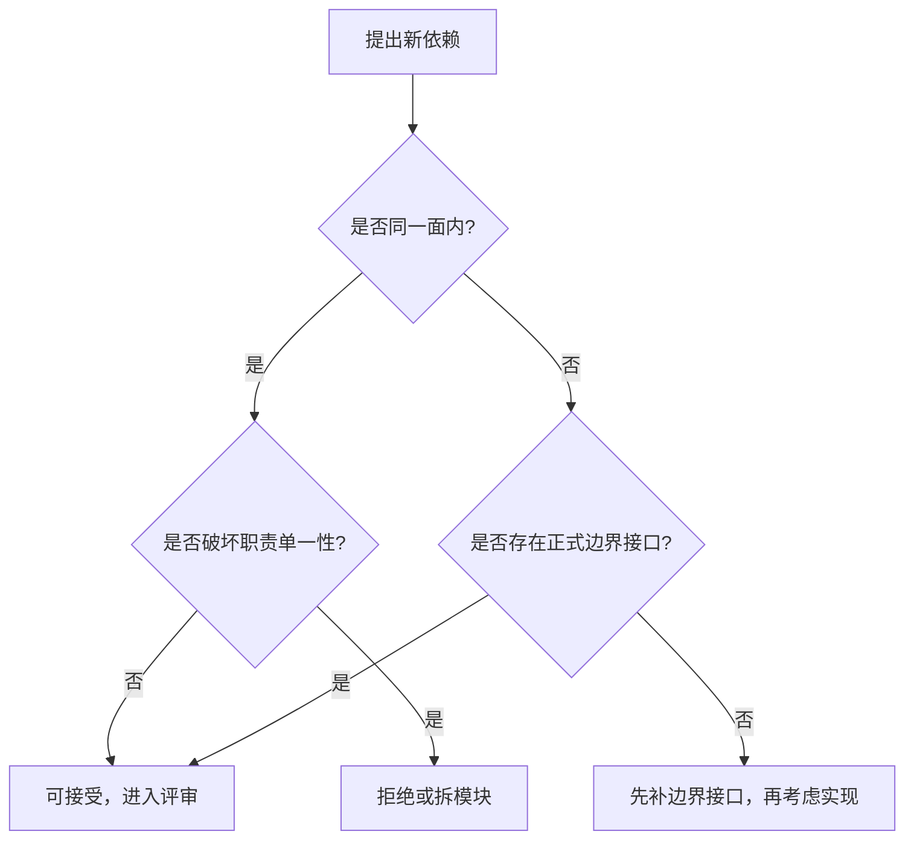

# 依赖关系

> 文档状态：当前有效
> 角色：架构真相源之一
> 统一入口：`docs/02_总体架构/架构索引.md`
> 关联文档：
> - `docs/02_总体架构/系统分层设计.md`
> - `docs/02_总体架构/模块边界.md`
> - `docs/02_总体架构/系统技术上下文与基础设施.md`
> - `docs/05_数据模型设计/数据库跨界约束.md`

## 1. 这份文档在总体架构章节里的位置

这份文档属于总体架构章节的约束层。  
《模块边界》先回答“模块是谁、归哪一面”，这份文档再回答“它具体可以依赖谁、不能依赖谁”。

## 2. 依赖原则

1. 单向依赖：上层依赖下层，不允许反向调用。
2. 稳定依赖：高变化模块尽量依赖低变化抽象。
3. 数据访问收敛：只有 Repository/DAO 访问数据库。
4. 运行时收敛：Worker 只执行工作包入口，不直接绑定算法模块。

## 3. 模块依赖图

图说明：这张图强调模块之间的主依赖方向，重点看哪些调用必须经过适配层或服务层，而不是直接穿透到数据库或运行时内部实现。

读图规则：

1. 实线表示主依赖方向。
2. 虚线表示受控的辅助依赖。
3. 图上没有画出来的依赖，默认不应该直接出现。

## 4. 数据依赖图

图说明：这张图只画正式数据库域和主要写入方，目的是避免把“谁能写哪个域”误解成共享写库。

六个核心 schema 的职责：

| schema | 主写方 | 主消费方 | 保存内容 |
|---|---|---|---|
| `governance` | API、Worker | API、Observability | 任务、治理结果、审核闭环 |
| `runtime` | Agent、发布门禁 | Runtime、Observability | 工作包版本、发布事实 |
| `control_plane` | Runtime Orchestrator | Runtime、Observability、排障工具 | 执行控制态、执行证据 |
| `trust_meta` | Trust Hub | Core、API | 来源、快照、质量报告 |
| `trust_data` | Trust Hub | Core、Bundle | 可信查询数据 |
| `audit` | 所有关键流程 | Observability、审计回放 | 关键动作与证据索引 |

## 5. 允许依赖与禁止依赖矩阵

| 调用方 | 允许依赖 | 禁止依赖 |
|---|---|---|
| CLI | Agent、API SDK | DB、Repository、ORM |
| Agent | LLM Gateway、Workflow、Runtime Adapter | FastAPI Handler、SQL 细节、页面实现 |
| API Router | Application Service | CLI、Worker 内部实现 |
| Application Service | Core、Repository、Observability | 直接拼 HTTP Response 细节到领域层 |
| Worker / Executor | Bundle、Repository、Queue、受控查询接口 | 直接 import `address_core` 主线算法、`opencode` 推理调用 |
| Bundle | Schema、Trust Hub、共享原语 | Worker 内部实现、页面逻辑 |
| Core | 抽象接口（Trust/Repo） | Web Framework、Queue SDK |
| Trust Hub | Provider Adapter、Repository | CLI、前端页面 |
| Observability | Repository、聚合器 | 直接修改业务状态机 |

## 6. 新依赖评估流程

图说明：这张图说明新依赖必须先判断是否跨面、是否已有正式边界接口；没有接口时，先补接口而不是直接写实现。

## 7. 明确禁止的耦合

1. `Core -> API Router`
2. `Repository -> Service / Router`
3. `CLI -> DB`
4. `Frontend -> DB`
5. `Agent -> ORM 直写`
6. `Trust Hub <-> Address Core` 双向循环依赖
7. `Observability <-> Runtime Worker` 双向业务控制
8. 通过环境变量暗开 fallback 规避失败
9. 通过本地文件替代数据库真相源且未声明模式

## 8. 守护方式

1. 架构评审：新增模块必须声明上游依赖、下游依赖、禁止依赖。
2. 测试守护：保留边界测试，阻止 CLI 直连 DB、Core 引入 Web Framework。
3. 发布守护：非 Alembic 生产 DDL 一律阻断。
4. PR 守护：评审模板必须回答“是否引入新耦合、是否违反 No-Fallback”。
