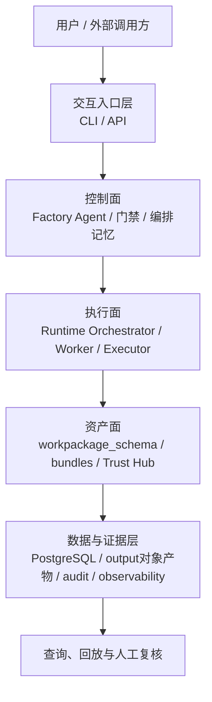
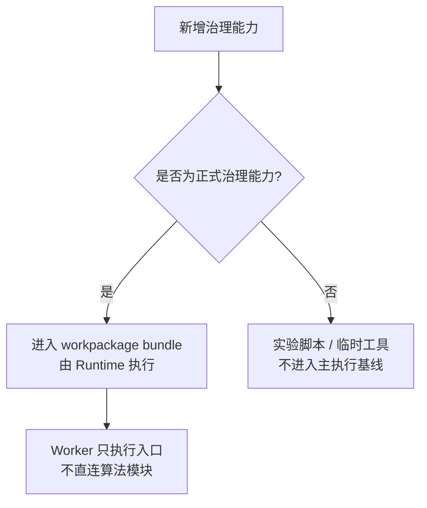

# 数据工厂技术架构

> 文档状态：当前有效
> 角色：总体技术架构与关键技术决策
> 统一入口：`docs/02_总体架构/架构索引.md`
> 关联文档：
> - `docs/02_总体架构/系统总览.md`
> - `docs/02_总体架构/系统技术上下文与基础设施.md`
> - `docs/02_总体架构/软件架构设计.md`
> - `docs/02_总体架构/系统分层设计.md`
> - `docs/02_总体架构/模块边界.md`
> - `docs/02_总体架构/依赖关系.md`

## 1. 这份文档解决什么问题

《系统总览》回答的是“系统由哪些面组成，主链路怎么走”；这份文档回答的是“这些面为什么这样拆、当前技术基线是什么、后续实现必须守哪些技术决策”。

《系统技术上下文与基础设施》则进一步回答“系统当前正式支持哪些输入输出、落在哪些基础设施上、数据库域由哪些服务和接口承接”。

《软件架构设计》则继续回答“这些正式边界落实到模块语言、开源骨架和系统软件主 Loop 时，应如何收敛”。

如果你要判断一个新设计是否合理，优先看三件事：

1. 是否仍然符合“控制面、执行面、资产面、证据面”的四面职责模型。
2. 是否仍然遵守“工作包契约执行器”这一执行模型。
3. 是否仍然遵守“PG 为正式元数据与控制真相源、对象/文件产物为大对象与证据载体”的双层存储模型。

## 2. 当前技术架构全景

图说明：这张图只看正式技术基线，重点看四个面如何协作，以及 PostgreSQL、对象/文件产物层和 Runtime 执行框架各自承担什么职责。

## 3. 四个技术事实

当前技术架构围绕四个事实收敛，后续设计默认以此为前提：

1. 上游由 `Factory Agent` 负责目标对齐、工作包蓝图生成、用户门禁和发布编排。
2. 下游由 `Runtime / Worker` 按 `workpackage_id@version` 装载并执行工作包入口。
3. 工作包的正式契约由 `workpackage_schema.v1` 定义，输入输出格式和 I/O binding 都必须显式声明。
4. 控制状态、发布记录、治理结果、审计与证据采用分层落库，不能混成一套万能状态表。

## 4. 正式技术基线

### 4.1 执行基线

Runtime 的正式执行对象是：

1. 版本化资产：`workpackage_id@version`
2. 运行实例：`task_id`

这意味着：

1. Worker 不直接绑定具体治理算法模块。
2. Worker 只通过 `Workpackage Executor -> bundle entrypoint` 执行工作包。
3. 算法实现优先落在 bundle 内部，主线 Runtime 只提供执行容器和状态推进。

### 4.2 数据基线

当前正式数据基线是“双层存储”：

1. PostgreSQL
   - 负责控制态、元数据、治理结果、可信数据索引、审计日志。
2. 对象/文件产物层
   - 当前默认体现为仓库或部署环境里的 `output/` 产物目录。
   - 后续可演进到 S3 / OSS / MinIO 兼容对象存储。

边界是：

1. PG 保存“结构化真相”和“可查询控制信息”。
2. 对象/文件层保存“大对象产物”和“可回放证据文件”。

### 4.3 能力基线

当前能力资产正式分三类：

1. 协议资产
   - `workpackage_schema`
2. 可执行资产
   - `workpackages/bundles/*`
3. 可信能力资产
   - `trust_meta / trust_data`

`address_core` 只保留为过渡共享原语层，不再作为新增治理能力的首选落点。

### 4.4 编排基线

Factory Agent 的正式职责是：

1. 把用户目标收敛成结构化工作包蓝图。
2. 基于真实能力快照和 schema 约束驱动 LLM 迭代。
3. 通过 `WAIT_USER_INPUT / WAIT_USER_GATE / BLOCKED` 明确人工介入和恢复点。

Factory Agent 不负责：

1. 直接执行数据治理算法。
2. 在上游编排层内写入下游专有算法分支。

### 4.5 技术上下文基线

当前系统工作的技术上下文，已经固定成以下正式口径：

1. 正式输入默认支持 `file / database`，可信数据标准查询和已登记 HTTP 能力属于受控正式能力。
2. 正式输出分成四层：
   - `governance.*` 业务结果
   - `runtime.* / control_plane.*` 发布与任务控制
   - `audit.*` 审计留痕
   - `output/` 或对象存储中的大对象证据
3. 正式基础设施默认是：
   - PostgreSQL
   - Redis / RQ
   - 对象 / 文件产物层
   - 真实外部 LLM Gateway
   - 可信 Provider 适配链路
4. PostgreSQL 各个 schema 不是“一个数据库里随便查”，而是分别归口到治理、发布、控制、可信元数据、可信查询和审计接口。

细节统一看《系统技术上下文与基础设施》。

## 5. 关键技术决策

### 5.1 工作包优先，执行器统一

图说明：这张图只回答一个问题：为什么新增治理能力应该先进入工作包，而不是继续堆进主线代码。

决策：

1. 新增治理算法默认进入 `workpackages/bundles/*`。
2. Runtime 只提供执行容器、状态机和证据沉淀。
3. `address_core` 只保留弱业务绑定、可迁移的共享原语。

### 5.2 API 与 Worker 边界必须收口

决策：

1. API 不应直接依赖 Worker 内部 job 或 queue 组织方式。
2. Agent / API 到 Runtime 的提交与状态回传必须经过正式交接契约。

这也是为什么：

1. [Agent与Runtime交接契约](../04_系统组件设计/03_Runtime执行/Agent与Runtime交接契约.md)
2. [Runtime调度与任务系统](../04_系统组件设计/03_Runtime执行/Runtime调度与任务系统.md)

必须和总体技术架构一起看。

### 5.3 PG 为正式查询真相源

决策：

1. 正式查询链路默认以 PostgreSQL 为准。
2. 文件、缓存、内存态只能作为执行辅助，不得冒充正式查询真相源。
3. `trust_db` 只可作为过渡物理底座背景说明，不可写成当前正式查询入口。

### 5.4 证据优先

任何关键动作都必须留下可追溯对象，包括：

1. 提交与门禁
2. 状态转移
3. 结果写回
4. 外部能力调用
5. 人工确认与阻塞恢复

这类对象分别归口到：

1. `control_plane.task_state`
2. `control_plane.evidence_records`
3. `runtime.publish_record`
4. `governance.*`
5. `audit.*`
6. `output/` 产物

## 6. 从总体架构到实现的映射

| 技术关注点 | 对应正式文档 | 主要约束 |
|---|---|---|
| 系统全景 | `docs/02_总体架构/系统总览.md` | 四个面和主链路 |
| 分层方式 | `docs/02_总体架构/系统分层设计.md` | 入口、编排、执行、数据与回放分层 |
| 技术上下文 | `docs/02_总体架构/系统技术上下文与基础设施.md` | 输入输出支持范围、基础设施、数据库域与接口归口 |
| 模块归属 | `docs/02_总体架构/模块边界.md` | 所属面、允许依赖、禁止依赖 |
| 依赖合法性 | `docs/02_总体架构/依赖关系.md` | 不得越面、越层、越库 |
| 工作包契约 | `docs/04_系统组件设计/02_工作包协议/工作包Schema设计.md` | 输入输出和 binding 必须显式 |
| Runtime 执行 | `docs/04_系统组件设计/03_Runtime执行/Runtime调度与任务系统.md` | 状态、证据、执行器边界 |
| 数据与血缘 | `docs/04_系统组件设计/03_Runtime执行/数据血缘与可追溯设计.md` | 每次执行必须可追溯 |
| 数据湖与执行栈 | `docs/04_系统组件设计/03_Runtime执行/数据湖与执行技术架构.md` | PG + 对象产物层的双层存储 |

## 7. 设计评审时最容易踩错的地方

1. 把 `Factory Agent` 当成算法执行器。
2. 让 Worker 直接 import 主线算法模块。
3. 把内存态或文件态写成正式查询真相源。
4. 把 Runtime 状态机和 Agent 状态机混为一套。
5. 把大对象证据全部塞进 PG，而没有对象/文件产物层。

## 8. 这份文档的使用规则

1. 它是正式总体技术基线，不再需要另看“增量收敛稿”才能理解为什么这样设计。
2. 如果需要追溯 2026-03-06 附近的收敛背景，再去看历史文档：
   - `archive/docs/architecture/架构增量收敛-历史参考.md`
3. 新 Story、评审和设计补充默认引用这份文档，而不是引用历史增量稿。
