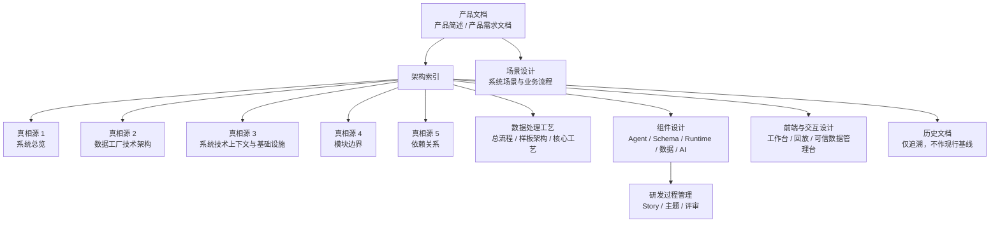
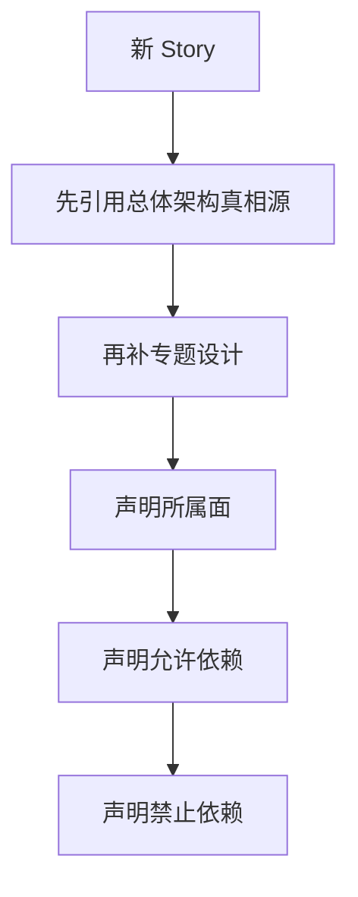

# 架构索引

> 文档状态：当前有效
> 角色：架构真相源总入口
> 关联文档：
> - `docs/01_产品与业务/产品简述.md`
> - `docs/01_产品与业务/产品需求文档.md`

## 1. 这份文档解决什么问题

团队现在不缺文档，缺的是统一入口和稳定口径。这份索引只回答三件事：

1. 当前正式架构真相源是哪几份文档。
2. 总体架构、数据处理工艺、组件设计应该按什么顺序读。
3. 哪些文档只是历史参考或研发过程材料，不得直接当当前基线。

## 2. 架构阅读地图

图说明：从产品文档进入总体架构，再进入数据处理工艺和组件设计；研发过程管理和历史文档只用于追溯或实施拆解，不替代正式基线。

## 3. 总体架构章节重构后的三层

`02_总体架构/` 不再把所有文档都放在同一个粒度上理解，而是按三层来组织：

1. 速览层
   - 先帮助读者看清系统全景和主链路。
2. 基线层
   - 解释正式技术基线、技术上下文、软件实现基线和核心原则。
3. 约束层
   - 解释分层、模块边界、允许依赖和禁止依赖。

## 4. 速览层、基线层、约束层

### 4.1 速览层

| 文档 | 主要回答的问题 | 典型读者 |
|---|---|---|
| `docs/02_总体架构/系统总体架构图.md` | 一页看懂系统全景和主链路 | 新成员、产品、管理者 |
| `docs/02_总体架构/系统总览.md` | 系统由哪些面组成、主链路如何推进 | 新成员、PM、架构师、开发 |

### 4.2 基线层

| 文档 | 主要回答的问题 | 典型读者 |
|---|---|---|
| `docs/02_总体架构/数据工厂技术架构.md` | 当前技术基线和关键技术决策是什么 | 架构师、PM、评审、核心开发 |
| `docs/02_总体架构/系统技术上下文与基础设施.md` | 支持哪些输入输出、依赖哪些基础设施、数据库域由哪些服务和接口承接 | 架构师、平台、Runtime、Agent、数据 |
| `docs/02_总体架构/软件架构设计.md` | 软件如何实现、各模块主语言和开源骨架如何收敛 | 架构师、平台、核心开发 |
| `docs/02_总体架构/核心设计原则.md` | 需要被长期记住的系统级原则是什么 | 所有人 |

### 4.3 约束层

| 文档 | 主要回答的问题 | 典型读者 |
|---|---|---|
| `docs/02_总体架构/系统分层设计.md` | 系统落到实现时是几层、每层能做什么 | 架构师、开发、评审 |
| `docs/02_总体架构/模块边界.md` | 每个模块属于哪一面、能做什么、不能做什么 | Story 编写者、开发、评审 |
| `docs/02_总体架构/依赖关系.md` | 允许依赖和禁止依赖分别是什么 | 开发、评审、测试 |

## 5. 推荐阅读路径

### 5.1 第一次接触项目

1. 《系统总体架构图》
2. 《系统总览》
3. 《数据工厂技术架构》
4. 《系统技术上下文与基础设施》

### 5.2 要做设计或代码实现

1. 《数据工厂技术架构》
2. 《系统技术上下文与基础设施》
3. 《软件架构设计》
4. 《系统分层设计》
5. 《模块边界》
6. 《依赖关系》

### 5.3 要写 Story、做评审或验收

1. 《系统总览》
2. 《数据工厂技术架构》
3. 视主题补：
   - 《系统技术上下文与基础设施》
   - 《软件架构设计》
4. 《模块边界》
5. 《依赖关系》

## 6. 当前有效专题设计

| 文档 | 适用主题 | 典型消费者 |
|---|---|---|
| `docs/03_数据处理工艺/地址治理处理架构.md` | 地址治理样板处理链路、发布、持久化、人工反馈 | `MVP-A3/A4/A6` 及后续地址治理 Story |
| `docs/04_系统组件设计/01_工厂Agent编排/工厂Agent编排系统.md` | Agent、工作包编排、蓝图形成 | Agent 相关 Story |
| `docs/04_系统组件设计/01_工厂Agent编排/工厂Agent状态机.md` | 用户介入、跳转标准、恢复点 | Agent、门禁、交互设计 |
| `docs/04_系统组件设计/01_工厂Agent编排/编排记忆与恢复设计.md` | orchestration memory 结构和恢复逻辑 | Agent、Schema、评审 |
| `docs/04_系统组件设计/02_工作包协议/工作包Schema设计.md` | 工作包 Schema 顶层结构和系统位置 | Schema、生成器、评审 |
| `docs/04_系统组件设计/02_工作包协议/工作包协议与IO绑定.md` | 输入输出 binding、协议与脚本映射 | Schema、生成器、评审 |
| `docs/04_系统组件设计/03_Runtime执行/Runtime调度与任务系统.md` | Runtime 执行框架、状态机、调度骨架 | Runtime、API、测试 |
| `docs/04_系统组件设计/03_Runtime执行/Agent与Runtime交接契约.md` | Agent 到 Runtime 的提交载荷、状态映射、门禁边界 | Agent、Runtime、API、测试 |
| `docs/04_系统组件设计/03_Runtime执行/数据处理引擎.md` | 工作包驱动的数据处理引擎 | Bundle、Executor、评审 |
| `docs/04_系统组件设计/03_Runtime执行/数据血缘与可追溯设计.md` | `task_id / trace_id / workpackage_id@version` 血缘闭环 | Runtime、DAO、页面、验收 |
| `docs/04_系统组件设计/03_Runtime执行/数据湖与执行技术架构.md` | PG、对象产物层、执行框架、工作流语言边界 | Runtime、平台、架构 |
| `docs/04_系统组件设计/04_数据与人工介入/可信数据管理模块设计.md` | Trust Hub 的正式模块边界、流程与消费方式 | Agent、Runtime、数据管理员 |
| `docs/04_系统组件设计/04_数据与人工介入/可信数据API调用契约.md` | 可信数据管理模块的 API 边界与调用矩阵 | Agent、Runtime、页面、评审 |
| `docs/05_数据模型设计/数据库分域设计.md` | 数据库 schema 分域、域归属、过渡态口径 | API、页面、存储设计 |
| `docs/05_数据模型设计/数据库跨界约束.md` | 数据库不能跨界的硬约束 | API、DAO、页面、评审 |
| `docs/05_数据模型设计/可信数据数据库契约设计.md` | `trust_meta / trust_data / trust_db` 的正式数据库契约 | Trust Hub、DAO、评审 |
| `docs/07_系统运行与运维/系统可观测性能力设计.md` | 运行态观测、Dashboard、观测 API | 观测 Story、页面、API |
| `docs/02_总体架构/软件架构设计.md` | 模块语言、开源骨架、Agent 主 Loop、Runtime 软件实现与演进基线 | 架构师、平台、核心开发、评审 |
| `docs/06_前端与交互设计/前端与交互总览.md` | 系统前端信息架构与统一交互原则 | 前端、产品、测试 |
| `docs/06_前端与交互设计/工厂工作台设计.md` | `S1/S2` 主工作台的页面和门禁交互 | 前端、Agent、测试 |
| `docs/06_前端与交互设计/运行监控与回放设计.md` | `S3` 运行监控与回放页面 | 前端、运维、测试 |
| `docs/06_前端与交互设计/可信数据管理台设计.md` | `S4` 可信数据管理台 | 前端、数据管理员、测试 |

## 7. Story 如何消费架构文档

图说明：Story 先引用总体架构真相源，再按主题补专题设计，最后声明模块归属和依赖边界。

强制规则：

1. Story 默认先引用总体架构真相源，再按主题补专题设计。
2. Story 不得直接把历史文档写成“当前基线”。
3. Story 必须显式声明：
   - 所属面
   - 允许依赖
   - 禁止依赖

## 8. 已降级为历史参考的文档

| 历史文档 | 降级原因 |
|---|---|
| `archive/docs/architecture/架构增量收敛-历史参考.md` | 属于收敛阶段的过程性架构稿，稳定结论已并入《数据工厂技术架构》 |
| `archive/docs/architecture/地址治理MVP架构刷新-历史参考.md` | 属于地址治理 MVP 阶段的增量稿，稳定结论已并入《地址治理处理架构》 |
| `archive/docs/architecture/architecture-unified-pg-multi-schema-v1-2026-02-27.md` | 仍有专题价值，但不再代表现行整体基线 |
| `archive/docs/architecture/architecture-spatial-intelligence-data-factory-2026-02-27.md` | 与当前工作包契约执行器边界存在差异 |
| `archive/docs/architecture/architecture-spatial-intelligence-data-factory-2026-02-28.md` | 属于早期总架构，不再反映当前收敛结果 |

历史文档只用于三种场景：

1. 追溯设计演进。
2. 解释迁移背景。
3. 对比新旧架构决策。

## 9. 当前被 Story 直接消费的专题设计

1. `docs/99_研发过程管理/99_归档/截止2026-03-05/可观测性与PG一体化/故事/OBS-PG-S1-系统可观测性与PG库一体化构建.md`
   - 补充设计：`docs/07_系统运行与运维/系统可观测性能力设计.md`
2. `docs/99_研发过程管理/99_归档/截止2026-03-05/地址治理MVP/故事/MVP-A6-数据库模型与持久化闭环补齐.md`
   - 补充设计：`docs/03_数据处理工艺/地址治理处理架构.md`
3. `docs/99_研发过程管理/10_EPIC-文档体系工业化完善/故事/DOC-S2-Agent与Runtime交接契约补齐.md`
   - 补充设计：`docs/04_系统组件设计/03_Runtime执行/Agent与Runtime交接契约.md`
