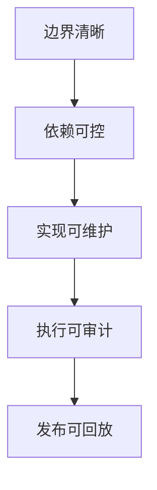

# 核心设计原则

> 角色：原则总览
> 来源：`docs/02_总体架构/依赖关系.md`、`docs/02_总体架构/数据工厂技术架构.md`

## 1. 这份文档在总体架构章节里的位置

这份文档属于总体架构章节的基线层，但它不负责展开细节。  
它的作用是把团队最需要长期记住的设计原则压缩成一页，便于 Story、评审和实现时快速对照。

## 2. 原则清单

1. `No-Fallback`：失败必须显式暴露，不能静默降级。
2. `PG-only`：主链路默认以 PostgreSQL 为真相源。
3. `Bundle-first`：新增治理算法默认进入工作包 bundle。
4. `契约执行`：Worker 只按工作包入口执行。
5. `边界清晰`：每个模块必须声明所属面和依赖边界。
6. `证据优先`：关键动作都要留下 audit、trace、evidence。

## 3. 原则关系图

图说明：这张图说明这些原则不是孤立存在的，而是从边界控制一路传导到可维护性、可审计性和可回放性。

## 4. 对研发的直接影响

1. Story 不能只写功能点，必须写边界。
2. 运行失败不能用 fallback 掩盖。
3. 新依赖要先问“是否越层、是否越面、是否已有正式接口”。
