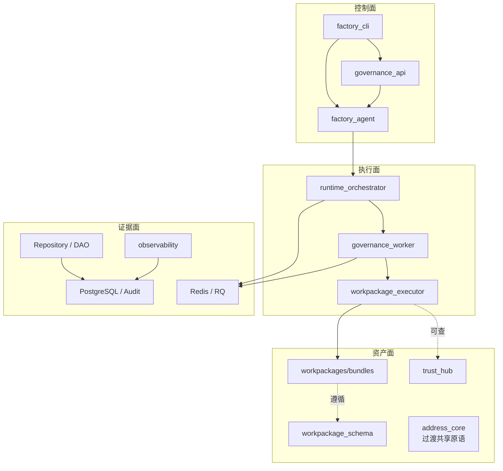

# 模块边界

> 文档状态：当前有效
> 角色：架构真相源之一
> 统一入口：`docs/02_总体架构/架构索引.md`
> 关联文档：
> - `docs/02_总体架构/系统分层设计.md`
> - `docs/02_总体架构/系统技术上下文与基础设施.md`
> - `docs/02_总体架构/软件架构设计.md`

## 1. 边界判断原则

模块边界不是按目录名字判断，而是按职责判断。判断顺序如下：

1. 这个模块属于哪一面。
2. 它的唯一职责是什么。
3. 它可以依赖谁。
4. 它绝不能依赖谁。

## 2. 模块边界图

图说明：这张图只回答“模块属于哪一面，以及主调用方向怎么走”。重点是先把边界框清楚，而不是把所有技术细节塞进一张图。

这张图只表达允许的主调用方向。图上没有出现的方向，默认需要谨慎审查。

## 3. 模块边界总表

| 模块 | 所属面 | 核心职责 | 允许依赖 | 禁止依赖 |
|---|---|---|---|---|
| `factory_cli` | 控制面 | 命令入口、参数收集、结果展示 | `factory_agent`、`governance_api` | DB、Repository、Worker 内部实现 |
| `governance_api` | 控制面 | 对外 HTTP 契约、认证、统一错误语义 | 应用服务、Repository、Observability | `factory_cli` 内部实现、Worker 内部 job/queue |
| `factory_agent` | 控制面 | 目标对齐、蓝图生成、门禁编排 | LLM Gateway、Runtime Adapter、工作流组件 | 页面实现、SQL 细节、具体治理算法 |
| `runtime_orchestrator` | 执行面 | 任务调度、状态推进、执行触发 | Worker、Queue、Runtime 记录 | CLI、页面、具体业务交互逻辑 |
| `governance_worker` | 执行面 | 装载工作包并回写执行结果 | Executor、Repository、Queue | 直接 import `address_core` 主线算法、`opencode` 推理调用 |
| `workpackage_executor` | 执行面 | 执行 `entrypoint.sh|entrypoint.py` | Bundle、运行环境、受控 binding | 绕过 bundle 直接执行算法模块 |
| `workpackages/bundles` | 资产面 | 封装治理算法、脚本、技能和配置 | `workpackage_schema`、可信能力、共享原语 | 反向依赖 Worker 内部实现 |
| `workpackage_schema` | 资产面 | 定义工作包契约和编排记忆契约 | JSON Schema、模板、示例 | 运行时业务逻辑 |
| `trust_hub` | 资产面 | 可信能力目录、可信数据查询 | Repository、外部 Provider Adapter | CLI、前端页面、Worker 内部状态 |
| `address_core` | 资产面 | 过渡共享原语和弱业务绑定能力 | 抽象仓储、抽象查询接口 | Web Framework、Worker 主链直接调用 |
| `Repository / DAO` | 证据面 | 数据访问、事务边界、SQL 收敛 | PostgreSQL | CLI、页面、业务编排逻辑 |
| `observability` | 证据面 | 聚合 trace、metrics、events 并提供查询 | Repository、审计记录、运行记录 | 反向驱动主业务状态机 |

## 4. 边界解释

### 4.1 控制面

控制面只负责“问清楚、编排好、把结果说明白”。它不直接执行治理算法。

### 4.2 执行面

执行面只负责“按契约执行”。它不负责决定目标，也不负责生成工作包蓝图。

### 4.3 资产面

资产面负责“把能力和契约沉淀成可复用资产”。新增治理算法默认进 bundle，而不是把 Worker 越写越重。

### 4.4 证据面

证据面负责“保存事实和证据”。它可以被查询，但不应该反过来操控业务状态机。

## 5. 明确禁止的穿透

1. `factory_cli -> PostgreSQL`
2. `governance_api -> governance_worker.app.jobs.*`
3. `governance_worker -> address_core` 主线算法直接调用
4. 页面前端 -> 数据库直连
5. `trust_hub <-> address_core` 双向循环依赖
6. Worker 直接写页面缓存代替标准观测落库
7. 通过 fallback 掩盖真实失败
8. 绕过 Alembic 进入生产 DDL

## 6. 对 Story 和评审的要求

新 Story 和评审至少要回答三件事：

1. 所属面是什么。
2. 允许依赖哪些模块。
3. 禁止依赖哪些模块。

如果这三件事答不出来，通常说明边界还没想清楚，不应直接进入开发。
