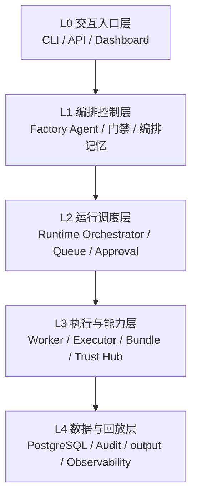

# 系统分层设计

> 文档状态：当前有效
> 角色：总体架构的分层展开
> 来源：
> - `docs/02_总体架构/系统总览.md`
> - `docs/02_总体架构/数据工厂技术架构.md`
> - `docs/02_总体架构/系统技术上下文与基础设施.md`
> - `docs/02_总体架构/软件架构设计.md`

## 1. 这份文档解决什么问题

《系统总览》讲的是“系统有哪些面”；这份文档讲的是“这些面落到实现时形成哪些层、每层可以依赖什么、每层禁止做什么”。

它属于总体架构章节的约束层，默认在看完《数据工厂技术架构》《系统技术上下文与基础设施》《软件架构设计》之后再读。

## 2. 五层结构图

图说明：这张图把总体架构再压成五层，便于判断一个模块到底属于“入口、编排、执行、数据、回放”的哪一层。

## 3. 各层职责

| 层 | 负责什么 | 不能做什么 |
|---|---|---|
| L0 交互入口层 | 接收请求、展示状态、触发确认 | 直接执行治理算法、直接改内部状态表 |
| L1 编排控制层 | 目标收敛、蓝图生成、用户门禁、阻塞恢复 | 绕过 Runtime 直接写业务结果 |
| L2 运行调度层 | 创建任务、推进 Runtime 状态、调度执行器 | 发明工作包内容、直接承载业务算法 |
| L3 执行与能力层 | 读取 binding、执行脚本、查询可信能力、产出结果 | 理解产品目标、绕过契约私自扩展输出 |
| L4 数据与回放层 | 持久化控制态、业务结果、证据、审计、对象产物 | 反向篡改上游决策逻辑 |

## 4. 分层依赖规则

### 4.1 允许规则

1. 上层可以通过正式接口依赖下层。
2. 编排层可以调用 Runtime 交接契约，但不能依赖 Worker 内部实现。
3. 执行层可以通过正式 repository / adapter 访问数据层，但不能把数据库 schema 当业务边界来穿透。

### 4.2 禁止规则

1. L0 不得直接访问 Runtime 内部状态表作为唯一真相源。
2. L1 不得跳过 Runtime 直接执行 bundle。
3. L2 不得直连具体治理算法模块。
4. L3 不得直接回写页面专用展示结构。
5. L4 不得被页面、API、Agent 任意跨界拼装成默认查询模型。

## 5. 这套分层怎么落到当前模块

| 当前模块 | 所在层 | 说明 |
|---|---|---|
| `packages/factory_cli` | L0 | 交互入口 |
| `services/governance_api` | L0 / L1 边界 | 对外接口，承接编排和查询 |
| `packages/factory_agent` | L1 | 目标收敛、蓝图和门禁 |
| `src/runtime/orchestrator.py` 一类 Runtime 骨架 | L2 | 任务调度与状态推进 |
| `services/governance_worker` / `Workpackage Executor` | L3 | 执行 bundle |
| `workpackages/bundles/*` | L3 | 业务处理能力本体 |
| `trust_meta / trust_data` | L4 | 可信数据与能力索引 |
| `runtime / control_plane / governance / audit / output` | L4 | 结果、状态、证据、回放 |

## 6. 分层评审清单

新设计进入评审时，至少检查三件事：

1. 这个模块在哪一层？
2. 它是否跨层调用了不该知道的内部实现？
3. 它输出的对象是业务结果、控制态，还是证据产物？

如果这三件事答不清，设计通常还没有收敛。
