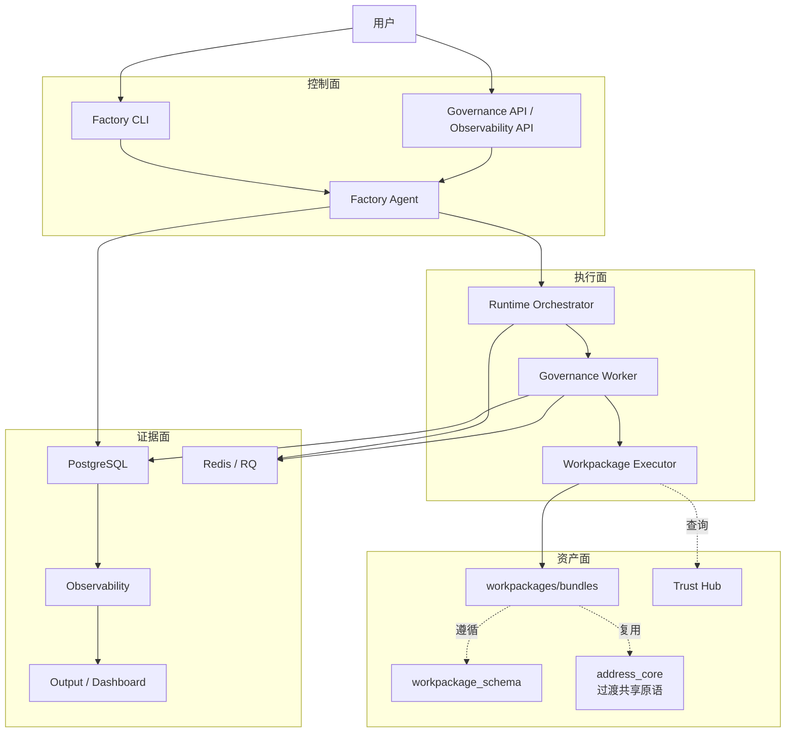

# 系统总体架构图

> 角色：一图看懂系统
> 来源：`docs/02_总体架构/系统总览.md`

## 1. 这份文档在总体架构章节里的位置

这份文档属于 `02_总体架构/` 的速览层。  
它只负责一件事：让读者在一页里看清系统主链路，不承担技术上下文、软件实现和边界约束的细节说明。

如果看完这页还想继续深入，顺序建议是：

1. [系统总览](系统总览.md)
2. [数据工厂技术架构](数据工厂技术架构.md)
3. [系统技术上下文与基础设施](系统技术上下文与基础设施.md)

## 2. 总体架构图

图说明：这张图是一页式全景图，适合新成员先看“用户发起、Agent 编排、Runtime 执行、证据沉淀”四段主链如何连起来。

## 3. 如何读这张图

1. 从左上到右下看，是“用户发起 -> 编排 -> 执行 -> 留痕”。
2. 四个面共同组成系统，不应把某一个模块当成整个系统。
3. Worker 不直接绑定治理算法，而是执行工作包入口。
