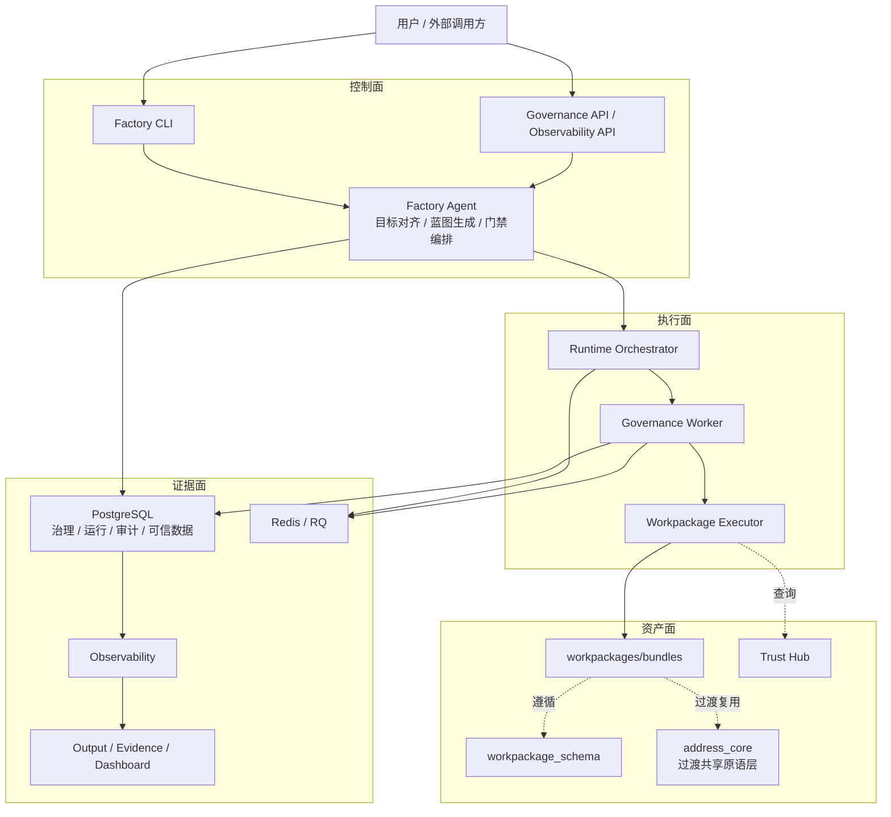
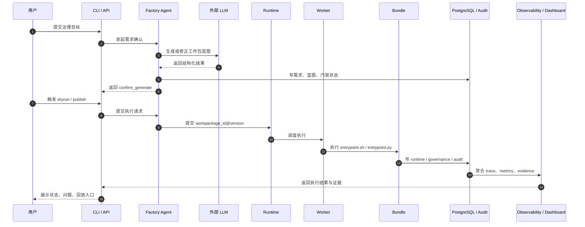

# 系统总览

> 文档状态：当前有效
> 角色：架构真相源之一
> 统一入口：`docs/02_总体架构/架构索引.md`
> 关联产品文档：
> - `docs/01_产品与业务/产品简述.md`
> - `docs/01_产品与业务/产品需求文档.md`
> 关联架构文档：
> - `docs/02_总体架构/数据工厂技术架构.md`
> - `docs/02_总体架构/系统技术上下文与基础设施.md`

## 1. 这份文档怎么读

如果你只想先理解系统主结构，先看两张图：

1. 整体架构图：回答“系统由哪些面组成”。
2. 端到端时序图：回答“一条治理任务如何跑完”。

如果你还需要确认：

1. 系统当前支持哪些输入、输出和工作流语言。
2. 系统依赖哪些数据库、队列、对象产物层和外部能力。
3. 哪些数据库域归哪类服务和接口承接。

再继续看《系统技术上下文与基础设施》。

细粒度边界和依赖规则，分别去看《模块边界》和《依赖关系》。

## 2. 整体架构图

图说明：这张图说明系统按控制面、执行面、资产面、证据面分层协作，重点看每一面各自负责什么、不负责什么。

## 3. 四个面的职责

| 面 | 核心模块 | 负责什么 | 不负责什么 |
|---|---|---|---|
| 控制面 | CLI、API、Factory Agent | 收目标、做编排、守门禁、返回结构化结果 | 直接执行治理算法 |
| 执行面 | Orchestrator、Worker、Executor | 按 `workpackage_id@version` 执行 bundle | 自己发明工作包内容 |
| 资产面 | schema、bundles、Trust Hub、共享原语 | 定义契约、封装能力、沉淀可复用资产 | 直接承载页面或交互逻辑 |
| 证据面 | PG、audit、observability、dashboard | 保存结果、证据、trace、指标 | 反向篡改业务状态 |

## 4. 端到端时序图

图说明：这张图按一条真实治理请求展开，重点看 Agent 负责目标对齐和门禁，Runtime 负责执行，数据库和观测层负责留痕与回放。

## 5. 核心链路解释

### 5.1 需求确认链路

1. 用户从 CLI 或 API 提交治理目标。
2. Factory Agent 收敛目标、约束和验收口径。
3. LLM 仅负责生成候选蓝图，最终是否通过由 schema 和门禁决定。

### 5.2 执行链路

1. 运行时只认 `workpackage_id@version`。
2. Worker 只执行工作包入口，不直接绑定具体治理算法。
3. 治理能力优先封装在 bundle 内，而不是散落到主执行链。

### 5.3 证据链路

1. 结果落 PG。
2. 审计、trace、metrics 聚合到 Observability。
3. Dashboard 和 API 从证据层读取状态，而不是直接读业务内部临时状态。

### 5.4 技术上下文补充

这条主链默认工作在以下技术上下文里：

1. 正式结构化真相源是 PostgreSQL。
2. 正式异步分发层是 Redis / RQ。
3. 大对象结果、trace 和验收产物走 `output/` 或兼容对象存储。
4. 当前正式输入默认支持 `file / database`，`http / kafka / stream` 属于受控扩展位。
5. 当前正式工作流语言默认支持 `Python 3 / Shell`。

这些细节统一以《系统技术上下文与基础设施》为准，不再在各个专题文档里重复发明口径。

## 6. 全局约束

1. 默认以 PostgreSQL 作为主链路真相源。
2. 不允许 fallback 掩盖真实失败，失败必须显式 `blocked/error`。
3. CLI 不得直连数据库。
4. 页面层不得直读 Runtime 内部表或本地临时文件作为唯一真相源。
5. DDL 变更只能通过 Alembic。
