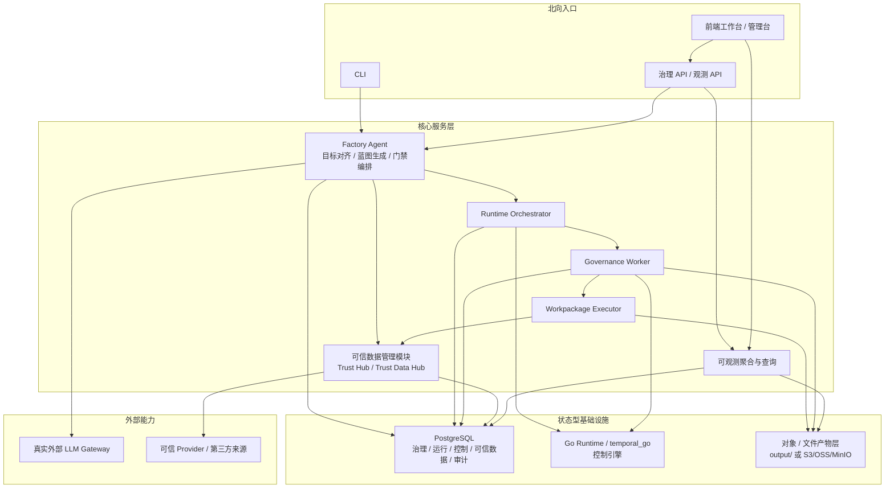
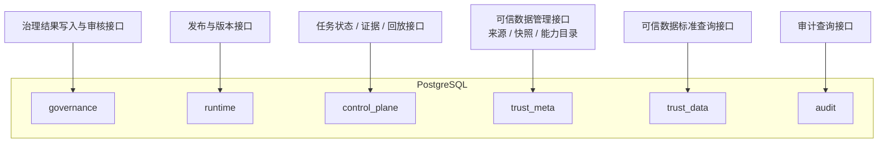

# 系统技术上下文与基础设施

> 文档状态：当前有效
> 角色：系统技术上下文、基础设施基线与输入输出支持范围的统一真相源
> 统一入口：`docs/02_总体架构/架构索引.md`
> 关联文档：
> - `docs/02_总体架构/数据工厂技术架构.md`
> - `docs/02_总体架构/软件架构设计.md`
> - `docs/04_系统组件设计/02_工作包协议/工作包协议与IO绑定.md`
> - `docs/04_系统组件设计/03_Runtime执行/数据湖与执行技术架构.md`
> - `docs/04_系统组件设计/04_数据与人工介入/可信数据管理模块设计.md`
> - `docs/05_数据模型设计/数据库分域设计.md`

## 1. 这份文档回答什么

前面的总体架构文档已经说明了系统分面、主链路和模块边界，但系统要真正落地，还必须回答下面这些工程问题：

1. 系统当前正式支持哪些类型的数据输入。
2. 系统当前正式支持哪些形式的数据输出。
3. 系统运行在什么样的基础设施之上。
4. PostgreSQL 各个 schema 分别归属于哪些服务、能力和接口。
5. 哪些能力是当前正式支持，哪些只是受控扩展位。

这份文档就是把这些“系统工作的技术上下文”统一写清楚，避免它们散落在 Runtime、Schema、Trust Hub 和数据库文档里各说一段。

## 2. 系统技术上下文总图

图说明：这张图只看系统运行所依赖的技术上下文。重点看“北向入口、核心服务、状态型基础设施、外部能力”之间的关系，而不是代码目录结构。

## 3. 当前正式支持的数据输入

### 3.1 输入类型支持矩阵

| 输入类型 | 正式支持级别 | 进入方式 | 典型载体 | 主要消费者 | 说明 |
|---|---|---|---|---|---|
| 文件批次输入 | 当前正式支持 | `input_bindings[].mode = file` | `csv`、`json`、`jsonl`、`parquet` | Runtime / Bundle | 最常见的批处理输入模式 |
| 数据库结构化输入 | 当前正式支持 | `input_bindings[].mode = database` | PostgreSQL 表 / 查询结果 | Runtime / Bundle | 适合治理批次、增量处理和回放 |
| 可信数据标准查询输入 | 当前正式支持 | 可信数据标准查询契约 + `input_binding_ref` | `trust_data.*` 的标准查询结果 | Runtime / Bundle / 管理台 | 不能把它当治理输出表 |
| 已登记 HTTP 能力输入 | 受控正式支持 | `api_plan.registered_apis_used` + 注册能力目录 | HTTP/JSON | Agent / Bundle | 必须来自 `trust_meta.capability_registry` |
| Kafka / Stream 输入 | 受控扩展位 | `input_bindings[].mode = kafka/stream` | 事件流 | Runtime 扩展适配器 | Schema 已预留，当前不是默认一等公民 |
| 页面直接上传临时文件 | 非正式主链路 | 页面临时上传 -> API -> 受控落盘 | 上传文件 | 页面 / API | 必须转成正式 binding，不能绕过契约 |

### 3.2 输入的最小工程要求

1. 每个正式输入都必须能落到 `input_binding_ref` 或等价输入引用。
2. 每个正式输入都必须能说明协议、格式、位置或来源。
3. 每个正式输入都必须能追溯到：
   - 工作包版本
   - 任务执行实例
   - 所依赖的来源快照或能力目录
4. 未在工作包 Schema 或可信能力目录里登记的输入方式，不能写成当前正式支持。

## 4. 当前正式支持的数据输出

### 4.1 输出类型支持矩阵

| 输出类型 | 正式支持级别 | 主要落点 | 主要消费者 | 说明 |
|---|---|---|---|---|
| 治理主结果输出 | 当前正式支持 | `governance.*` | API、页面、审核系统 | 例如 `canonical_record`、复核对象 |
| 运行状态与发布输出 | 当前正式支持 | `runtime.*`、`control_plane.*` | Runtime、Dashboard、回放 | 例如 `publish_record`、`task_state` |
| 可信数据管理输出 | 当前正式支持 | `trust_meta.*`、`trust_data.*` | 管理台、Agent、Runtime | 只由可信数据管理链路写入 |
| 审计输出 | 当前正式支持 | `audit.*` | 审计查询、回放、合规检查 | 记录关键动作和签字轨迹 |
| 证据与回放产物 | 当前正式支持 | `output/` 或对象存储 | 观测、验收、回放 | 例如 `runtime_output.json`、trace、报表 |
| 导出文件输出 | 当前正式支持 | 对象/文件产物层 | 页面下载、验收、外部交付 | 例如 `json/jsonl/parquet/zip` |
| HTTP callback / Kafka event 输出 | 受控扩展位 | 扩展适配器 | 外部系统 | 当前不是默认正式主链路输出 |

### 4.2 输出的最小工程要求

1. 主结果输出和证据输出必须分开。
2. 任何结果都必须能关联：
   - `task_id`
   - `workpackage_id@version`
   - `trace_id` 或等价证据引用
3. 大对象输出优先进入对象/文件产物层，不直接塞进 PostgreSQL 主表。
4. 没有正式落点的输出，不应写进当前设计。

## 5. 基础设施基线

### 5.1 当前正式基础设施清单

| 基础设施 | 当前角色 | 正式用途 | 不应承担什么 |
|---|---|---|---|
| PostgreSQL | 主结构化真相源 | 结果、状态、元数据、可信数据、审计 | 承载所有大对象证据 |
| `Go Runtime / temporal_go` 控制引擎 | Runtime 控制与工作流引擎 | 状态推进、恢复、执行协调 | 充当正式结果真相源 |
| 对象 / 文件产物层 | 大对象和证据载体 | 结果包、trace、报表、回放产物 | 替代正式状态查询 |
| 真实外部 LLM Gateway | 编排与生成外部能力 | 支撑 Agent 的真实推理链路 | 被 mock/stub 替代成正式验收链路 |
| 可信 Provider / 第三方来源 | 标准数据和外部能力来源 | 来源抓取、快照形成、能力适配 | 直接暴露给页面或 Runtime 主链路 |

### 5.2 基础设施与服务依赖矩阵

| 服务 / 模块 | PostgreSQL | `Go Runtime / temporal_go` 控制引擎 | 对象 / 文件产物层 | 外部 LLM | 第三方 Provider |
|---|---|---|---|---|---|
| Factory Agent | 读写 | 不依赖主链路 | 写蓝图/证据摘要 | 需要 | 不直接调，走可信能力目录 |
| Governance API / Observability API | 读写 | 不直接依赖 | 读证据引用 | 不强依赖 | 不直接调 |
| Runtime Orchestrator | 读写 | 需要 | 读写证据引用 | 不需要 | 不直接调 |
| Governance Worker / Executor | 读写 | 需要 | 读写运行产物 | 不需要 | 通过可信数据模块受控访问 |
| 可信数据管理模块 | 读写 | 不依赖主链路 | 写快照/导入产物 | 不需要 | 需要 |
| 前端页面 / 管理台 | 不直连 | 不直连 | 不直连 | 不直连 | 不直连 |

## 6. PostgreSQL 的正式数据库域、服务与接口

### 6.1 数据库域与服务归口图

图说明：这张图只回答“哪些 PostgreSQL schema 归哪类服务拥有，并通过什么接口对外提供能力”。箭头表示正式归口，不表示所有调用细节。

### 6.2 数据库域到服务/接口映射

| 数据库域 | 主要对象 | 正式拥有方 | 正式北向接口 / 能力 | 主要读取方 | 说明 |
|---|---|---|---|---|---|
| `governance` | `batch`、`raw_record`、`canonical_record`、`review` | 治理处理链路 + 审核接口 | 结果查询、复核、反馈 | API、页面、审核系统 | 业务结果域 |
| `runtime` | `publish_record` 等版本/发布对象 | 发布与版本服务 | 发布查询、版本解析 | Agent、Runtime、页面 | 版本态，不等于任务态 |
| `control_plane` | `task_state`、`evidence_records` | Runtime Orchestrator / 观测聚合 | 任务状态、证据查询、回放接口 | API、页面、观测 | 控制态和证据索引域 |
| `trust_meta` | `source_registry`、`source_snapshot`、`active_release`、`capability_registry` | 可信数据管理模块 | 来源管理、快照管理、能力发现 | Agent、管理台、Runtime | 可信元数据域 |
| `trust_data` | 标准查询数据表 | 可信数据导入链路 / 标准查询服务 | 标准查询接口 | Runtime、Bundle、管理台 | 正式查询域 |
| `audit` | 审计事件、门禁、签字轨迹 | 审计写入链路 | 审计查询、回放支撑 | API、运维、合规 | 横切审计域 |

### 6.3 数据库域与跨界约束的直接结论

1. 页面只消费 API，不直连任何 PostgreSQL schema。
2. Agent 不直接改写 `trust_meta.*`、`trust_data.*`。
3. Runtime / Worker 不把 `trust_data.*` 当治理结果输出表。
4. `trust_db.*` 只保留为过渡底座，不进入新接口、新工作包、新查询设计。

## 7. 正式接口面清单

### 7.1 北向接口

| 接口面 | 主要协议 | 典型消费者 | 当前角色 |
|---|---|---|---|
| CLI / 会话入口 | CLI / 本地命令 | 用户、开发者 | 目标提交、门禁确认 |
| 治理 API | HTTP / JSON | 页面、外部系统 | 任务提交、结果查询、治理反馈 |
| 观测 API | HTTP / JSON | 页面、运维 | 状态、指标、回放、告警 |
| 可信数据管理 API | HTTP / JSON | 管理台、数据管理员 | 来源、快照、激活、能力目录管理 |
| 可信数据标准查询 API | HTTP / JSON / 受控查询契约 | Runtime、Bundle、管理台 | 标准查询 |
| Agent 与 Runtime 交接契约 | 结构化载荷 / 内部服务契约 | Agent、Runtime | 发布、执行、状态回传 |

### 7.2 南向接口

| 接口面 | 主要协议 | 主要调用方 | 说明 |
|---|---|---|---|
| PostgreSQL 访问 | SQL / 驱动 | Agent、Runtime、可信数据管理模块 | 只允许访问各自归属域 |
| `Go Runtime / temporal_go` 控制接口 | workflow / control protocol | Runtime、Worker | 负责控制推进、恢复和执行协调 |
| 对象 / 文件产物层 | 文件系统 / 对象存储 API | Runtime、Worker、观测 | 负责大对象产物 |
| 外部 LLM Gateway | HTTP / SDK | Factory Agent | 真实推理能力 |
| Provider 适配接口 | HTTP / SDK / 数据源专有协议 | 可信数据导入链路 | 只留在模块内部 |

## 8. 当前正式支持与受控扩展边界

### 8.1 当前正式支持

1. `file + database` 作为默认输入 binding。
2. PostgreSQL 作为正式结构化真相源。
3. `output/` 或兼容对象存储作为大对象与证据产物层。
4. `Python 3 + Shell` 作为 Runtime 当前一等公民工作流语言。
5. 已登记能力目录驱动的 HTTP 能力调用。

### 8.2 受控扩展位

1. `http / kafka / stream` 输入输出 binding。
2. `SQL / R / Java / Scala` 等工作流语言。
3. S3 / OSS / MinIO 兼容对象存储替代本地 `output/`。
4. 更细粒度的流式事件输出与外部回调。

这些扩展位可以继续设计，但不能在没有实现与验收的前提下写成“当前已经正式支持”。

## 9. 继续阅读

1. [数据工厂技术架构](数据工厂技术架构.md)
2. [数据处理总流程](../03_数据处理工艺/数据处理总流程.md)
3. [数据湖与执行技术架构](../04_系统组件设计/03_Runtime执行/数据湖与执行技术架构.md)
4. [可信数据管理模块设计](../04_系统组件设计/04_数据与人工介入/可信数据管理模块设计.md)
5. [数据库分域设计](../05_数据模型设计/数据库分域设计.md)
