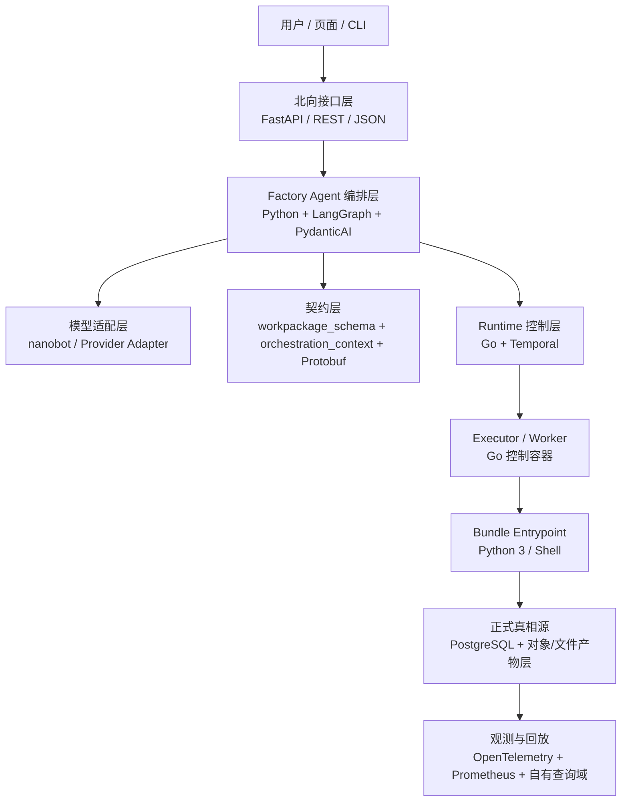

# 软件架构设计

> 文档状态：当前有效
> 角色：软件实现层目标架构、技术选型与演进基线
> 统一入口：`docs/02_总体架构/架构索引.md`
> 关联文档：
> - `docs/02_总体架构/系统总览.md`
> - `docs/02_总体架构/数据工厂技术架构.md`
> - `docs/02_总体架构/系统技术上下文与基础设施.md`
> - `docs/04_系统组件设计/01_工厂Agent编排/工厂Agent编排系统.md`
> - `docs/04_系统组件设计/03_Runtime执行/Runtime调度与任务系统.md`
> - `docs/99_研发过程管理/软件架构与技术选型/分析报告.md`

## 1. 这份文档解决什么问题

《系统总览》回答系统由哪些面组成，《数据工厂技术架构》回答总体技术基线，《系统技术上下文与基础设施》回答系统依赖哪些输入输出和基础设施。

这份文档继续回答“软件到底应该怎么实现”：

1. 各个核心模块优先使用什么编程语言。
2. Agent、Runtime、契约、可观测分别采用什么开源骨架。
3. 当前实现和推荐目标实现之间如何分层表达。
4. 哪些方向是正式基线，哪些只是受控备选。

它属于总体架构章节的基线层，默认在《数据工厂技术架构》《系统技术上下文与基础设施》之后阅读。

## 2. 设计目标与强约束

### 2.1 设计目标

1. 保持“控制面、执行面、资产面、证据面”四面职责稳定。
2. 让 Agent、Runtime、契约、观测各自有清晰的软件骨架，不再长期依赖自研壳拼接。
3. 保持 `workpackage_schema.v1` 和 `orchestration_context.v1` 的正式契约地位。
4. 支持长生命周期任务、人工门禁、阻塞恢复、证据回放和观测闭环。

### 2.2 强约束

1. 不用 mock、stub、fake gateway 伪造正式 LLM 主链路。
2. Worker 仍然只按 `workpackage_id@version` 装载并执行 bundle 入口。
3. PostgreSQL 仍然是正式结构化真相源。
4. 对象 / 文件产物层仍然承载大对象证据和回放产物。
5. 页面与外部调用方不直连数据库。

## 3. 当前基线与目标基线

### 3.1 当前基线

当前正式运行与实现基线如下：

1. Factory Agent、治理 API、Builder 和测试主链路主要由 Python 承载。
2. Runtime 当前仍基于 Python 服务骨架和 Redis / RQ 组织最小可用执行链。
3. workpackage 当前一等公民入口仍是：
   - `entrypoint.py`
   - `entrypoint.sh`
4. `FactoryAgent + nanobot 适配层 + opencode builder` 组成当前可工作的编排壳。

### 3.2 目标基线

本项目的软件目标基线如下：

1. Factory Agent 继续以 Python 为主语言，但采用正式 Agent 编排骨架。
2. Runtime 控制层优先向 Go + 正式工作流骨架收敛。
3. Bundle 运行入口继续保持 `Python 3 + Shell`。
4. 内部服务契约引入 Protobuf / Buf 作为结构化补强。
5. 可观测统一收敛到 OpenTelemetry + Prometheus + 自有观测域闭环。

## 4. 软件骨架总图

图说明：这张图表达的是推荐软件骨架，而不是当前仓库代码目录。重点看 Agent 主 Loop、Runtime 工作流骨架、bundle 执行器和正式真相源之间的关系。

## 5. 模块编程语言基线

| 模块 | 正式主语言 | 角色定位 | 说明 |
|---|---|---|---|
| Factory Agent 编排层 | `Python 3.11` | 控制面编排主脑 | 最贴近 LLM、schema 校验、工具调用和状态图建模 |
| 治理 API / 观测 API / 管理台后端 | `Python 3.11` | 北向 HTTP / JSON 接口 | 与现有 Pydantic、FastAPI、测试资产保持一致 |
| Runtime Orchestrator / Worker 控制层 | `Go` | 长生命周期任务控制面 | 优先承接调度、并发、租约、超时和恢复 |
| Workpackage Executor | `Go` | 受控执行容器 | 负责装载 bundle、调用入口、记录执行事件 |
| Bundle 内治理脚本 | `Python 3` | 数据处理主语言 | 与当前正式 workpackage 入口和数据处理生态一致 |
| Bundle 入口胶水 | `Shell` | 入口装配与环境组织 | 与当前正式执行契约一致 |
| 前端工作台 / 管理台 | `TypeScript` | 页面与交互层 | 与正式前端设计目录和浏览器生态一致 |
| 高隔离执行器 | `Rust`（可选） | 受控增强位 | 只在需要强隔离、安全和高密度执行时引入 |

### 5.1 关于 Python 与 Go 的边界

1. Python 负责“编排与生成”：
   - Agent
   - 北向 API
   - bundle 内脚本
2. Go 负责“调度与控制”：
   - Runtime workflow
   - Worker control plane
   - Executor 容器
3. 这两个边界必须分开，避免重新把 Worker 写成算法执行主脑。

### 5.2 关于 Rust 的边界

1. Rust 不是当前系统主语言。
2. Rust 只作为执行隔离和安全增强位。
3. 没有隔离与安全收益证明前，不引入 Rust 重写主链路。

## 6. 开源组件与框架基线

### 6.1 Agent 编排骨架

| 主题 | 正式基线 | 说明 |
|---|---|---|
| Agent 状态机与主 Loop | `LangGraph` | 承接长生命周期状态图、暂停、恢复和人机中断 |
| 类型化输出与工具调用 | `PydanticAI` | 承接结构化输出、工具入参/出参校验和 approval 语义 |
| 模型 / Provider 访问 | `nanobot` 适配层 | 作为模型访问与 Provider 适配层保留，不再承担系统级主 Loop |
| 构建器 | `opencode` | 作为 Builder / 工具节点保留，不作为主 Loop 框架 |

### 6.2 Runtime 骨架

| 主题 | 正式基线 | 说明 |
|---|---|---|
| 长生命周期编排 | `Temporal + Go SDK` | 承接 workflow、activity、超时、重试和恢复 |
| 当前过渡态 | `Redis / RQ` | 仅作为现有实现兼容层，不再扩大职责 |
| K8s-first 备选 | `Argo Workflows + Argo Events` | 只在明确 Kubernetes-first 前提下启用 |

### 6.3 服务契约与接口骨架

| 主题 | 正式基线 | 说明 |
|---|---|---|
| workpackage / orchestration memory | `JSON Schema` | 保持 `workpackage_schema.v1` 与 `orchestration_context.v1` 的正式地位 |
| 服务间契约 | `Buf + Protobuf` | 用于结构化契约、代码生成和 breaking-change 检查 |
| 内部 RPC | `ConnectRPC` | 优先用于 Go / TypeScript 内部服务通信；Python 服务允许保留 REST / JSON 过渡 |
| 北向外部接口 | `FastAPI + REST / JSON` | 保持页面、CLI、外部系统的兼容性与实现效率 |

### 6.4 可观测与事件骨架

| 主题 | 正式基线 | 说明 |
|---|---|---|
| 统一埋点与 trace | `OpenTelemetry` | 统一 `trace_id`、span、metric 语义 |
| 指标与告警 | `Prometheus` | 承接指标采集、SLI/SLO 与告警 |
| 事件总线 | `NATS JetStream`（可选） | 只作为辅助事件总线，不作为正式真相源 |
| 正式查询与回放 | `PostgreSQL + 对象/文件产物层` | 保持现有观测域、审计域和证据域闭环 |

## 7. Agent 软件架构设计

### 7.1 当前角色定位

Factory Agent 当前仍保留三类正式职责：

1. 目标收敛
2. 蓝图与 schema 驱动生成
3. 门禁确认、阻塞恢复与发布编排

### 7.2 目标实现方式

Factory Agent 的目标实现方式如下：

1. 用 `LangGraph` 承载主状态图。
2. 用 `PydanticAI` 承载：
   - 类型化输出
   - 工具调用
   - approval / deferred tool 语义
3. 用 `orchestration_context.v1` 承载 graph state 的正式结构化对象。
4. 用 `nanobot` 适配层访问真实外部模型与 Provider。

### 7.3 状态映射原则

当前正式状态集合继续保留：

1. `DISCOVERY`
2. `ALIGN_IO`
3. `BLUEPRINT_LOOP`
4. `BUILD_WITH_OPENCODE`
5. `VERIFY`
6. `PUBLISH`
7. `WAIT_USER_INPUT`
8. `WAIT_USER_GATE`
9. `BLOCKED`
10. `COMPLETED`

软件架构上的结论是：

1. 这些状态由正式 Agent 骨架承载。
2. 这些状态不再长期依赖自研壳手工拼接。
3. `WAIT_USER_INPUT / WAIT_USER_GATE` 必须映射到正式 interrupt / approval 语义，而不是自由文本等待。

## 8. Runtime 软件架构设计

### 8.1 Runtime 控制层

Runtime 控制层的目标软件骨架如下：

1. `Temporal Workflow`
   - 负责长生命周期任务状态推进
2. `Temporal Activities / Workers`
   - 负责执行控制动作和与执行器交互
3. `Go Runtime Services`
   - 负责调度、租约、超时、并发和恢复

### 8.2 Executor 与 bundle 的边界

1. Go 控制层负责装载与调度。
2. bundle 入口继续保持：
   - `entrypoint.py`
   - `entrypoint.sh`
3. bundle 内的治理脚本继续由 Python / Shell 承载。

### 8.3 真相源边界

即使引入新的工作流骨架，也必须保持：

1. Workflow 引擎状态不是正式业务真相源。
2. PostgreSQL 仍然是：
   - 发布记录
   - 任务控制态
   - 业务结果
   - 审计与观测索引
   的正式真相源。
3. Temporal、JetStream、Redis 一类中间状态只作为执行辅助，不反向定义正式业务状态。

## 9. 契约与数据边界设计

### 9.1 双契约模型

本项目的软件架构继续采用双契约模型：

1. `JSON Schema`
   - 负责工作包与编排记忆契约
2. `Protobuf`
   - 负责服务间结构化交接契约

### 9.2 北向与南向接口边界

1. 北向接口优先保持 HTTP / JSON 稳定。
2. 内部服务契约通过 Protobuf 收敛。
3. Runtime 到 bundle 的边界仍是 `workpackage_id@version + entrypoint`。
4. Agent 到 Runtime 的边界仍是结构化交接载荷，不回退到自然语言消息拼接。

## 10. 正式基线、过渡态和备选方案

### 10.1 正式基线

以下内容作为当前推荐的正式软件骨架基线：

1. `Python 3.11` 承载 Agent 与北向 API。
2. `Go + Temporal` 承载 Runtime 控制层。
3. `Python 3 + Shell` 承载 bundle 入口与脚本执行。
4. `LangGraph + PydanticAI` 作为 Agent 主框架。
5. `Buf + Protobuf` 作为服务契约骨架。
6. `OpenTelemetry + Prometheus` 作为统一观测骨架。

### 10.2 过渡态

以下内容视为过渡态，不再继续扩大职责：

1. `FactoryAgent + nanobot + opencode` 自研编排壳
2. `Redis / RQ` 作为 Runtime 主骨架

### 10.3 受控备选

以下内容保留为受控备选，不作为默认主基线：

1. `Argo Workflows + Argo Events`
2. `Google ADK`
3. `OpenAI Agents SDK` 作为专用子 Agent 框架
4. `Rust` 作为高隔离执行器语言

## 11. 演进原则

### 11.1 先契约，后框架

1. 先保持 `workpackage_schema.v1` 与 `orchestration_context.v1` 稳定。
2. 再替换 Agent 与 Runtime 骨架。

### 11.2 先控制层，后执行层

1. 先升级 Agent 主 Loop 与 Runtime 控制骨架。
2. 不先大规模改写 bundle 语言和工作包脚本。

### 11.3 先兼容，后切换

1. 允许过渡期内保留现有 Python 服务壳。
2. 但所有新增设计应按目标软件骨架写，不再继续强化过渡实现。

## 12. 继续阅读

1. [数据工厂技术架构](数据工厂技术架构.md)
2. [系统技术上下文与基础设施](系统技术上下文与基础设施.md)
3. [工厂Agent编排系统](../04_系统组件设计/01_工厂Agent编排/工厂Agent编排系统.md)
4. [Runtime调度与任务系统](../04_系统组件设计/03_Runtime执行/Runtime调度与任务系统.md)
5. [软件架构与技术选型分析报告](../99_研发过程管理/软件架构与技术选型/分析报告.md)
