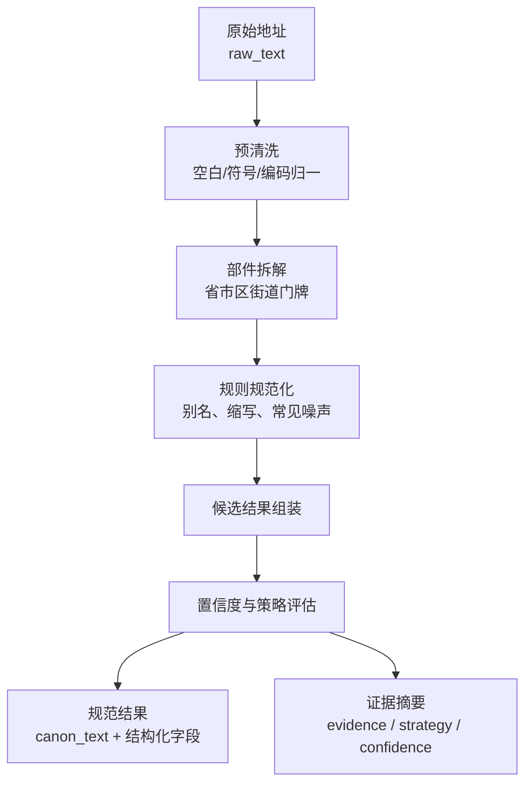

# 地址标准化工艺

> 文档状态：当前有效
> 角色：地址标准化处理工艺说明
> 适用范围：原始地址清洗、部件拆解、规范化结果生成
> 关联文档：
> - `docs/05_数据模型设计/数据处理阶段模型.md`
> - `docs/04_系统组件设计/03_Runtime执行/数据处理引擎.md`

## 1. 工艺目标

地址标准化工艺负责把“原始地址文本”处理成“结构化、可复核、可下游消费的规范结果”。

## 2. 标准化流程图

图说明：这张图只看标准化处理，不把真实性核验、实体治理和多源融合混进来。

## 3. 输入与输出

| 项目 | 说明 |
|---|---|
| 输入 | `governance.raw_record.raw_text` 及其预拆分字段 |
| 输出 | `governance.canonical_record` 中的 `canon_text`、地址部件、`strategy`、`confidence`、`evidence` |

## 4. 关键步骤

### 4.1 预清洗

1. 消除编码噪声、冗余空格和明显非地址字符。
2. 统一常见标点、方向词、楼栋表达。

### 4.2 部件拆解

1. 提取省、市、区、街道、道路、门牌等部件。
2. 对无法唯一拆解的部分保留原文证据，不强行归类。

### 4.3 规则规范化

1. 对行政区、道路、社区、楼栋等常见别名做规则归一。
2. 规则命中必须进入 `evidence`，不能只留下最终字符串。

### 4.4 结果评分

1. `strategy` 表达用了哪类标准化路径。
2. `confidence` 表达标准化结果可信度。
3. 低置信度结果不能伪装成高质量结果，必须为后续审核或核验留出入口。

## 5. 质量门

| 门禁 | 判定方式 | 失败处理 |
|---|---|---|
| 最小字段完整性 | 省市区或道路门牌至少形成一条有效路径 | 进入低置信度或待人工复核 |
| 规则证据完整性 | 命中的规则、字典、策略需进入证据 | 结果无证据则视为不合格 |
| 输出结构完整性 | 结果必须满足 `canon_text + strategy + confidence` | 输出契约校验失败 |

## 6. 与其他工艺的边界

1. 标准化工艺负责“把地址写对、拆对”。
2. 真实性核验工艺负责“判断这个地址是否可信、是否存在”。
3. 空间实体治理工艺负责“围绕地址构建空间实体和关系”。
