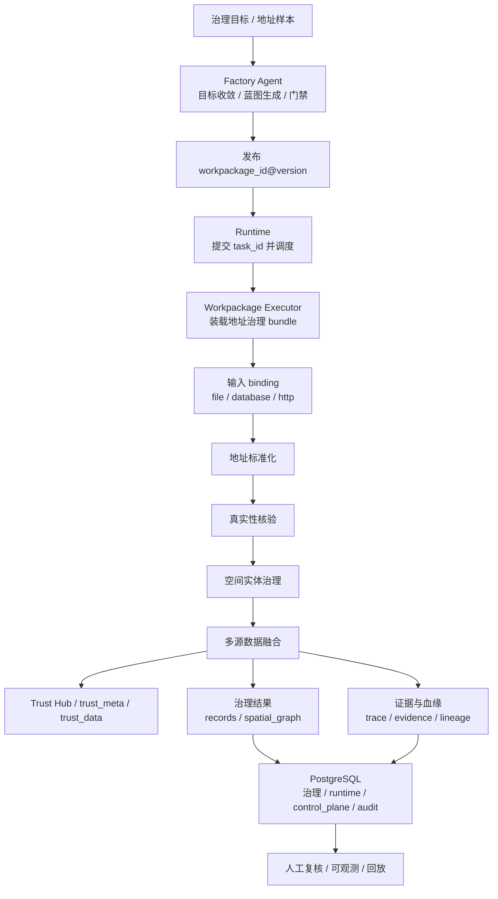

# 地址治理处理架构

> 文档状态：当前有效
> 角色：地址治理样板处理架构
> 使用规则：作为数据处理工艺章节中的正式样板架构，用于说明地址治理如何落到工作包、Runtime、数据库和人工反馈闭环
> 关联文档：
> - `docs/03_数据处理工艺/数据处理总流程.md`
> - `docs/04_系统组件设计/03_Runtime执行/Runtime调度与任务系统.md`
> - `docs/04_系统组件设计/03_Runtime执行/数据处理引擎.md`
> - `docs/05_数据模型设计/数据库分域设计.md`

## 1. 这份文档解决什么问题

它不再讲“MVP 刷新过程”，而是讲当前正式样板：一条地址治理任务如何经过工作包发布、Runtime 执行、可信数据查询、结果落库和人工反馈。

## 2. 地址治理样板架构图

图说明：这张图只看地址治理正式样板链路，重点看“Factory Agent 负责编排，Runtime 负责执行，Trust Hub 提供可信能力，数据库与对象产物负责留痕”。

## 3. 样板链路的七个环节

| 环节 | 核心对象 | 作用 |
|---|---|---|
| 目标收敛 | 目标、约束、蓝图 | 确认这次地址治理到底要做什么 |
| 版本发布 | `workpackage_id@version` | 固化这次执行的工作包版本 |
| 任务创建 | `task_id` | 形成一次具体执行实例 |
| 输入装载 | `input_binding` | 明确输入从哪里读、怎么读 |
| 核心处理 | 标准化、核验、实体治理、融合 | 完成地址治理业务逻辑 |
| 结果写回 | `records / spatial_graph / review hint` | 形成正式治理结果 |
| 证据回写 | `trace_id / evidence_ref / lineage_ref` | 支撑回放、审计和人工判断 |

## 4. 组件职责

### 4.1 Factory Agent

1. 收敛用户目标与约束。
2. 生成并校验地址治理工作包蓝图。
3. 在 `confirm_generate / confirm_dryrun_result / confirm_publish` 三个门禁点等待用户确认。

### 4.2 Runtime / Worker

1. 只按 `workpackage_id@version` 装载 bundle。
2. 推进 `task_id` 对应的 Runtime 状态。
3. 把治理结果、控制状态、证据与审计分层写回。

### 4.3 Trust Hub

1. 提供可信来源索引和样例数据入口。
2. 提供地址核验和来源快照查询能力。
3. 正式查询口径以 `trust_meta.*` 与 `trust_data.*` 为准。

### 4.4 数据与回放层

1. `governance.*` 保存治理结果和审核对象。
2. `runtime.*` 保存发布对象。
3. `control_plane.*` 保存控制状态和执行证据。
4. `audit.*` 保存审计事件。
5. `output/` 保存运行产物、证据文件和回放材料。

## 5. 地址治理最小契约

### 5.1 输入契约

地址治理工作包至少应声明：

1. 原始地址输入
2. 输入绑定模式
3. 处理所需的可信数据或外部能力引用

### 5.2 输出契约

至少应产出：

1. `records`
2. `spatial_graph`
3. `evidence`
4. `lineage`

### 5.3 状态与人工介入契约

1. 低置信度或关键冲突必须进入人工审核或门禁等待。
2. 不允许用 fallback 抹平真实失败。

## 6. 设计边界

1. 地址治理能力优先落在 bundle 内，而不是主线 Worker。
2. Address 样板处理链是正式工艺样板，不等于全系统只支持地址治理。
3. 这份文档解释的是“当前正式样板”，不是某次迭代的增量计划。

## 7. 历史文档如何处理

原增量稿已经归档到：

1. `archive/docs/architecture/地址治理MVP架构刷新-历史参考.md`

如果需要追溯 MVP 阶段的背景、故事拆解或 ADR 命名，可看历史稿；正式实现和新增 Story 默认引用本文件。
