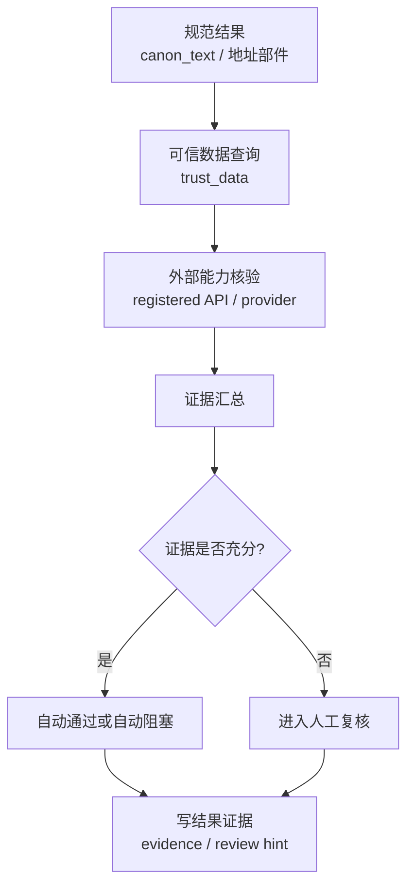

# 地址真实性核验工艺

> 文档状态：当前有效
> 角色：地址真实性与存在性核验工艺说明
> 适用范围：地址存在性、来源一致性、可信证据补强
> 关联文档：
> - `docs/05_数据模型设计/数据库跨界约束.md`
> - `docs/04_系统组件设计/02_工作包协议/工作包协议与IO绑定.md`

## 1. 工艺目标

真实性核验不是再次做标准化，而是回答：

1. 这个地址是否可能真实存在。
2. 它与可信来源的匹配程度如何。
3. 当前证据是否足以自动通过，还是应该进入人工复核。

## 2. 核验流程图

图说明：这张图强调“证据核验链”，从规范结果出发，经过可信数据查询和外部能力校验，最终得到真实性结论。

## 3. 证据来源

当前正式允许的证据来源包括：

1. `trust_data.admin_division`
2. `trust_data.road_index`
3. `trust_data.poi_index`
4. 注册的外部核验 API

明确禁止：

1. 直接从 `trust_db.*` 读取并把它写成正式来源
2. 用页面缓存或脚本临时文件冒充核验证据

## 4. 真实性判断维度

| 维度 | 说明 |
|---|---|
| 行政区一致性 | 行政区层级是否自洽 |
| 道路存在性 | 道路、街道、社区等是否有可信索引支撑 |
| 门牌合理性 | 门牌、楼栋、单元表达是否符合常见模式 |
| 来源一致性 | 多个来源是否给出一致或可解释的结果 |
| 外部核验结果 | Provider 返回是否支持存在性结论 |

## 5. 输出约束

真实性核验输出不应自创新的主结果表，而应通过以下方式回流：

1. 进入 `canonical_record.evidence`
2. 触发 `review` 提示或人工复核队列
3. 进入观测与审计链路

## 6. 失败与阻塞

1. 核验失败必须区分“证据否定”和“证据不足”。
2. “证据否定”可直接形成阻塞或失败结论。
3. “证据不足”应优先进入人工复核，而不是伪造成功。
