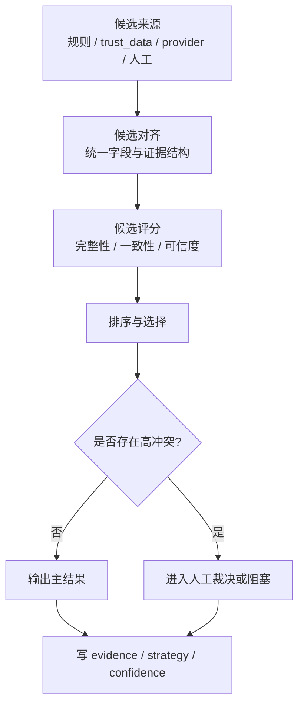

# 多源数据融合工艺

> 文档状态：当前有效
> 角色：多源数据融合与冲突消解工艺说明
> 适用范围：可信数据、外部能力结果、规则结果与人工结论融合
> 关联文档：
> - `docs/03_数据处理工艺/地址真实性核验工艺.md`
> - `docs/05_数据模型设计/核心表结构设计.md`

## 1. 工艺目标

多源数据融合不是简单拼接结果，而是回答：

1. 多个来源同时给出候选结果时，最终采用哪一个。
2. 来源冲突时如何保留证据和解释。
3. 哪些冲突必须进入人工裁决。

## 2. 融合流程图

图说明：这张图展示多源候选如何被对齐、评分、排序和裁决。

## 3. 融合维度

| 维度 | 说明 |
|---|---|
| 来源可信度 | 来源本身的权威性和稳定性 |
| 字段完整性 | 候选结果是否覆盖关键字段 |
| 结果一致性 | 与其他候选是否一致或可解释 |
| 新鲜度 | 是否来自当前激活快照或近期核验 |
| 人工优先级 | 若存在人工确认，应高于自动候选 |

## 4. 冲突处理规则

1. 高可信来源与低可信来源冲突时，不得简单平均，必须保留来源解释。
2. 自动结果与人工结果冲突时，人工结果优先，但要保留冲突证据。
3. 无法解释的重大冲突应进入 `review` 或门禁阻塞，而不是静默选边。

## 5. 输出要求

融合后的结果至少要保留：

1. 最终选择结果
2. 选择理由
3. 被放弃候选的摘要
4. 冲突说明

这些信息应通过 `strategy / confidence / evidence` 表达，而不是藏在日志文本里。
