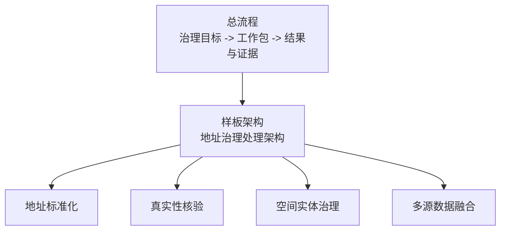

# 工艺索引

> 文档状态：当前有效
> 角色：`03_数据处理工艺/` 目录导航
> 适用范围：帮助读者按“总流程 -> 样板架构 -> 核心工艺”阅读数据处理设计
> 关联文档：
> - `docs/02_总体架构/系统总览.md`
> - `docs/04_系统组件设计/03_Runtime执行/数据处理引擎.md`

## 1. 这一章怎么读

`03_数据处理工艺/` 现在按三层组织，不再把“总流程、样板架构、阶段性增量稿”混在一起：

1. 总流程
   - [数据处理总流程](数据处理总流程.md)
2. 样板架构
   - [地址治理处理架构](地址治理处理架构.md)
3. 核心工艺
   - [地址标准化工艺](地址标准化工艺.md)
   - [地址真实性核验工艺](地址真实性核验工艺.md)
   - [空间实体治理工艺](空间实体治理工艺.md)
   - [多源数据融合工艺](多源数据融合工艺.md)

## 2. 工艺阅读结构图

图说明：这张图表达本章新的组织方式，先看总流程，再看样板架构，最后看四类核心工艺如何在执行链上展开。

## 3. 为什么要这样重组

重组前的问题是：

1. 样板架构文档还是阶段性 MVP 刷新稿，不适合作为正式工艺设计基线。
2. 读者很难分清“总流程”和“地址治理专题样板”。
3. 具体工艺和 Runtime 执行框架之间没有明确衔接点。

重组后：

1. 《数据处理总流程》只讲闭环。
2. 《地址治理处理架构》只讲地址治理样板如何落到工作包与 Runtime。
3. 四份工艺文档各自只讲本工艺负责的部分。

## 4. 使用规则

1. 如果你在做总体设计，先看《数据处理总流程》。
2. 如果你在做地址治理样板链路，优先看《地址治理处理架构》。
3. 如果你在做某一环节规则或测试，再进入具体工艺文档。
4. 历史增量稿已经归档到：
   - `archive/docs/architecture/地址治理MVP架构刷新-历史参考.md`
