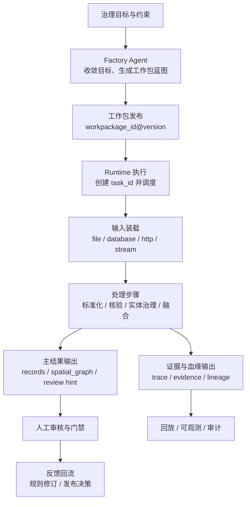

# 数据处理总流程

> 文档状态：当前有效
> 角色：数据处理闭环总流程
> 适用范围：从治理目标进入工作包执行，再到结果、证据、人工反馈的全流程
> 关联文档：
> - `docs/03_数据处理工艺/工艺索引.md`
> - `docs/02_总体架构/系统技术上下文与基础设施.md`
> - `docs/04_系统组件设计/03_Runtime执行/数据处理引擎.md`
> - `docs/04_系统组件设计/03_Runtime执行/数据血缘与可追溯设计.md`
> - `docs/05_数据模型设计/数据处理阶段模型.md`

## 1. 这份文档回答什么

这份文档不讨论某个具体算法，而是回答“数据治理任务如何从目标走到结果、证据和人工反馈闭环”。

## 2. 总流程图

图说明：这张图按正式主链展开，重点看目标收敛、工作包执行、结果回写、血缘留痕和人工反馈如何形成闭环。

## 3. 五个阶段

| 阶段 | 主输入 | 主输出 | 关键责任方 |
|---|---|---|---|
| 目标收敛 | 用户目标、约束、能力快照 | 工作包蓝图 | Factory Agent |
| 版本发布 | 蓝图、bundle 工件 | `workpackage_id@version` | Factory Agent / Runtime 发布域 |
| 任务执行 | 发布版本、执行模式、输入引用 | `task_id`、Runtime 状态 | Runtime Orchestrator |
| 数据处理 | 输入 binding、可信数据、脚本 | 规范结果、图谱结果、证据 | Worker / Bundle |
| 审核反馈 | 低置信度结果、阻塞票据、执行证据 | 复核结论、规则修订、发布门禁 | 审核与门禁系统 |

## 4. 流程里的四类正式对象

1. 工作包对象
   - `workpackage_id@version`
2. 执行对象
   - `task_id`
3. 业务结果对象
   - `records / spatial_graph / review`
4. 证据与血缘对象
   - `trace_id / evidence_ref / lineage_ref / audit_event`

没有这四类对象分层，数据处理流程就无法做到真正的追溯与回放。

## 5. 流程里的正式输入输出类型

### 5.1 当前正式输入类型

1. `file`
   - 典型载体：`csv / json / jsonl / parquet`
2. `database`
   - 典型载体：PostgreSQL 中的批次表或受控查询结果
3. 可信数据标准查询
   - 典型载体：`trust_data.*` 查询结果
4. 已登记 HTTP 能力
   - 典型载体：来自 `capability_registry` 的受控能力调用

`http / kafka / stream` 仍然是受控扩展位，只有在工作包 binding 和正式执行适配器都准备好时，才可作为当前主链路输入。

### 5.2 当前正式输出类型

1. 治理结果输出
   - 回到 `governance.*`
2. 运行控制与证据索引
   - 回到 `runtime.* / control_plane.* / audit.*`
3. 证据与回放产物
   - 回到 `output/` 或兼容对象存储
4. 可信数据管理输出
   - 仅可信数据管理链路可写 `trust_meta.* / trust_data.*`

## 6. 四类控制点

### 6.1 输入控制

1. 输入必须先经过 binding 对齐。
2. 输入协议、格式和最小字段集必须由工作包 Schema 声明。

### 6.2 处理控制

1. 每个步骤都必须明确自己读什么、写什么。
2. 外部能力调用必须留下来源快照和证据引用。

### 6.3 结果控制

1. 主结果与证据必须分开输出。
2. 低置信度、冲突结果和关键失败必须进入人工反馈链。

### 6.4 门禁控制

1. `confirm_generate` 解决是否允许进入执行准备。
2. `confirm_dryrun_result` 解决试运行结果是否可接受。
3. `confirm_publish` 解决是否允许进入正式发布。

## 7. 与样板架构和具体工艺的关系

1. 《数据处理总流程》只讲全局闭环。
2. 《地址治理处理架构》解释地址治理样板如何把这条闭环落到具体工作包与 Runtime。
3. 四份具体工艺文档解释标准化、核验、实体治理、融合分别做什么。

## 8. 工业化要求

1. 结果、状态、证据、审计、血缘必须分层留存。
2. 任一任务都要能按 `task_id`、`trace_id`、`workpackage_id@version` 回放。
3. 人工审核不是补丁流程，而是主链路里的正式阶段。
