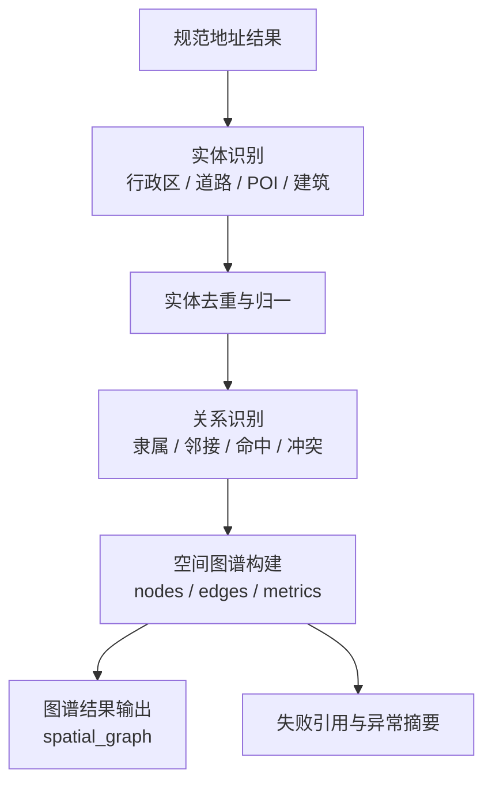

# 空间实体治理工艺

> 文档状态：当前有效
> 角色：空间实体提取与关系治理工艺说明
> 适用范围：实体识别、空间关系组装、图谱结果生成
> 关联文档：
> - `docs/04_系统组件设计/03_Runtime执行/数据处理引擎.md`
> - `docs/04_系统组件设计/02_工作包协议/工作包协议案例：地址治理.md`

## 1. 工艺目标

空间实体治理工艺负责把规范地址结果进一步转成可分析的空间实体与关系结果。

## 2. 实体治理流程图

图说明：这张图从规范地址结果开始，逐步形成实体、关系和空间图谱摘要。

## 3. 核心对象

| 对象 | 作用 |
|---|---|
| 实体 | 表示行政区、道路、建筑、POI 等基础对象 |
| 关系 | 表示归属、邻接、命中、冲突等连接 |
| 图谱摘要 | 表示节点数、边数、构建状态和失败引用 |

## 4. 关键规则

1. 实体标识必须稳定，不能因为一次执行顺序不同就完全变化。
2. 实体和关系的构建失败必须进入 `failed_row_refs` 或对应异常摘要。
3. 图谱结果是结果层产物，不应反向替代主业务结果表。

## 5. 输出约束

当前空间实体治理结果的正式输出形式包括：

1. 工作包输出中的 `spatial_graph`
2. 运行证据中的图谱摘要
3. 观测指标中的图谱构建状态

## 6. 与下游消费的关系

1. 页面和回放系统可以展示图谱摘要。
2. 业务主结果仍以 `records` 与审核结果为主，不应让图谱结果吞掉主治理结果语义。
