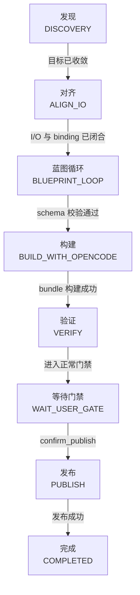
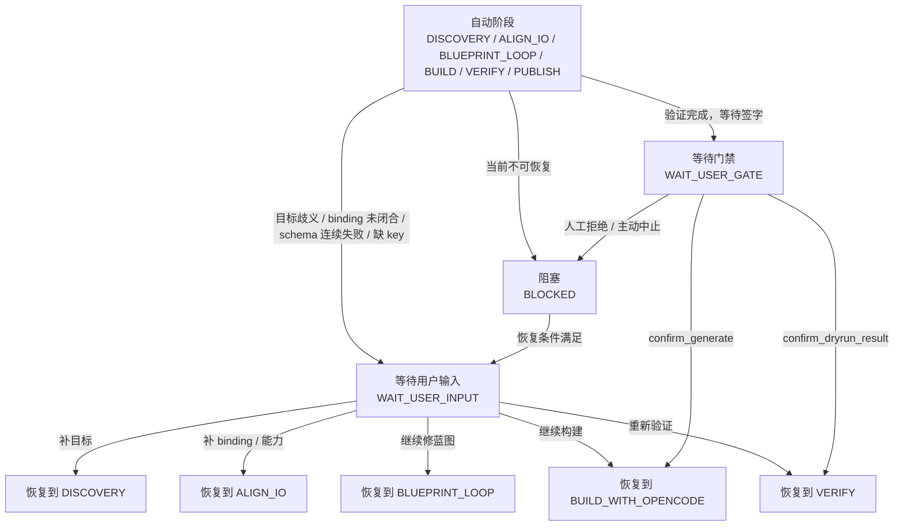
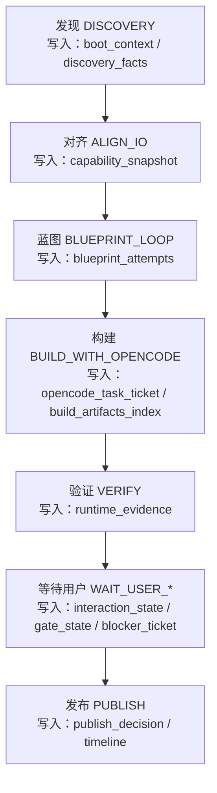

# 工厂Agent状态机

> 文档状态：当前有效
> 角色：Factory Agent / Nanobot 的完整状态机设计
> 适用范围：目标对齐、蓝图生成、工作包构建、dryrun、发布门禁
> 关联文档：
> - `docs/04_系统组件设计/01_工厂Agent编排/工厂Agent编排系统.md`
> - `docs/04_系统组件设计/01_工厂Agent编排/编排记忆与恢复设计.md`

## 1. 状态机要解决什么问题

这套状态机不是“审核流”，而是完整编排流。它解决三件事：

1. 什么情况下系统可以自动推进。
2. 什么情况下必须让用户介入。
3. 用户介入完成后从哪里恢复。

## 2. 状态集合

### 2.1 自动推进状态

1. `DISCOVERY`：目标发现。
2. `ALIGN_IO`：输入输出与 binding 对齐。
3. `BLUEPRINT_LOOP`：蓝图生成与 schema 校验。
4. `BUILD_WITH_OPENCODE`：bundle 构建。
5. `VERIFY`：dryrun 验证。
6. `PUBLISH`：发布动作。

### 2.2 用户介入状态

1. `WAIT_USER_INPUT`
   - 等用户补信息、补 key、补依赖、做技术裁决。
2. `WAIT_USER_GATE`
   - 等用户做正常门禁确认，例如 `confirm_generate`、`confirm_publish`。

### 2.3 异常与结束状态

1. `BLOCKED`
   - 当前不可继续，且恢复条件未满足。
2. `COMPLETED`
   - 本轮编排闭环已完成。

## 3. 为什么必须区分两种“用户介入”

| 状态 | 中文含义 | English 含义 | 典型场景 |
|---|---|---|---|
| `WAIT_USER_INPUT` | 等用户补条件 | waiting for user input | 缺 API key、目标歧义、binding 未闭合 |
| `WAIT_USER_GATE` | 等用户签字确认 | waiting for user gate | dryrun 已完成，等待确认发布 |

如果把两者混成一个状态，系统就无法区分：

1. 这是“问题尚未解完”。
2. 还是“问题已经解完，只差合规确认”。

## 4. 状态机拆解图

### 4.1 主推进链路

图说明：先看正常主链路。把自动推进和正常门禁单独画出来，避免一张图里塞满所有回跳关系。

### 4.2 异常、人工介入与恢复

图说明：再看异常链路。这里单独表达“为什么停、停到哪里、从哪里恢复”，不和主链路混画。

## 5. 阶段与记忆对象写入关系

图说明：这张图不再画成“双栏跨线图”，而是直接把“阶段”和“主要写入对象”放进同一个节点里，保证页面宽度内可读。

## 6. 典型跳转矩阵

| 当前阶段 | 触发条件 | 跳转到 | 原因码 | 默认上限 | 恢复点 |
|---|---|---|---|---|---|
| `DISCOVERY` | 目标歧义 | `WAIT_USER_INPUT` | `USER_GOAL_AMBIGUOUS` | 0 | `DISCOVERY` |
| `ALIGN_IO` | binding 未定 | `WAIT_USER_INPUT` | `IO_BINDING_UNRESOLVED` | 0 | `ALIGN_IO` |
| `BLUEPRINT_LOOP` | schema 连续失败 | `WAIT_USER_INPUT` | `SCHEMA_INVALID` | 3 | `BLUEPRINT_LOOP` |
| `BUILD_WITH_OPENCODE` | 缺 key / 缺依赖 / 缺能力 | `WAIT_USER_INPUT` | `API_AUTH_MISSING` / `DEPENDENCY_MISSING` / `CAPABILITY_GAP` | 1 | `ALIGN_IO` 或 `BUILD_WITH_OPENCODE` |
| `VERIFY` | dryrun 失败 | `WAIT_USER_INPUT` 或 `BLOCKED` | `RUNTIME_FAIL` | 1 | `VERIFY` |
| 任意自动阶段 | 进入人工门禁 | `WAIT_USER_GATE` | `GATE_CONFIRM_REQUIRED` | 0 | 原阶段下一步 |

## 7. 三个关键状态对象

### 7.1 `interaction_state`

用于表达“当前正处于什么状态”：

1. `current_stage`
2. `status`
3. `reason_code`
4. `retry_count`
5. `max_retry`
6. `resume_from_stage`
7. `next_action`

### 7.2 `blocker_ticket`

用于表达“为什么不能继续”：

1. 阻塞摘要 `summary`
2. 对目标的影响 `impact`
3. 用户动作 `user_actions`
4. 恢复条件 `resume_condition`
5. 恢复点 `resume_from_stage`

### 7.3 `gate_state`

用于表达“是否只是等待签字”：

1. 当前 gate 名称
2. `confirm_generate`
3. `confirm_dryrun_result`
4. `confirm_publish`

## 8. 设计原则

1. 不能把“缺信息”和“等签字”混在一个状态里。
2. 不能把“当前不可恢复”伪装成普通等待。
3. 每一次跳转都必须落在结构化记忆对象中。
4. 恢复点必须显式写出，不能靠人工回忆上下文。
5. 自动重试与人工介入的分界必须写成状态规则，而不是藏在提示词里。
6. 文档、Schema、实现三处的状态集合必须保持一致。

## 9. 用户求助消息模板

当进入 `WAIT_USER_INPUT` 时，Factory Agent 应输出标准化求助消息：

1. 当前阶段：例如 `ALIGN_IO`
2. 原因码：例如 `IO_BINDING_UNRESOLVED`
3. 问题摘要：一句话描述当前无法继续的原因
4. 影响：阻断了哪个目标
5. 你需要做：
   - 最多 2 个动作
6. 恢复条件：什么条件满足后可继续
7. 恢复位置：将从哪个阶段继续

## 10. 工程化结论

后续实现与评审必须按以下口径收敛：

1. `WAIT_USER_INPUT` 与 `WAIT_USER_GATE` 必须分开建模。
2. `interaction_state`、`blocker_ticket`、`gate_state` 必须作为结构化状态来源。
3. `timeline` 必须记录进入等待、恢复执行两个关键时点。
4. 自动重试上限必须写入记忆对象，不能只存在于提示词或代码默认值中。
