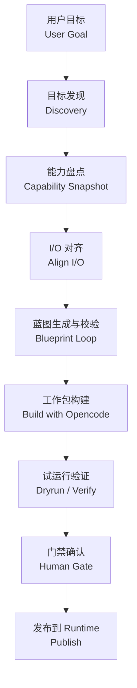
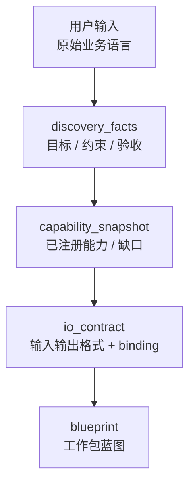
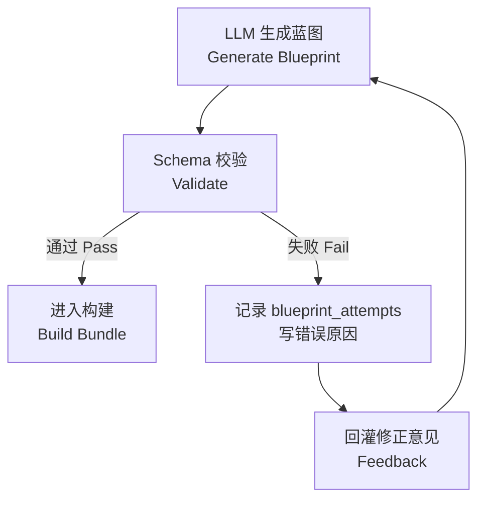
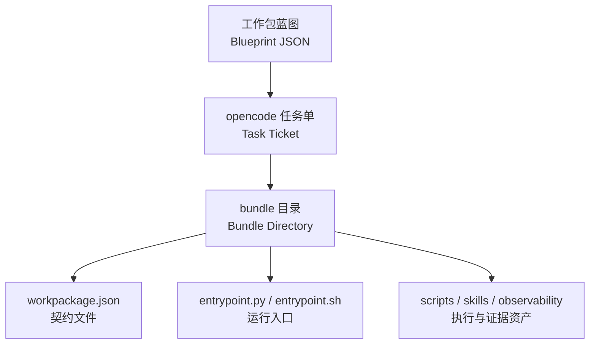

# 工厂Agent编排系统

> 文档状态：当前有效
> 角色：Factory Agent 编排总设计
> 适用范围：目标对齐、蓝图生成、工作包构建、dryrun、发布门禁
> 关联文档：
> - `docs/04_系统组件设计/01_工厂Agent编排/工厂Agent状态机.md`
> - `docs/04_系统组件设计/01_工厂Agent编排/编排记忆与恢复设计.md`
> - `docs/04_系统组件设计/02_工作包协议/工作包协议与IO绑定.md`
> - `docs/04_系统组件设计/03_Runtime执行/Agent与Runtime交接契约.md`

## 1. 这份文档回答什么

这份文档聚焦一个问题：Factory Agent 到底如何把“用户想法”收敛成“可执行工作包”。

它不讨论下游算法细节，而是讨论上游编排闭环：

1. 如何收目标。
2. 如何约束 LLM。
3. 如何判断可以进入生成。
4. 如何把蓝图变成 bundle。
5. 如何把 dryrun、人工确认、发布串成一条主链路。

## 2. Factory Agent 的职责边界

### 2.1 Factory Agent 负责什么

1. 接收用户目标、约束、验收要求。
2. 注入启动契约 `boot_context`。
3. 查询能力目录和可信来源快照。
4. 驱动 LLM 生成符合 `workpackage_schema.v1` 的蓝图。
5. 校验蓝图并回灌修正意见。
6. 下发 `opencode` 构建任务，形成 bundle 工件。
7. 组织 `dryrun -> gate -> publish` 的门禁流程。

### 2.2 Factory Agent 不负责什么

1. 不直接执行下游治理算法。
2. 不在 worker 主链路里写业务分支。
3. 不绕过 `workpackage_id@version` 去直调运行时代码。
4. 不用 mock / fallback 伪造链路成功。

## 3. 编排闭环总图

图说明：这张图按“目标收敛 -> 蓝图生成 -> 构建 -> 验证 -> 发布”展开，重点是每一步的编排产物，而不是代码调用细节。



## 4. 编排过程如何约束 LLM

Factory Agent 不是把一段自然语言直接扔给 LLM 就结束，而是先注入一组硬约束，再让 LLM 在约束内生成：

1. `role_contract`
   - 告诉 LLM 当前角色是编排者，不是执行器。
2. `boundary_contract`
   - 告诉 LLM 上游是 `nanobot <-> opencode`，下游是 `worker executes workpackage_id@version entrypoint`。
3. `schema_contract`
   - 告诉 LLM 输出必须符合 `workpackage_schema.v1`。
4. `capability_contract`
   - 告诉 LLM 可用 API 和能力来自 Trust Hub，而不是凭空假设。
5. `acceptance_contract`
   - 告诉 LLM 哪些阶段必须等待人工确认。

如果没有这层约束，LLM 往往能“写出方案”，但写不出“可执行工作包”。

## 5. 目标对齐不是一次问答，而是一轮结构化收敛

### 5.1 目标收敛图

图说明：用户语言先被收敛成结构化事实，再进入蓝图生成；这一步决定后面能否稳定生成可运行脚本。



### 5.2 进入蓝图生成前必须满足的条件

1. 目标已经能映射成唯一工作包目标。
2. 输入输出格式已经闭合。
3. 输入输出绑定 `binding` 已经闭合。
4. 关键依赖、API key、能力缺口已经明确。

如果这四项有一项不成立，Factory Agent 应该进入 `WAIT_USER_INPUT`，而不是继续让 LLM“猜”。

## 6. 蓝图不是一次生成成功，而是“生成-校验-回灌”循环

图说明：真正稳定的不是 LLM 本身，而是 Factory Agent 对它施加的 schema 校验循环。



这一步的核心不是“让 LLM 更聪明”，而是：

1. 让错误结构化。
2. 让失败可累计。
3. 让相同错误达到上限时转人工介入。

## 7. 工作包生成体系

### 7.1 目录结构图

图说明：下面不是仓库全目录，而是 Factory Agent 生成工作包时依赖的正式协议资产。

```text
workpackage_schema/
├── registry.json                               # 协议入口与当前版本索引
├── schemas/v1/
│   ├── workpackage_schema.v1.schema.json       # 工作包主契约（定义结构）
│   └── orchestration_context.v1.schema.json    # 编排记忆契约（定义恢复）
├── examples/v1/
│   ├── address_batch_governance.workpackage_schema.v1.json   # 地址治理示例
│   └── nanobot_orchestration_memory.v1.json                  # 编排记忆示例
└── templates/v1/
    ├── workpackage_bundle.README.v1.md         # README 模板
    └── workpackage_bundle.structure.v1.md      # 目录结构模板
```

### 7.2 生成产物图

图说明：Factory Agent 最终不是产出一段脚本，而是产出一个完整工作包 bundle。



### 7.3 为什么 `I/O binding` 是关键

只有 `input_schema / output_schema`，脚本生成器只知道“数据长什么样”；  
增加 `input_bindings / output_bindings` 之后，脚本生成器才能进一步知道：

1. 去哪里读。
2. 用什么协议读。
3. 往哪里写。
4. 用什么协议写。
5. 哪个步骤、哪个脚本负责读写。

这正是“能描述蓝图”和“能生成可运行脚本”之间的差别。

## 8. 工厂 Agent 与 Runtime 的分工

| 主题 | Factory Agent | Runtime / Worker |
|---|---|---|
| 目标收敛 | 负责 | 不负责 |
| 蓝图生成 | 负责 | 不负责 |
| Schema 校验 | 负责 | 不负责 |
| Bundle 构建 | 负责驱动 | 不负责决策 |
| Dryrun 触发 | 负责发起 | 负责执行 |
| 发布 | 负责门禁和发布动作 | 负责消费发布后的工作包 |
| 算法执行 | 不负责 | 负责按入口执行 |

## 9. 为什么不能把它简化成“对话代理”

如果把 Factory Agent 理解成一个普通聊天式 LLM 代理，会丢掉四个关键工程要素：

1. 它要管理协议，而不是只生成文本。
2. 它要管理门禁，而不是只输出建议。
3. 它要管理构建工件，而不是只回答问题。
4. 它要管理恢复点，而不是一次性成功或失败。

因此它更像“有状态的工作包编排器”，而不是“会聊天的代码生成器”。

## 10. 继续深入读什么

1. 看 [工厂Agent状态机](工厂Agent状态机.md)，了解各阶段如何跳转。
2. 看 [编排记忆与恢复设计](编排记忆与恢复设计.md)，了解记忆对象如何支撑恢复。
3. 看 [工作包Schema设计](../02_工作包协议/工作包Schema设计.md)，了解工作包蓝图的正式结构。
4. 看 [工作包协议与IO绑定](../02_工作包协议/工作包协议与IO绑定.md)，了解协议如何支撑脚本生成。
5. 看 [工作包协议案例：地址治理](../02_工作包协议/工作包协议案例：地址治理.md)，了解一个具体实例如何落地。
6. 看 [Agent与Runtime交接契约](../03_Runtime执行/Agent与Runtime交接契约.md)，理解上游蓝图和下游执行是如何正式交接的。
7. `workpackage_schema/templates/v1/workpackage_bundle.README.v1.md`
8. `workpackage_schema/templates/v1/workpackage_bundle.structure.v1.md`

## 11. 工程推进建议

建议按以下顺序推进：

1. 以当前 `v1` 作为唯一正式协议继续收敛。
2. 生成器优先实现 `file`、`database` 两类 binding。
3. Factory Agent 的用户求助消息模板、恢复提示模板再做一轮协议化。
4. 后续再扩展 `http`、`kafka`、`stream` binding 的脚本骨架。
