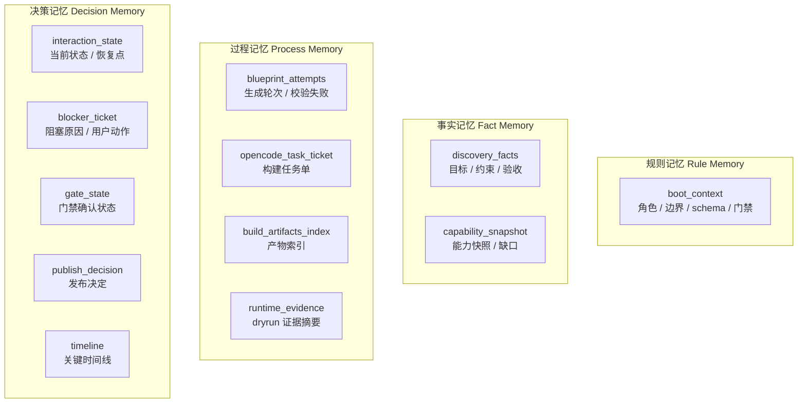
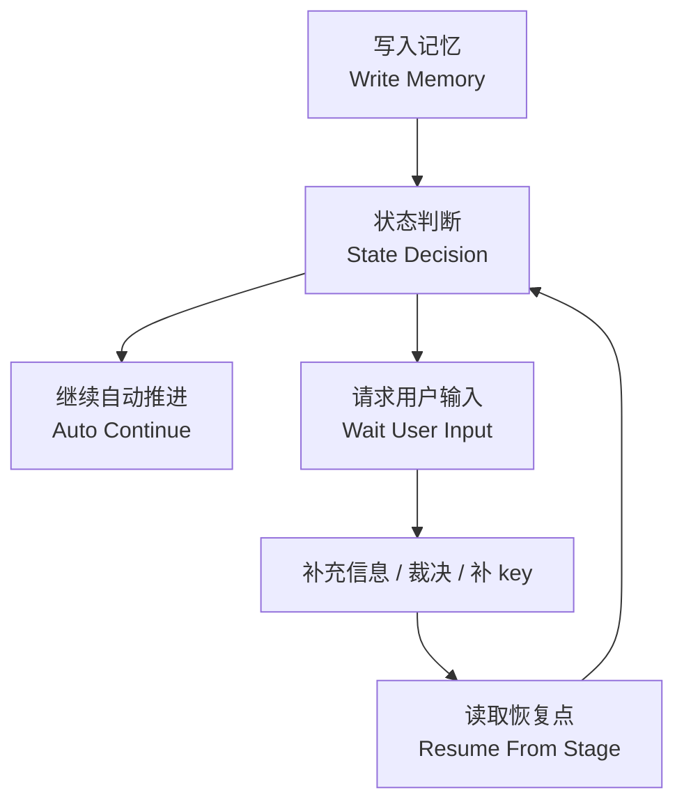
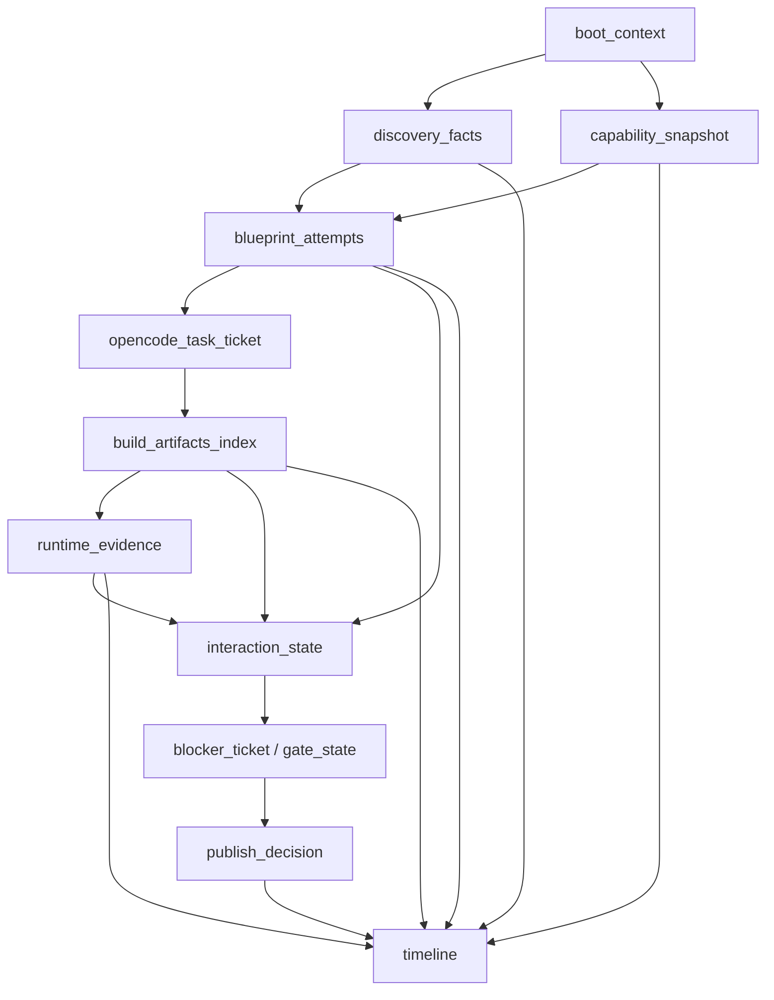

# 编排记忆与恢复设计

> 文档状态：当前有效
> 角色：Factory Agent 的结构化记忆设计
> 适用范围：会话记忆、轮次记忆、阻塞恢复、人工接管、证据回放
> 关联文档：
> - `docs/04_系统组件设计/01_工厂Agent编排/工厂Agent状态机.md`
> - `workpackage_schema/schemas/v1/orchestration_context.v1.schema.json`
> - `workpackage_schema/examples/v1/nanobot_orchestration_memory.v1.json`

## 1. 这里说的“记忆”到底是什么

这里的记忆不是聊天记录，也不是 LLM 的上下文窗口，而是 **Factory Agent 的结构化工作记忆**。

它要解决的问题是：

1. 当前会话已经确认了什么。
2. 当前能力环境是什么。
3. 蓝图失败过几轮、错在哪里。
4. 为什么进入等待用户输入。
5. 用户补完信息后从哪里恢复。

如果没有这层记忆，系统每一轮都像重新开始，无法稳定进入工程化闭环。

## 2. 记忆分层图

图说明：这张图把记忆拆成“规则记忆、事实记忆、过程记忆、决策记忆”四层，便于理解它不是一堆零散 JSON 字段。



## 3. 记忆对象树

图说明：这不是所有字段明细，而是当前正式记忆协议的主干树。它直接对应 `nanobot_orchestration_memory.v1.json` 的结构。

```text
orchestration_context.v1
├── boot_context
│   ├── role_contract
│   ├── boundary_contract
│   ├── schema_contract
│   ├── capability_contract
│   └── acceptance_contract
├── discovery_facts
├── capability_snapshot
├── blueprint_attempts[]
├── opencode_task_ticket
├── build_artifacts_index
├── interaction_state
├── blocker_ticket
├── gate_state
├── runtime_evidence
├── publish_decision
└── timeline[]
```

## 4. 关键记忆对象表

| 记忆对象 | 类型 | 什么时候写入 | 主要用途 |
|---|---|---|---|
| `boot_context` | 规则记忆 | 会话开始 | 固定编排规则，不随轮次变化 |
| `discovery_facts` | 事实记忆 | 目标发现阶段 | 收敛用户目标、范围、限制 |
| `capability_snapshot` | 事实记忆 | 能力盘点阶段 | 固定“当时可用能力” |
| `blueprint_attempts` | 过程记忆 | 蓝图循环阶段 | 记录每轮生成、失败原因、修正结果 |
| `opencode_task_ticket` | 过程记忆 | 进入构建前 | 固定发给构建器的任务单 |
| `build_artifacts_index` | 过程记忆 | 构建成功后 | 记录 bundle 产物路径、版本、摘要 |
| `runtime_evidence` | 过程记忆 | dryrun 后 | 记录证据摘要、回执、结果统计 |
| `interaction_state` | 决策记忆 | 任意状态跳转时 | 告诉系统当前在哪、为什么停、从哪恢复 |
| `blocker_ticket` | 决策记忆 | 遇到阻塞时 | 把“要求用户做什么”说清楚 |
| `gate_state` | 决策记忆 | 等待门禁时 | 区分“等输入”与“等签字” |
| `publish_decision` | 决策记忆 | 发布时 | 记录最终确认人与决定 |
| `timeline` | 决策记忆 | 全程追加 | 形成可追踪的事件时间线 |

## 5. 一次真实阻塞时，记忆里到底存了什么

下面这组字段来自当前正式示例 `nanobot_orchestration_memory.v1.json`，能直接看出“记忆”不是抽象概念，而是恢复系统所需的实际对象：

| 记忆对象 | 示例值 | 说明 |
|---|---|---|
| `discovery_facts.goal_text` | `创建地址治理工作包并完成发布` | 当前会话的目标 |
| `capability_snapshot.apis[0].interface_id` | `address_standardize` | 当时可用能力快照 |
| `blueprint_attempts[0].status` | `schema_invalid` | 第一轮蓝图失败 |
| `blueprint_attempts[1].status` | `success` | 第二轮蓝图成功 |
| `interaction_state.status` | `waiting_user_input` | 当前状态不是继续执行，而是等待用户 |
| `interaction_state.resume_from_stage` | `ALIGN_IO` | 满足条件后从哪里继续 |
| `blocker_ticket.code` | `API_AUTH_MISSING` | 当前阻塞原因码 |
| `blocker_ticket.user_actions[0]` | `提供 SPATIAL_GRAPH_API_KEY` | 用户必须做的动作 |
| `timeline[-1].stage` | `WAIT_USER_INPUT` | 最近一次关键事件 |

这一节是记忆设计的关键。  
只有当这些对象被结构化保留下来，系统才能真正实现：

1. 暂停
2. 恢复
3. 人工接管
4. 证据回放

## 6. 记忆写入与读取闭环

图说明：记忆不是只写不读。Factory Agent 会在每个阶段写入记忆，并在下一个阶段读取它，直到发生阻塞或恢复。



## 7. 记忆为什么能支撑恢复

### 7.1 恢复不靠“重新理解对话”

恢复依赖的不是重新喂一遍聊天上下文，而是三类关键记忆：

1. `interaction_state`
   - 当前停在什么状态。
2. `blocker_ticket`
   - 为什么停，用户要做什么。
3. `resume_from_stage`
   - 满足条件后应从哪里继续。

### 7.2 典型恢复链路

1. 蓝图阶段连续三轮 schema 失败。
2. `interaction_state.status = waiting_user_input`
3. `blocker_ticket.code = SCHEMA_INVALID`
4. 用户确认缩小范围。
5. 系统读取 `resume_from_stage = BLUEPRINT_LOOP`
6. 从蓝图循环而不是从发现阶段重新开始。

## 8. 记忆对象关系图

图说明：这张图表达的是“谁依赖谁”，不是时序图。它能看出哪些对象是基础上下文，哪些对象是后续决策和恢复的依据。



## 9. 哪些对象最容易被误解

### 9.1 `timeline`

它不是完整业务数据，而是索引层。  
它回答的是“什么时候发生了什么”，方便回放和人工排查。

### 9.2 `blueprint_attempts`

它不是普通日志，而是生成过程的纠错记忆。  
没有它，LLM 下一轮容易重复犯同一个错误。

### 9.3 `blocker_ticket`

它不是报错字符串，而是标准化的人机协作票据。  
它必须明确：

1. 问题是什么。
2. 影响是什么。
3. 用户需要做什么。
4. 满足什么条件后系统继续。

## 10. 失败升级模板为什么是记忆设计的一部分

用户介入如果只是自由文本，会带来两个问题：

1. 系统下一轮不知道用户到底补了什么。
2. 人工接手时无法稳定判断是否满足恢复条件。

所以“失败升级模板”必须结构化地落在 `blocker_ticket` 中，而不是只发一段提示语。

## 11. 当前协议口径

当前结构化记忆字段由以下协议约束：

1. `workpackage_schema/schemas/v1/orchestration_context.v1.schema.json`
2. `workpackage_schema/examples/v1/nanobot_orchestration_memory.v1.json`

这意味着记忆已经不是文档约定，而是正式 schema 的一部分。
