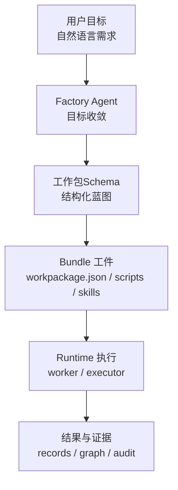
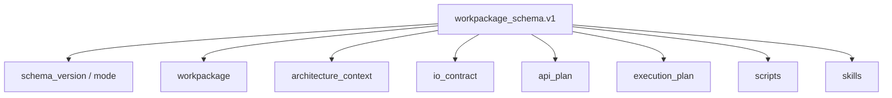

# 工作包Schema设计

> 文档状态：当前有效
> 角色：`workpackage_schema.v1` 的正式设计章节
> 适用范围：工作包蓝图、Schema 评审、生成器、Runtime 消费边界
> 关联文档：
> - `docs/04_系统组件设计/02_工作包协议/工作包协议与IO绑定.md`
> - `docs/04_系统组件设计/02_工作包协议/工作包协议案例：地址治理.md`
> - `docs/04_系统组件设计/01_工厂Agent编排/工厂Agent编排系统.md`
> - `workpackage_schema/schemas/v1/workpackage_schema.v1.schema.json`

## 1. 这份文档解决什么问题

之前文档里一直在讲：

1. 工作包
2. 蓝图
3. I/O binding
4. scripts / steps / skills

但没有单独把 `workpackage_schema.v1` 作为正式设计对象讲清楚。  
这份文档就是专门解决这个问题的。

一句话定义：

`workpackage_schema.v1` 是工作包蓝图的正式结构化契约，用来把“用户目标”翻译成“可校验、可构建、可发布、可执行”的工作包定义。

## 2. Schema 在整条链路里的位置

图说明：这张图表达的是 Schema 在系统里的位置。它既不等于用户需求，也不等于最终 bundle，而是处在中间的正式契约层。



## 3. Schema 设计目标

这套 Schema 至少要同时满足四个目标：

1. 给 LLM 一个受控输出格式
2. 给生成器一个可直接消费的结构
3. 给评审一个可校验的边界对象
4. 给 Runtime 一个明确的工作包执行契约

如果只满足其中一个，它都不够用。

## 4. 顶层结构图

图说明：这张图展示 `workpackage_schema.v1` 的顶层骨架，也就是这份 Schema 到底由哪些部分组成。



## 5. 各顶层对象分别负责什么

| 顶层对象 | 作用 | 回答的问题 |
|---|---|---|
| `schema_version` | 协议版本 | 当前遵循哪版协议 |
| `mode` | 协议模式 | 当前对象是不是工作包蓝图 |
| `workpackage` | 工作包元信息 | 这是什么工作包、目标是什么、谁负责 |
| `architecture_context` | 运行上下文 | 它运行在什么架构和环境中 |
| `io_contract` | 输入输出契约 | 数据长什么样、怎么读写 |
| `api_plan` | 外部能力计划 | 会调用什么可信能力、缺什么能力 |
| `execution_plan` | 步骤与门禁 | 执行顺序是什么、什么时候停 |
| `scripts` | 可执行脚本定义 | 要生成和运行哪些脚本 |
| `skills` | 随包交付的技能资产 | 工作包自带哪些文档化技能和约束 |

## 6. Schema 内部结构树

```text
workpackage_schema.v1
├── schema_version
├── mode = blueprint_mode
├── workpackage
│   ├── id / name / version
│   ├── objective
│   ├── scope
│   ├── owner
│   ├── priority / status
│   └── acceptance_criteria
├── architecture_context
│   ├── factory_architecture
│   └── runtime_env
├── io_contract
│   ├── input_schema
│   ├── output_schema
│   ├── input_bindings[]
│   └── output_bindings[]
├── api_plan
│   ├── registered_apis_used[]
│   └── missing_apis[]
├── execution_plan
│   ├── steps[]
│   ├── gates
│   └── failure_handling
├── scripts[]
└── skills[]
```

## 7. 这份 Schema 和其他对象的区别

### 7.1 与用户目标的区别

用户目标是自然语言，例如：

1. “做地址治理”
2. “输出空间图谱”

Schema 则必须把这些目标翻译成机器可校验结构。

### 7.2 与 bundle 的区别

Schema 是“结构化定义”。  
bundle 是“根据这个定义真正生成出来的文件目录”。

### 7.3 与 Runtime task 的区别

Schema 定义“应该执行什么”。  
Runtime task 定义“某一次具体执行现在执行到了哪一步”。

## 8. 为什么 `mode = blueprint_mode`

当前 `workpackage_schema.v1` 顶层固定使用 `blueprint_mode`。  
它表达的是：这份对象的本质身份是“工作包蓝图”，不是运行结果，也不是页面缓存对象。

这样做的好处是：

1. 生成阶段和运行阶段不会混对象
2. Schema 校验目标非常明确
3. 后续如果出现别的 mode，也不会把现有蓝图对象搞混

## 9. 关键设计原则

1. 顶层结构稳定
   - 避免每次业务变化都改顶层骨架
2. I/O 与执行分离
   - `io_contract` 管数据契约
   - `execution_plan` 管步骤与门禁
3. 脚本与协议同时声明
   - 不允许只有脚本没有契约
4. 能力与依赖显式化
   - 外部 API 和缺失能力都要写出来
5. 结果可构建
   - Schema 不只是给看，还必须能驱动 bundle 生成

## 10. 与 I/O binding 文档的关系

这份文档讲的是：

1. Schema 的整体骨架
2. 各顶层对象分工
3. Schema 在系统中的位置

[工作包协议与IO绑定](工作包协议与IO绑定.md) 讲的是：

1. `io_contract` 的细化设计
2. binding 如何驱动 reader / writer
3. `scripts / steps / bindings` 的映射关系

所以：

1. 先看本文件，建立整体认识
2. 再看 I/O binding 文档，理解工程化细节

## 11. 当前正式入口

当前正式入口不是这篇文档本身，而是：

1. Schema 文件：
   - `workpackage_schema/schemas/v1/workpackage_schema.v1.schema.json`
2. 示例文件：
   - `workpackage_schema/examples/v1/address_batch_governance.workpackage_schema.v1.json`

这篇文档的作用，是把 Schema 文件里的字段结构翻译成人能读懂的设计说明。
