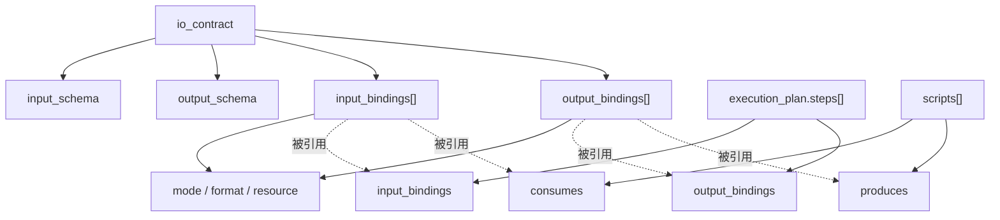

# 工作包协议与IO绑定

> 文档状态：当前有效
> 角色：`workpackage_schema` 工程化演进设计
> 适用范围：支撑工厂从“生成工作包蓝图”推进到“生成可直接运行脚本”
> 关联真相源：
> - `docs/02_总体架构/架构索引.md`
> - `docs/02_总体架构/模块边界.md`
> - `docs/02_总体架构/依赖关系.md`
> - `docs/02_总体架构/数据工厂技术架构.md`
> - `docs/04_系统组件设计/02_工作包协议/工作包Schema设计.md`
> - `docs/04_系统组件设计/04_数据与人工介入/可信数据API调用契约.md`

## 0. 先读什么

如果你还没建立 `workpackage_schema.v1` 的整体概念，先读：

1. [工作包Schema设计](工作包Schema设计.md)

本文件只聚焦 `io_contract`、`binding`、`scripts / steps` 的工程化细节。

## 1. 问题定义

当前 `workpackage_schema.v1` 已明确：

1. 输入输出格式定义在 `io_contract.input_schema` / `io_contract.output_schema`。
2. API 绑定定义在 `api_plan`。
3. 执行步骤定义在 `execution_plan.steps`。

但对“脚本如何直接运行”仍缺少一类核心信息：输入输出绑定协议。也就是：

1. 输入从哪里读。
2. 用什么协议读。
3. 输出往哪里写。
4. 用什么协议写。
5. 哪个脚本消费哪个输入绑定、产出哪个输出绑定。

如果这些信息不进入 schema，工厂只能生成“知道字段长什么样”的蓝图，不能稳定生成“知道去哪里读写”的可运行脚本。

## 2. 设计目标

本次设计目标不是重写整套 schema，而是在不碰 runtime 主逻辑的前提下，把以下信息升级为 schema 一等公民：

1. 输入绑定
2. 输出绑定
3. 协议模式
4. 交付语义
5. 脚本与绑定映射关系
6. 执行步骤与绑定映射关系

## 3. 结构图

图说明：这张图重点表达 `io_contract`、`execution_plan`、`scripts` 三者如何通过 binding 串起来。

## 4. 设计原则

1. 格式与协议分离
   - `input_schema/output_schema` 只定义“数据长什么样”。
   - `input_bindings/output_bindings` 只定义“数据怎么流动”。
2. 主输入输出显式
   - 每个工作包必须至少声明 1 个输入绑定和 1 个输出绑定。
3. 绑定可被脚本直接消费
   - 生成器拿到 binding 后，应能直接推导读取器/写入器骨架。
4. 协议类型受控枚举
   - 避免自由文本导致脚本生成不可预测。
5. 绑定引用全链路一致
   - `scripts[]` 与 `execution_plan.steps[]` 只能引用已声明的 binding id。

## 5. v1 字段增强设计

### 5.1 `io_contract` 新结构

在保留 `input_schema/output_schema` 的前提下，新增：

1. `input_bindings[]`
2. `output_bindings[]`

每个 binding 至少包含：

1. `binding_id`
2. `role`
3. `mode`
4. `format`
5. `delivery_semantics`
6. `resource`

### 5.2 Binding 字段语义

#### `binding_id`

唯一标识，例如：

1. `input_batch_csv`
2. `output_governance_records`
3. `output_runtime_evidence`

#### `role`

用于区分主数据和辅助产物：

1. `primary`
2. `evidence`
3. `control`

#### `mode`

定义协议/介质类型：

1. `file`
2. `database`
3. `http`
4. `kafka`
5. `stream`

#### `format`

定义序列化或数据格式：

1. `json`
2. `jsonl`
3. `csv`
4. `parquet`
5. `avro`
6. `none`

说明：

1. `database` 模式下可使用 `none`，表示记录结构由表模型承载。
2. `http/kafka/stream` 可根据消息体选用 `json/jsonl/avro`。

#### `delivery_semantics`

定义交付语义，供脚本骨架与门禁使用：

1. `batch`
2. `request_response`
3. `at_least_once`
4. `exactly_once`

### 5.3 `resource` 子结构

`resource` 按 `mode` 分支：

1. `file`
   - `path`
   - `path_env`（可选）
2. `database`
   - `engine`
   - `dsn_env`
   - `schema`
   - `table`
   - `write_mode`
3. `http`
   - `base_url`
   - `path`
   - `method`
   - `auth_env`（可选）
4. `kafka`
   - `brokers_env`
   - `topic`
   - `group_id`（输入时建议必填）
5. `stream`
   - `engine`
   - `stream_name`
   - `consumer_group`（可选）

## 6. 生成器可直接消费的关系

### 6.1 脚本与绑定

`scripts[]` 新增：

1. `consumes`
2. `produces`

要求：

1. `consumes` 只能引用 `input_bindings[].binding_id` 或上游 `output_bindings[].binding_id`。
2. `produces` 只能引用 `output_bindings[].binding_id`。

这样脚本生成器可以直接推导：

1. 入口脚本需要初始化哪些 reader。
2. 主处理脚本需要接收哪些标准输入对象。
3. 运行后要调用哪些 writer。

### 6.2 执行步骤与绑定

`execution_plan.steps[]` 新增：

1. `input_bindings`
2. `output_bindings`

要求：

1. 步骤声明只允许引用已存在的 binding id。
2. Step `dryrun` 至少要覆盖主输入绑定和主输出绑定。
3. Step `publish` 至少要覆盖主输出绑定和证据输出绑定。

## 6. 对工程化的直接收益

引入 binding 后，工厂可以稳定生成以下脚手架能力：

1. `load_input_<binding_id>()`
2. `write_output_<binding_id>()`
3. 环境变量校验器
4. 协议适配器选择逻辑
5. dryrun 样例输入装载逻辑
6. 结果写库/写文件/发消息骨架

这比只知道 `input_schema/output_schema` 更接近“可直接运行”。

## 7. 与现有字段的边界

1. `input_schema/output_schema`
   - 定义 payload 结构
   - 不负责定义协议
2. `api_plan`
   - 定义工作包执行过程中会调用哪些外部能力
   - 不替代主输入输出绑定
3. `architecture_context.runtime_env`
   - 定义环境基线与网络/数据库约束
   - 不替代具体 I/O 绑定
4. 可信能力调用
   - `api_plan.registered_apis_used` 必须服从《可信数据API调用契约》
   - 不允许在工作包蓝图里手写未登记的 provider 接口作为正式能力
4. `execution_plan`
   - 定义步骤顺序与门禁
   - 不替代 binding 的协议细节

## 8. 建议的最小强约束

若项目要支撑“直接生成可运行脚本”，建议后续正式版本至少强制：

1. `io_contract.input_bindings` `minItems = 1`
2. `io_contract.output_bindings` `minItems = 1`
3. 每个 `scripts[]` 必须声明 `consumes/produces`
4. 每个 `dryrun/publish` 相关步骤必须声明 `input_bindings/output_bindings`
5. `mode` 与 `resource` 必须匹配，不允许“mode=database 但 resource.file 生效”

## 9. 本次落地产物

本次已直接并入现行 `v1`：

1. 设计文档：本文
2. 正式 schema：
   - `workpackage_schema/schemas/v1/workpackage_schema.v1.schema.json`
3. 正式示例：
   - `workpackage_schema/examples/v1/address_batch_governance.workpackage_schema.v1.json`

## 10. 推进建议

建议按两步走：

1. 先让 Story、评审、工作包生成统一引用当前 v1
2. 再实现生成器消费 binding
   - 先支持 `file/database`
   - 再扩展 `http/kafka/stream`

这样可以先统一协议表达，再逐步落脚本生成能力。
