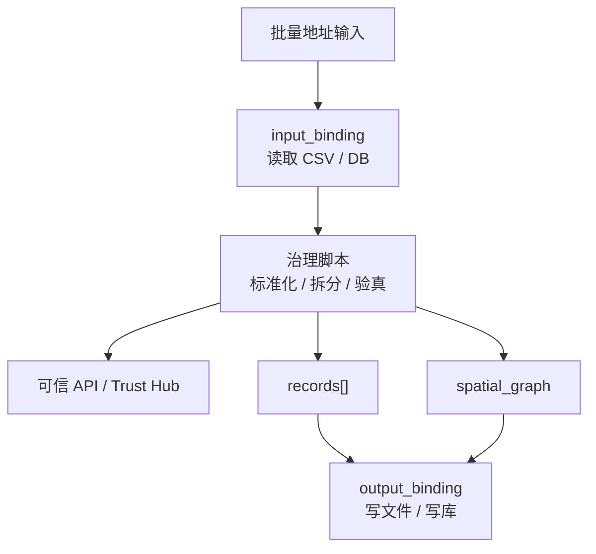

# 工作包协议案例：地址治理

## 1. 案例目标
- 输入：一批地址字段（`addresses[]`，每条含 `raw_id/raw_text`）。
- 输出：
  - 地址标准化结果（`normalization`）
  - 地址验真结果（`address_validation`）
  - 实体拆分结果（`entity_parsing`）
  - 图谱成果（`spatial_graph`）

## 2. 案例流程图

图说明：地址治理工作包先读取输入 binding，再调用治理脚本和可信能力，最后把 `records[]` 与 `spatial_graph` 写回输出 binding。

## 3. 对应协议文件
- Schema：`workpackage_schema/schemas/v1/workpackage_schema.v1.schema.json`
- 示例：`workpackage_schema/examples/v1/address_batch_governance.workpackage_schema.v1.json`

## 4. 字段映射（案例视角）
- `workpackage`：定义目标、范围、责任人、优先级与验收条件。
- `architecture_context`：定义四层架构上下文与运行环境约束（含 Docker PG、禁 fallback）。
- `io_contract.input_schema`：定义批量地址输入结构。
- `io_contract.output_schema`：定义 records + spatial_graph 输出结构。
- `io_contract.input_bindings`：定义输入从哪里读、用什么协议读。
- `io_contract.output_bindings`：定义输出往哪里写、用什么协议写。
- `api_plan.registered_apis_used`：定义已注册可信 API 绑定关系。
- `api_plan.missing_apis`：定义缺失能力扩展（含 `api_key_env` 与 `register_plan`）。
- `execution_plan.steps[].input_bindings/output_bindings`：定义步骤级读写绑定。
- `execution_plan`：定义执行步骤、人工门禁、失败处理策略。
- `scripts[].consumes/produces`：定义脚本直接消费和产出的绑定。
- `scripts`：定义可执行脚本入口与依赖。
- `skills`：定义工作包内置技能清单，技能文件路径必须落在 `skills/*.md`。

## 5. 最小验收要点
- 每条输入地址均在 `records[]` 中有对应结果。
- `records[]` 必须同时含 `normalization/entity_parsing/address_validation`。
- `spatial_graph` 必须包含：
  - `nodes`
  - `edges`
  - `metrics`
  - `failed_row_refs`
  - `build_status`
- 人工门禁必须存在并可追踪：
  - `confirm_generate`
  - `confirm_dryrun_result`
  - `confirm_publish`

## 6. 工程化推进结论
- `v1` 已直接纳入输入输出绑定定义，不再额外保留 `v1.1 draft`。
- 生成器应同时消费：
  - `io_contract.input_schema/output_schema`
  - `io_contract.input_bindings/output_bindings`
  - `execution_plan.steps[].input_bindings/output_bindings`
  - `scripts[].consumes/produces`
- 当前建议优先实现：
  - `file`
  - `database`
  两类 binding 的脚本骨架生成。
