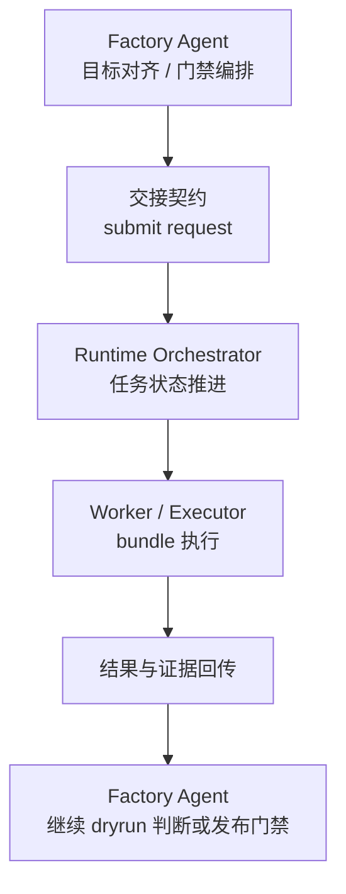

# Agent与Runtime交接契约

> 文档状态：当前有效
> 角色：Factory Agent 与 Runtime 的正式交接契约
> 适用范围：dryrun、publish、状态回传、证据回传、人工门禁映射
> 关联文档：
> - `docs/04_系统组件设计/01_工厂Agent编排/工厂Agent编排系统.md`
> - `docs/04_系统组件设计/01_工厂Agent编排/工厂Agent状态机.md`
> - `docs/04_系统组件设计/03_Runtime执行/Runtime调度与任务系统.md`

## 1. 这份文档解决什么问题

Factory Agent 和 Runtime 各自有状态机，但没有交接契约就会出现：

1. Agent 不知道何时该提交 Runtime。
2. Runtime 不知道收到的执行请求最少应该带什么。
3. 测试和验收无法统一判断状态如何映射。

## 2. 交接边界图

图说明：这张图只画 Agent 与 Runtime 之间的交接边界，不展开内部状态机。

## 3. 最小提交载荷

Agent 向 Runtime 提交时，最小载荷应包含：

1. `task_id`
2. `workpackage_id`
3. `version`
4. `execution_mode`
5. `requested_by`
6. `trace_context`
7. `gate_context`
8. `input_binding_ref` 或等价输入引用

其中：

1. `execution_mode` 至少区分 `dryrun / publish`
2. `gate_context` 表示当前是哪个门禁之后发起的执行

## 4. Agent 侧触发点

| Agent 阶段 | 允许动作 | 交接说明 |
|---|---|---|
| `DISCOVERY` | 不允许提交 Runtime | 目标尚未闭合 |
| `ALIGN_IO` | 不允许提交 Runtime | 输入输出 binding 尚未闭合 |
| `BLUEPRINT_LOOP` | 不允许提交 Runtime | 蓝图仍在校验 |
| `BUILD_WITH_OPENCODE` | 条件性允许 | 仅在 bundle 已完成且待验证时 |
| `VERIFY` | 允许提交 `dryrun` | 进入 Runtime 做试运行 |
| `PUBLISH` | 允许提交 `publish` | 通过门禁后进入正式执行 |

## 5. Runtime 回传内容

Runtime 回传给 Agent 的最小内容应包含：

1. `task_id`
2. `runtime_state`
3. `result_summary`
4. `evidence_refs`
5. `trace_id`
6. `blocked_reason` 或 `failure_reason`
7. `needs_human`

## 6. 状态映射关系

| Agent 视角 | Runtime 视角 | 说明 |
|---|---|---|
| `VERIFY` 中发起 dryrun | `SUBMITTED -> ... -> COMPLETED/FAILED/NEEDS_HUMAN` | Runtime 负责执行推进 |
| `WAIT_USER_GATE` | Runtime 已回传结果，等待 Agent 门禁决策 | 不应继续推进 Runtime |
| `WAIT_USER_INPUT` | Runtime 可无参与，或已回传失败/阻塞 | Agent 负责用户补输入 |
| `BLOCKED` | Runtime `FAILED/ROLLED_BACK` 或 Agent 前置阻塞 | 以原因码区分来源 |

## 7. 门禁映射

1. `confirm_generate`
   - 解决是否允许从蓝图进入 bundle 与执行准备。
2. `confirm_dryrun_result`
   - 解决 dryrun 结果是否允许继续进入发布决策。
3. `confirm_publish`
   - 解决是否允许从 Runtime 试运行结果进入正式发布。

## 8. EPIC15 当前对外合同补充

截至 `2026-03-08`，Agent 与 Runtime 交接前后的最小结构化合同补充如下：

1. Agent 对外返回必须带 `orchestration` snapshot。
2. 该 snapshot 至少包含：
   - `phase`
   - `control_state`
   - `reason_code`
   - `resume_from_stage`
   - `pending_gate`
3. 当 Runtime 尚未被触发时：
   - `WAIT_USER_GATE` 表示 Agent 仍停留在门禁决策层，不应向 Runtime 自动推进。
   - `BLOCKED` 表示 Agent 已有结构化阻塞原因，Runtime 不应被假定为已接管。
4. 当 Runtime 已完成 dryrun 回传时：
   - Agent 应把门禁等待回写到 `gate_state`
   - Agent 应把当前人工动作回写到 `interaction_state`
5. 当发布或执行失败时：
   - `blocker_ticket` 必须保留 `code / summary / resume_from_stage`
   - 不允许只返回自由文本错误而缺失恢复位点
6. 当前中断与门禁控制载荷已补入最小 typed contract：
   - `factory.recover_request.v1`
   - `factory.approval_decision.v1`
7. `factory.recover_request.v1` 只用于 Agent 编排层恢复，不直接作为 Runtime submit payload。
8. `factory.approval_decision.v1` 只解决 Agent 门禁推进，不等价于 Runtime 内部审批记录。
9. `EPIC15` 试点验收时，Agent 编排层的 canonical 合同回归入口为：
   - `tests/test_factory_agent_orchestration_core.py`
   - `tests/test_factory_agent_runtime_trace_logging.py`
   - `tests/test_factory_agent_routing.py`
   - `tests/test_factory_agent_contract.py`
   - `tests/test_orchestration_context_schema_contract.py`
10. 上述回归入口仅用于证明 Agent 编排层替换试点的合同回归方式；具体执行结果应保留在对应 Epic 验收与测试产物中。
11. 该结论不外推为 Runtime 控制层替换完成。

## 9. 工业化要求

1. Agent 与 Runtime 之间的交接必须结构化，不允许靠自然语言消息拼接。
2. 交接载荷、回传载荷和证据引用必须能进入测试与验收。
3. 状态机的新增状态如影响交接，必须同步更新本契约和两侧状态机文档。

## 10. EPIC16-S1 最小承接范围

截至 `2026-03-09`，`EPIC16-S1` 对 Agent 与 Runtime 交接的最小承接范围冻结如下：

1. 本阶段只冻结：
   - Runtime 状态机到 Workflow 的映射
   - submit / get / evidence 最小承接范围
   - 真相源边界
2. 本阶段不提前冻结：
   - bundle 执行面改造
   - 全量内部服务契约升级
   - 正式全量 E2E 门禁
3. Runtime Workflow state 不得取代以下正式查询对象：
   - `control_plane.task_state`
   - `control_plane.evidence_records`
   - `runtime.publish_record`
4. 上游 Agent 在 `EPIC16` 中仍只要求 submit/query/evidence 对外交接 contract 稳定，不要求同时升级为新内部协议。
5. 当前 Python 迁移前置基线中，`dryrun / publish` 对外回执已补入最小控制内核标识：
   - `runtime.task_id`
   - `runtime.trace_id`
   - `runtime.state`
   - `runtime.workflow_core = runtime_control_core.v1`
6. 上述 `runtime.workflow_core = runtime_control_core.v1` 仅用于标识 Python 迁移承接层，不得作为 `Go` 语言切换完成信号。
7. `EPIC16-S2 / S3 / S5` 的正式通过信号应改为：
   - `runtime.control_plane.impl = go_runtime.v1`
   - `runtime.control_plane.engine = temporal_go`
   - `runtime.executor.impl = go_executor.v1`
   - `runtime.executor.entrypoint_mode = workpackage_entrypoint`
   - `runtime.compat.python_control_fallback_used = false`
8. 截至 `EPIC16` 收口，Agent 已可稳定收到：
   - `runtime.control_plane.impl = go_runtime.v1`
   - `runtime.control_plane.engine = temporal_go`
   - `runtime.executor.impl = go_executor.v1`
   - `runtime.executor.entrypoint_mode = workpackage_entrypoint`
   - `runtime.compat.python_control_fallback_used = false`
9. 上述信号已通过 backend smoke 与 PostgreSQL truth-source 回查验证，可作为 `EPIC16` 试点完成口径。
