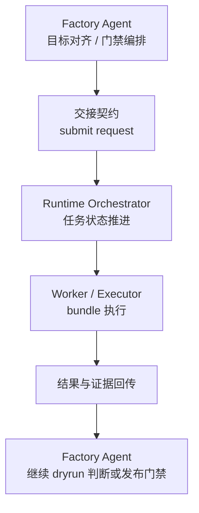

# Agent与Runtime交接契约

> 文档状态：当前有效
> 角色：Factory Agent 与 Runtime 的正式交接契约
> 适用范围：dryrun、publish、状态回传、证据回传、人工门禁映射
> 关联文档：
> - `docs/04_系统组件设计/01_工厂Agent编排/工厂Agent编排系统.md`
> - `docs/04_系统组件设计/01_工厂Agent编排/工厂Agent状态机.md`
> - `docs/04_系统组件设计/03_Runtime执行/Runtime调度与任务系统.md`

## 1. 这份文档解决什么问题

Factory Agent 和 Runtime 各自有状态机，但没有交接契约就会出现：

1. Agent 不知道何时该提交 Runtime。
2. Runtime 不知道收到的执行请求最少应该带什么。
3. 测试和验收无法统一判断状态如何映射。

## 2. 交接边界图

图说明：这张图只画 Agent 与 Runtime 之间的交接边界，不展开内部状态机。

## 3. 最小提交载荷

Agent 向 Runtime 提交时，最小载荷应包含：

1. `task_id`
2. `workpackage_id`
3. `version`
4. `execution_mode`
5. `requested_by`
6. `trace_context`
7. `gate_context`
8. `input_binding_ref` 或等价输入引用

其中：

1. `execution_mode` 至少区分 `dryrun / publish`
2. `gate_context` 表示当前是哪个门禁之后发起的执行

## 4. Agent 侧触发点

| Agent 阶段 | 允许动作 | 交接说明 |
|---|---|---|
| `DISCOVERY` | 不允许提交 Runtime | 目标尚未闭合 |
| `ALIGN_IO` | 不允许提交 Runtime | 输入输出 binding 尚未闭合 |
| `BLUEPRINT_LOOP` | 不允许提交 Runtime | 蓝图仍在校验 |
| `BUILD_WITH_OPENCODE` | 条件性允许 | 仅在 bundle 已完成且待验证时 |
| `VERIFY` | 允许提交 `dryrun` | 进入 Runtime 做试运行 |
| `PUBLISH` | 允许提交 `publish` | 通过门禁后进入正式执行 |

## 5. Runtime 回传内容

Runtime 回传给 Agent 的最小内容应包含：

1. `task_id`
2. `runtime_state`
3. `result_summary`
4. `evidence_refs`
5. `trace_id`
6. `blocked_reason` 或 `failure_reason`
7. `needs_human`

## 6. 状态映射关系

| Agent 视角 | Runtime 视角 | 说明 |
|---|---|---|
| `VERIFY` 中发起 dryrun | `SUBMITTED -> ... -> COMPLETED/FAILED/NEEDS_HUMAN` | Runtime 负责执行推进 |
| `WAIT_USER_GATE` | Runtime 已回传结果，等待 Agent 门禁决策 | 不应继续推进 Runtime |
| `WAIT_USER_INPUT` | Runtime 可无参与，或已回传失败/阻塞 | Agent 负责用户补输入 |
| `BLOCKED` | Runtime `FAILED/ROLLED_BACK` 或 Agent 前置阻塞 | 以原因码区分来源 |

## 7. 门禁映射

1. `confirm_generate`
   - 解决是否允许从蓝图进入 bundle 与执行准备。
2. `confirm_dryrun_result`
   - 解决 dryrun 结果是否允许继续进入发布决策。
3. `confirm_publish`
   - 解决是否允许从 Runtime 试运行结果进入正式发布。

## 8. 工业化要求

1. Agent 与 Runtime 之间的交接必须结构化，不允许靠自然语言消息拼接。
2. 交接载荷、回传载荷和证据引用必须能进入测试与验收。
3. 状态机的新增状态如影响交接，必须同步更新本契约和两侧状态机文档。
