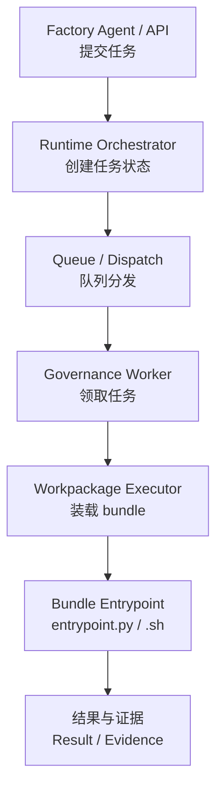
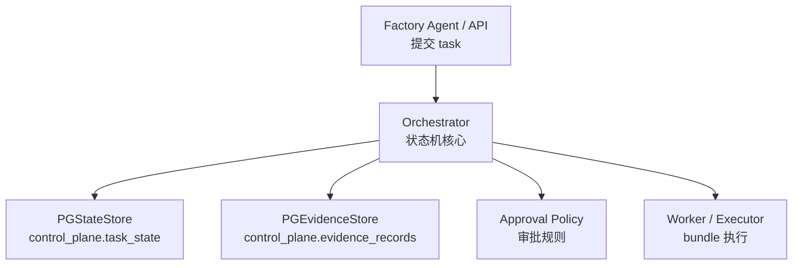
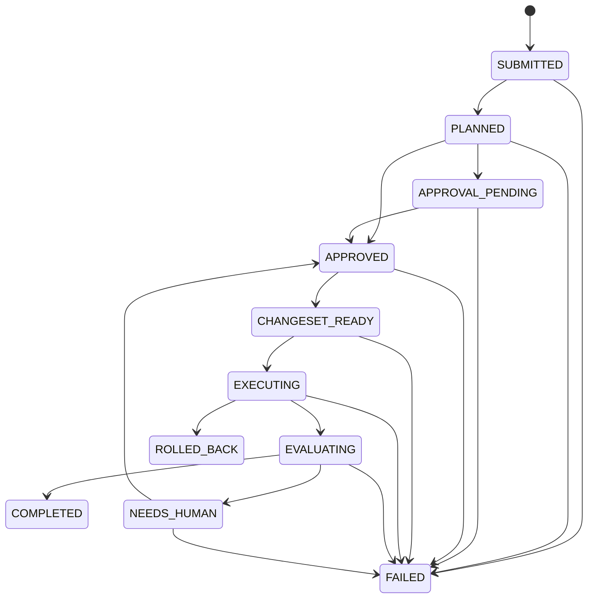
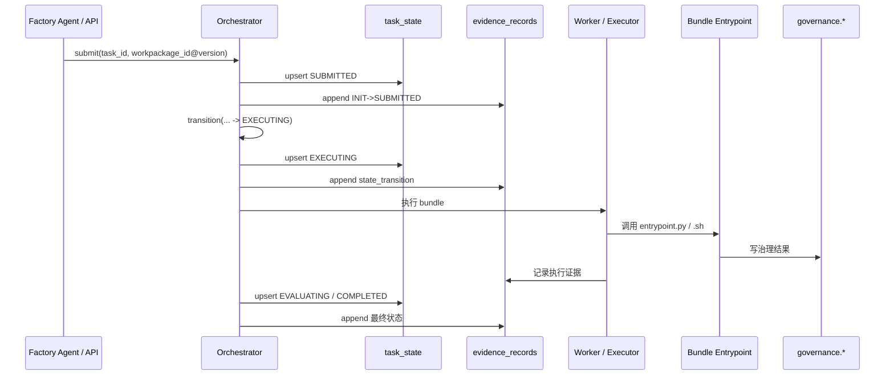
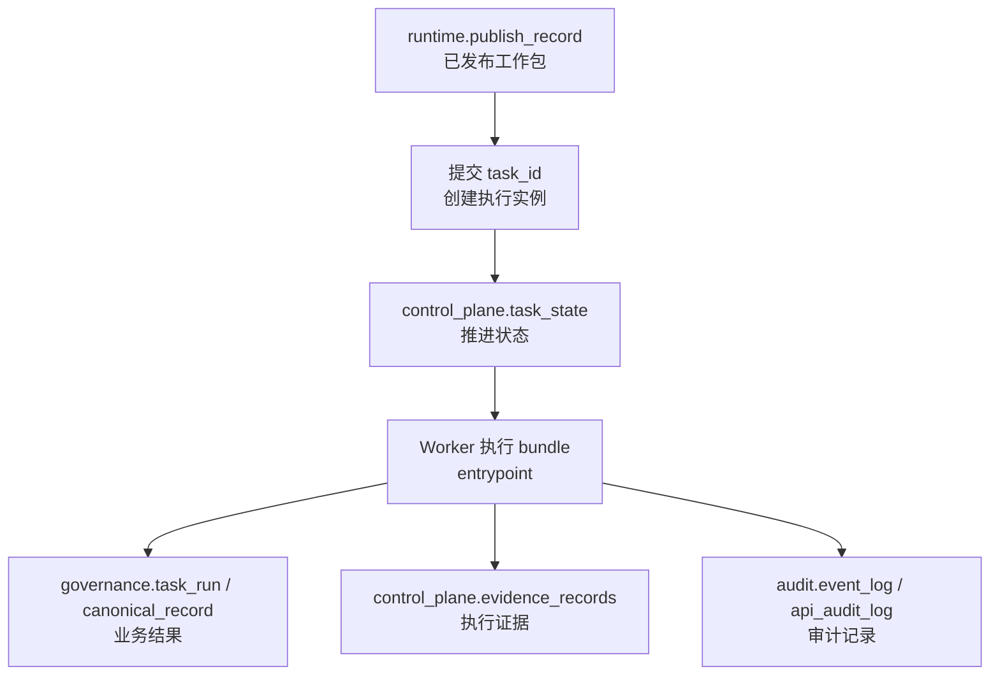

# Runtime调度与任务系统

> 文档状态：当前有效
> 角色：治理 Runtime 执行框架设计说明
> 适用范围：任务提交、状态推进、证据记录、worker 执行、bundle 装载
> 关联文档：
> - `docs/02_总体架构/系统总览.md`
> - `docs/04_系统组件设计/01_工厂Agent编排/工厂Agent状态机.md`
> - `docs/04_系统组件设计/04_数据与人工介入/数据存储体系设计.md`
> - `docs/04_系统组件设计/03_Runtime执行/Agent与Runtime交接契约.md`
> - `docs/04_系统组件设计/03_Runtime执行/数据血缘与可追溯设计.md`
> - `docs/04_系统组件设计/03_Runtime执行/数据湖与执行技术架构.md`

## 1. 这份文档在讲什么

这份文档讲的不是通用“调度原理”，而是本项目里 **治理 Runtime 框架** 的核心执行设计：

1. 上游如何把工作包提交给 Runtime。
2. Runtime 如何推进任务状态。
3. Worker 如何只按 `workpackage_id@version` 执行 bundle。
4. 执行过程如何留证据、留状态、留审计。

## 2. Runtime 总体执行图

图说明：这张图只看执行面，不把上游目标对齐细节混进来。

## 3. Runtime 框架的核心组件

当前仓库里，这个 Runtime 框架不是概念文档，而是已经有最小实现骨架：

| 组件 | 当前实现位置 | 作用 |
|---|---|---|
| Orchestrator | `src/runtime/orchestrator.py` | 维护显式状态机、校验状态跳转、记录证据 |
| PGStateStore | `src/runtime/state_store.py` | 将任务控制态落到 `control_plane.task_state` |
| PGEvidenceStore | `src/runtime/evidence_store.py` | 将状态转移和执行事件落到 `control_plane.evidence_records` |
| Approval Policy | `src/runtime/policies.py` | 判定审批是否满足 |
| RuntimeControlCore | `src/runtime/control_core.py` | 统一 submit/query/evidence 与 `dryrun / publish` 控制主链 |

图说明：这张图展示 Runtime 框架内部的核心组件关系，强调“状态”和“证据”是并行存在的。

## 4. 调度对象到底是什么

Runtime 有两个核心对象，但它们不是一回事：

1. `workpackage_id@version`
   - 表示“要执行哪个工作包版本”。
2. `task_id`
   - 表示“某次具体执行任务”。

换句话说：

1. 工作包是版本化资产。
2. 任务是运行时实例。

这也是为什么 Runtime 设计里必须同时存在：

1. 工作包发布记录，例如 `runtime.publish_record`
2. 任务执行记录，例如 `governance.task_run`、`control_plane.task_state`

## 5. Runtime 的关键接口

`src/runtime/orchestrator.py` 当前已经暴露出一套很明确的控制接口：

| 接口 | 作用 | 典型时机 |
|---|---|---|
| `submit()` | 创建 `SUBMITTED` 状态并写初始化证据 | 上游提交任务 |
| `get()` | 读取当前任务状态 | 页面/API 查询 |
| `transition()` | 校验并推进状态 | 编排或执行阶段推进 |
| `grant_approval()` | 写入审批结果 | 人工门禁或系统门禁 |
| `check_approvals()` | 检查审批是否满足 | `APPROVAL_PENDING` 之后 |
| `evidence()` | 拉取全量证据事件 | 回放、排障、验收 |
| `record_event()` | 追加任意执行事件 | bundle 内外部关键事件 |

这意味着 Runtime 不是“worker 自己写点日志”，而是以 `Orchestrator + StateStore + EvidenceStore` 为骨架。

## 6. Runtime 不应该负责什么

Runtime / Worker 不负责：

1. 理解用户需求。
2. 生成工作包蓝图。
3. 让 LLM 再次发散推理。
4. 直接 import 主线算法模块绕过 bundle。

它只负责：

1. 根据 `workpackage_id@version` 找到 bundle。
2. 装载 `entrypoint.py` 或 `entrypoint.sh`。
3. 推进任务状态。
4. 写回执行证据。

## 7. 运行时任务状态机

图说明：这张图是 Runtime 内部任务状态机，不等于 Factory Agent 的上游状态机。前者解决“执行推进”，后者解决“编排推进”。

这套状态来自当前 `src/runtime/orchestrator.py`，说明 Runtime 已经有自己的显式状态机，而不是“worker 跑完就算结束”。

## 8. 一次任务是怎么跑起来的

图说明：这张图按“提交 -> 状态推进 -> bundle 执行 -> 结果与证据回写”描述一次完整执行链，不展开上游目标对齐。

## 9. 状态、证据、审计分别落在哪里

### 9.1 控制面状态

当前 `src/runtime/state_store.py` 使用：

1. `control_plane.task_state`

它记录：

1. `task_id`
2. `state`
3. `payload_json`
4. `updated_at`

这张表解决的是“当前任务推进到了哪一步”。

### 9.2 执行证据

当前 `src/runtime/evidence_store.py` 使用：

1. `control_plane.evidence_records`

它记录：

1. 谁做了什么 `actor / action`
2. 关联了什么工件 `artifact_ref`
3. 结果如何 `result`
4. 附加元数据 `metadata_json`

这张表解决的是“为什么会走到这个状态”。

### 9.3 业务运行结果

业务运行结果当前归口到：

1. `governance.task_run`
2. `governance.raw_record`
3. `governance.canonical_record`
4. `governance.review`

这些对象解决的是“治理结果本身是什么”。

### 9.4 工作包发布记录

当前稳定主表是：

1. `runtime.publish_record`

它记录：

1. `workpackage_id`
2. `version`
3. `status`
4. `evidence_ref`
5. `bundle_path`
6. 发布与确认信息

这张表解决的是“哪个版本已经被正式提交到 Runtime”。

## 10. 失败与人工介入如何处理

Runtime 侧的失败处理不是“失败就结束”，而是至少要区分三类情况：

1. 可直接失败
   - 例如非法状态跳转，直接进入 `FAILED`
2. 需人工复核
   - 例如 `EVALUATING` 后进入 `NEEDS_HUMAN`
3. 可回滚
   - 执行中触发 `ROLLED_BACK`

这和上游 Factory Agent 的 `WAIT_USER_INPUT` 不一样。  
上游是“目标和门禁层”的人工介入，Runtime 是“执行与评估层”的人工介入。

## 11. 任务执行链条

图说明：这张图用“对象视角”说明任务是如何从发布记录一路走到执行证据的。

## 12. 为什么这不是“空壳调度器”

一个真正的治理 Runtime 至少要有三层能力：

1. 状态推进

## 13. EPIC16-S1 Workflow 映射口径

本节用于冻结 Runtime 状态机到 Workflow 的首版映射，避免后续 `EPIC16` 各 Story 各自发明控制语义。

### 13.1 正式状态到 Workflow state 的映射

| 正式状态 | Workflow state | control semantics | 说明 |
|---|---|---|---|
| `SUBMITTED` | `SUBMITTED` | `submitted` | 已创建执行实例，等待进入规划。 |
| `PLANNED` | `PLANNED` | `planned` | 已完成计划装配，等待审批或直进。 |
| `APPROVAL_PENDING` | `APPROVAL_PENDING` | `awaiting_approval` | 等待人工或系统门禁批准。 |
| `APPROVED` | `APPROVED` | `approved` | 审批完成，允许继续推进。 |
| `CHANGESET_READY` | `CHANGESET_READY` | `changeset_ready` | 执行前输入与变更集已就绪。 |
| `EXECUTING` | `EXECUTING` | `executing` | Worker / Executor 正在执行 bundle。 |
| `EVALUATING` | `EVALUATING` | `evaluating` | 正在归集执行结果与评估。 |
| `NEEDS_HUMAN` | `NEEDS_HUMAN` | `awaiting_human` | 需要人工复核或恢复决策。 |
| `FAILED` | `FAILED` | `failed` | 控制链或执行链失败。 |
| `ROLLED_BACK` | `ROLLED_BACK` | `rolled_back` | 已执行回滚，当前流程结束。 |
| `COMPLETED` | `COMPLETED` | `completed` | 本轮 Runtime 执行闭环结束。 |

### 13.2 当前冻结的允许迁移

截至 `EPIC16-S1`，当前冻结的迁移规则如下：

1. `SUBMITTED -> PLANNED / FAILED`
2. `PLANNED -> APPROVAL_PENDING / APPROVED / FAILED`
3. `APPROVAL_PENDING -> APPROVED / FAILED`
4. `APPROVED -> CHANGESET_READY / FAILED`
5. `CHANGESET_READY -> EXECUTING / FAILED`
6. `EXECUTING -> EVALUATING / FAILED / ROLLED_BACK`
7. `EVALUATING -> COMPLETED / FAILED / NEEDS_HUMAN`
8. `NEEDS_HUMAN -> APPROVED / FAILED`

### 13.3 真相源边界

`EPIC16-S1` 明确冻结以下边界：

1. Workflow 引擎只承接控制过程，不作为正式结构化真相源。
2. 当前正式真相源仍为：
   - `control_plane.task_state`
   - `control_plane.evidence_records`
   - `runtime.publish_record`
   - `governance.*`
3. 任何 Workflow state 变化，都必须能回写到上述正式对象，而不是只停留在引擎内部状态。

### 13.4 最小设计冻结验证

当前已通过 `tests/test_agent_runtime.py` 对以下 contract 做最小验证：

1. `runtime.workflow_state_mapping.v1` schema 标识存在。
2. `APPROVAL_PENDING / NEEDS_HUMAN / ROLLED_BACK` 控制语义已冻结。
3. `workflow_engine_is_truth_source = false`。

## 14. EPIC16 完成后的默认执行基线

截至 `2026-03-09`，当前仓库中 Runtime 默认执行基线已更新为：

1. `src/runtime/control_core.py` 固定为 Python adapter，不再承担默认控制主脑。
2. `src/runtime/go_runtime_bridge.py` + `services/governance_runtime_go/cmd/runtimebridge/main.go` 共同承接默认 `Go Runtime` 控制链。
3. `src/runtime/go_executor_bridge.py` + `services/governance_runtime_go/cmd/executorbridge/main.go` 共同承接默认 `Go Executor` 执行链。
4. `Go Executor` 默认优先装载 `entrypoint.py`，bundle 仍保留 `entrypoint.py / entrypoint.sh` 作为正式入口。
5. OpenCode 生成的 bundle 已在 `entrypoint.py` 内将脚本执行结果汇总为 `output/runtime_output.json`，满足 Worker 统一执行 contract。
6. `dryrun / publish` 已默认经由 `Go Runtime + Go Executor` 进入：
   - `SUBMITTED -> PLANNED -> APPROVED -> CHANGESET_READY -> EXECUTING -> EVALUATING -> COMPLETED/FAILED/ROLLED_BACK`
7. `dryrun / publish` 返回结果已补入统一字段：
   - `runtime.task_id`
   - `runtime.trace_id`
   - `runtime.state`
   - `runtime.workflow_core`
   - `runtime.control_plane.impl`
   - `runtime.control_plane.engine`
   - `runtime.executor.impl`
   - `runtime.executor.entrypoint_mode`
   - `runtime.compat.*`
8. `EPIC16` 收口后已移除 legacy entrypoint fallback 通路；若 bundle 未产出 `output/runtime_output.json`，Runtime 必须直接阻塞并返回真实失败。
9. `EPIC16-S2 / S3 / S5` 的正式通过信号应以以下字段为准：
   - `runtime.control_plane.impl = go_runtime.v1`
   - `runtime.control_plane.engine = temporal_go`
   - `runtime.executor.impl = go_executor.v1`
   - `runtime.executor.entrypoint_mode = workpackage_entrypoint`
   - `runtime.compat.python_control_fallback_used = false`
10. bundle 执行仍受 `workpackage_id@version + entrypoint` 唯一执行面约束。
11. 证据与审计仍以 PostgreSQL + 对象/文件产物层作为正式落点。

如果只有“排队 + 执行脚本”，那它只是一个任务队列，不是治理 Runtime。  
本项目的设计口径明确要求 Runtime 还要能回答：

1. 当前处于哪个状态。
2. 这次状态转移是谁触发的。
3. 失败发生在 bundle 的哪个阶段。
4. 这次执行对应哪个工作包版本。

## 15. 与 Factory Agent 状态机的关系

这两套状态机不要混：

| 维度 | Factory Agent 状态机 | Runtime 状态机 |
|---|---|---|
| 关注点 | 目标对齐与门禁 | 执行推进与证据 |
| 核心对象 | 用户目标、蓝图、工作包 | task、bundle、结果 |
| 典型状态 | `ALIGN_IO`、`BLUEPRINT_LOOP` | `EXECUTING`、`EVALUATING` |
| 用户介入 | `WAIT_USER_INPUT`、`WAIT_USER_GATE` | `NEEDS_HUMAN` |

正式交接字段、门禁语义和状态映射，不再散落在多份文档里，统一看 [Agent与Runtime交接契约](Agent与Runtime交接契约.md)。

## 16. 与血缘和数据湖设计的关系

这份文档只解决“任务怎么被提交、调度、推进和留证据”，另外两类问题已经单独收口：

1. 结果如何按 `task_id / trace_id / workpackage_id@version` 回查，统一看 [数据血缘与可追溯设计](数据血缘与可追溯设计.md)。
2. Runtime 依赖哪些存储服务、执行框架和工作流语言边界，统一看 [数据湖与执行技术架构](数据湖与执行技术架构.md)。

## 17. 当前设计结论

1. 调度对象必须是 `workpackage_id@version + task_id` 二元组合。
2. Worker 必须只执行 bundle 入口，不得反向依赖具体治理算法。
3. Runtime 状态、业务结果、证据、审计必须分层落库。
4. 如果未来扩展队列实现，队列技术可以替换，但这四条边界不能变。
