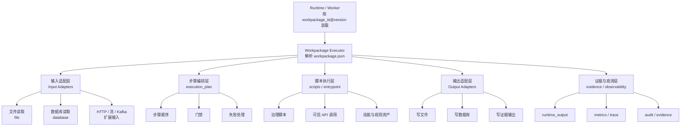
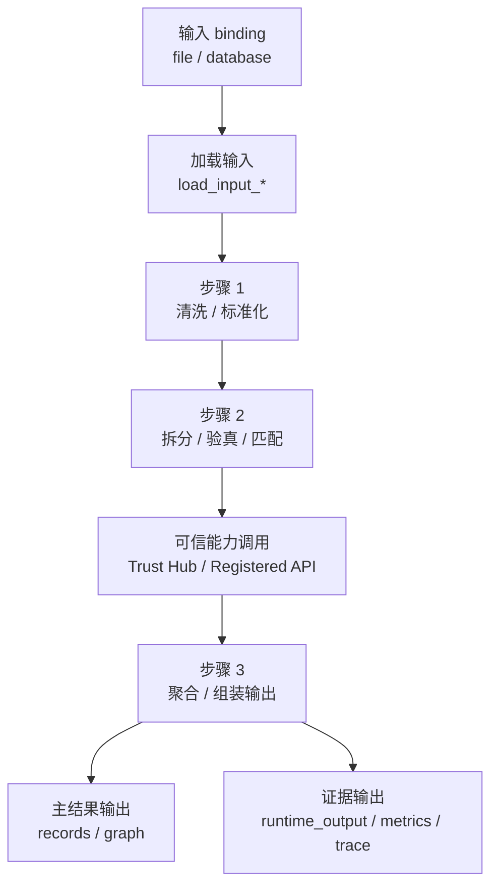

# 数据处理引擎

> 文档状态：当前有效
> 角色：工作包驱动的数据处理引擎设计说明
> 适用范围：输入装载、步骤执行、可信能力调用、结果写回、证据产出
> 关联文档：
> - `docs/04_系统组件设计/03_Runtime执行/Runtime调度与任务系统.md`
> - `docs/04_系统组件设计/02_工作包协议/工作包Schema设计.md`
> - `docs/04_系统组件设计/02_工作包协议/工作包协议与IO绑定.md`
> - `docs/04_系统组件设计/02_工作包协议/工作包协议案例：地址治理.md`
> - `docs/04_系统组件设计/03_Runtime执行/数据血缘与可追溯设计.md`
> - `docs/04_系统组件设计/03_Runtime执行/数据湖与执行技术架构.md`

## 1. 这份文档到底在讲什么

这里说的“数据处理引擎”，不是单独某个 Python 包，也不是某个算法库。  
它指的是一套以工作包为中心的执行架构，负责把：

1. 输入绑定 `input_bindings`
2. 执行步骤 `execution_plan.steps`
3. 脚本定义 `scripts`
4. 可信能力 `api_plan`
5. 输出绑定 `output_bindings`

串成一条真正可以跑起来的数据处理链路。

换句话说，它回答的是：

1. 数据从哪里进来。
2. 在哪里被处理。
3. 如何调用外部可信能力。
4. 最终往哪里写结果和证据。

## 2. 数据处理引擎总体架构图

图说明：这张图表达的是“数据处理引擎内部”的核心结构。重点不是 Runtime 如何调度任务，而是 bundle 被装载后，数据如何在引擎内部流动。

## 3. 引擎分层设计

### 3.1 输入适配层

这一层负责把 schema 里声明的 `input_bindings` 变成真实 reader。

它关心的是：

1. 从文件读还是从库读。
2. 输入是 `csv/json/parquet` 还是表记录。
3. 输入是一批数据还是请求响应式数据。

它不关心的是：

1. 地址标准化怎么做。
2. 图谱构建算法怎么做。

### 3.2 步骤编排层

这一层对应 `execution_plan.steps[]`。

它关心的是：

1. 先执行哪个步骤。
2. 每个步骤读哪些 binding。
3. 每个步骤写哪些 binding。
4. 失败后是中止、转人工，还是继续收集证据。

### 3.3 脚本执行层

这一层对应 `entrypoint + scripts`。

它是引擎里真正跑业务处理逻辑的地方，例如：

1. 地址标准化
2. 地址验真
3. 实体拆分
4. 图谱构建

但这些逻辑必须封装在 bundle 内部，不应直接挂到 Runtime 主链路。

### 3.4 输出适配层

这一层负责把 `output_bindings` 变成真实 writer。

它关心的是：

1. 结果写 JSON 文件还是写 PostgreSQL。
2. 证据写到 `output/` 还是回写到控制面。
3. 输出需要 `append/upsert/replace` 哪种语义。

### 3.5 证据与观测层

这一层负责沉淀“这次数据处理发生了什么”，而不是只关心最终结果。

它通常包括：

1. 结果摘要
2. trace / metrics
3. 失败原因
4. 外部能力调用摘要
5. dryrun / publish 可复核证据

## 4. 处理链路图

图说明：这张图按一条典型治理链路展开，从输入读取开始，到结果和证据写回结束。

## 5. 为什么它不只是“执行脚本”

如果只有：

1. 找到一个脚本
2. 执行脚本
3. 保存结果

那这只是脚本运行器，不是数据处理引擎。

真正的数据处理引擎还需要至少四类能力：

1. 协议驱动
   - 从 schema 中推导读写方式，而不是硬编码。
2. 步骤驱动
   - 明确每一步输入、输出和失败语义。
3. 证据驱动
   - 不只产出结果，还产出可观测和可审计证据。
4. 版本驱动
   - 同一个 Runtime 可以执行不同 `workpackage_id@version`。

## 6. 与 Runtime 的边界

| 主题 | Runtime / Worker | 数据处理引擎 |
|---|---|---|
| 负责什么 | 调度任务、装载 bundle、记录状态 | 执行具体数据处理步骤 |
| 关心什么 | `task_id`、状态、证据 | binding、步骤、脚本、结果 |
| 不负责什么 | 业务处理细节 | 上游目标对齐、发布决策 |

所以：

1. Runtime 是执行容器
2. 数据处理引擎是 bundle 内部执行体系

## 7. 与工作包 Schema 的关系

数据处理引擎不是脱离协议独立存在的。它直接消费 `workpackage_schema.v1` 的这些部分：

1. `io_contract.input_schema`
2. `io_contract.output_schema`
3. `io_contract.input_bindings`
4. `io_contract.output_bindings`
5. `execution_plan.steps`
6. `scripts`
7. `api_plan`

也就是说：

1. Schema 决定引擎应该长什么样
2. 引擎负责把 Schema 变成真实执行

## 8. 最小执行闭环

一个最小可执行的数据处理引擎闭环至少包括：

1. 读取主输入 binding
2. 执行至少一个主处理脚本
3. 产出主结果输出 binding
4. 产出证据输出 binding
5. 把失败原因写成可追踪信息

如果缺任意一项，就还不算工程化闭环。

## 9. 这份设计给实现方的直接要求

1. 生成器不能只生成 `entrypoint.py`，还要按 binding 生成 reader / writer 骨架。
2. 执行器不能假定输入永远是文件；必须按 binding 选择适配器。
3. 输出不能只看 `runtime_output.json`；还要考虑 evidence / control 类输出。
4. 失败不能只 print；需要进入证据层和控制层。

## 10. 继续阅读

1. 看 [工作包Schema设计](../02_工作包协议/工作包Schema设计.md)，理解引擎依赖的正式协议骨架。
2. 看 [工作包协议与IO绑定](../02_工作包协议/工作包协议与IO绑定.md)，理解 binding 如何驱动 reader / writer。
3. 看 [工作包协议案例：地址治理](../02_工作包协议/工作包协议案例：地址治理.md)，理解一个具体工作包如何落地。
4. 看 [数据血缘与可追溯设计](数据血缘与可追溯设计.md)，理解执行结果如何形成正式血缘链。
5. 看 [数据湖与执行技术架构](数据湖与执行技术架构.md)，理解引擎依赖的存储层和工作流语言边界。
