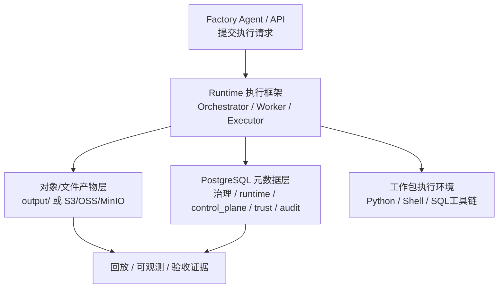

# 数据湖与执行技术架构

> 文档状态：当前有效
> 角色：Runtime 依赖的数据湖与执行栈设计
> 适用范围：结构化数据库、对象/文件产物层、执行框架、工作流语言与处理模式
> 关联文档：
> - `docs/02_总体架构/数据工厂技术架构.md`
> - `docs/02_总体架构/系统技术上下文与基础设施.md`
> - `docs/04_系统组件设计/03_Runtime执行/Runtime调度与任务系统.md`
> - `docs/04_系统组件设计/03_Runtime执行/数据处理引擎.md`
> - `docs/05_数据模型设计/数据库分域设计.md`

## 1. 这份文档解决什么问题

Runtime 不是只依赖一个数据库。工业级治理执行至少需要三层技术栈：

1. 元数据与控制真相源
2. 大对象结果与证据产物层
3. 可替换的执行框架与工作流语言约束

这份文档把这三层说明清楚，并补足 Runtime 视角下“系统到底工作在什么样的基础设施上、当前支持哪些输入输出模式”的实现口径。

## 2. 数据湖与执行栈总图

图说明：这张图强调 Runtime 依赖的不是“单库 + 单脚本”，而是“PG 元数据层 + 对象/文件产物层 + 统一执行框架”的组合。

## 3. 当前正式存储分层

### 3.1 PostgreSQL 元数据层

负责保存：

1. 控制状态
2. 发布与版本
3. 业务结果索引
4. 可信来源与样例数据索引
5. 审计与 API 事件

正式 schema 包括：

1. `governance`
2. `runtime`
3. `control_plane`
4. `trust_meta`
5. `trust_data`
6. `audit`

### 3.2 对象/文件产物层

负责保存：

1. 原始批次快照
2. 大对象输出文件
3. 运行证据文件
4. Trace 导出、回放材料、验收产物

当前现实：

1. 仓库和运行环境里的 `output/` 是最小可用产物层。

演进方向：

1. 在不改契约的前提下切到 S3 / OSS / MinIO 兼容对象存储。

### 3.3 为什么不把所有东西都塞进 PG

因为以下对象不适合直接当主查询表：

1. 大批量中间结果
2. 大体积 Trace 明细
3. 回放材料和验收文件
4. 原始样本导出包

它们应通过 `artifact_ref / evidence_ref` 与 PG 索引关联。

### 3.4 Runtime 依赖的基础设施服务矩阵

| 基础设施 | Runtime 怎么用 | 当前正式要求 |
|---|---|---|
| PostgreSQL | 保存版本态、任务态、治理结果索引、可信数据引用、审计引用 | 必须可备份、可恢复、可查询 |
| `Go Runtime / temporal_go` 控制引擎 | 状态推进、恢复、执行协调 | 可重建，但不能取代 PG 真相源 |
| 对象 / 文件产物层 | 保存 `runtime_output`、trace、报表、导出包 | 必须和 PG 索引形成双向引用 |
| 可信数据标准查询服务 | 提供 `trust_data.*` 标准数据和能力元数据 | 必须通过正式契约访问 |
| 真实外部能力 | 通过已登记能力目录由 bundle 受控调用 | 不允许脚本私自接第三方接口 |

## 4. 执行框架

### 4.1 正式执行骨架

当前正式执行骨架由四部分组成：

1. `Runtime Orchestrator`
2. `Governance Worker`
3. `Workpackage Executor`
4. `Bundle Entrypoint`

### 4.2 责任边界

| 组件 | 负责什么 | 不负责什么 |
|---|---|---|
| Orchestrator | 创建任务、推进状态、审批门禁、记录证据 | 执行具体治理算法 |
| Worker | 领取任务、装载 bundle、调用入口 | 生成工作包内容 |
| Executor | 解析工作包契约、准备执行环境 | 直接决定业务目标 |
| Bundle Entrypoint | 执行具体工作流和脚本 | 修改 Runtime 状态机 |

## 5. 支持的数据处理模式

### 5.1 当前正式支持

1. `file` binding
2. `database` binding
3. 批处理模式 `batch`
4. 可信数据标准查询作为受控输入上下文

### 5.2 输入输出支持矩阵

| 模式 | 输入 / 输出 | 当前状态 | 说明 |
|---|---|---|---|
| `file` | 输入 + 输出 | 当前正式支持 | 默认最稳定的批处理模式 |
| `database` | 输入 + 输出 | 当前正式支持 | 正式结构化落库模式 |
| `http` | 输入 | 受控正式支持 | 仅限已登记能力目录和受控适配器 |
| `http` | 输出 | 受控扩展位 | 当前不是默认正式主链路 |
| `kafka` | 输入 + 输出 | 受控扩展位 | Schema 预留，Runtime 默认不承诺 |
| `stream` | 输入 + 输出 | 受控扩展位 | 需要专门适配器与回放设计 |
| 对象 / 文件产物层 | 输出 | 当前正式支持 | 负责大对象和证据 |

### 5.3 兼容扩展路径

在不改变正式契约的前提下，可逐步扩展：

1. `http`
2. `kafka`
3. `stream`

但这些模式必须通过 `workpackage_schema.v1` 的 binding 声明进入，不允许脚本自行发明输入协议。

## 6. 支持的工作流语言

### 6.1 当前一等公民

1. `Python 3`
2. `Shell`

原因：

1. 当前 Runtime 通过 `entrypoint.py / entrypoint.sh` 执行工作包。
2. 这两类入口最容易和现有契约、环境变量、证据产出对齐。

### 6.2 受控扩展路径

如需扩展其他语言，必须满足两个前提：

1. 仍然通过标准入口暴露给 Runtime
2. 仍然遵守输入输出 binding 与证据产出契约

可受控扩展的方向包括：

1. `SQL` 工具链
2. `R`
3. `Java / Scala`

但它们当前都不是默认一等公民，不能写成已经普遍支持。

### 6.3 与执行服务的对应关系

| 语言 / 入口 | 当前承接方式 | 主要服务 |
|---|---|---|
| `Python 3` | `entrypoint.py` | Worker / Executor |
| `Shell` | `entrypoint.sh` | Worker / Executor |
| `SQL` 工具链 | 受控扩展 | Bundle 内部工具链 |
| `R / Java / Scala` | 受控扩展 | Bundle 内部运行时 |

## 7. 推荐的数据格式

| 场景 | 推荐格式 | 说明 |
|---|---|---|
| 小批量调试输入 | `csv` / `json` | 便于查看和 dryrun |
| 批量记录输入输出 | `jsonl` / `parquet` | 便于机器处理和分区 |
| DB 结果索引 | 结构化表 | 便于查询与跨对象关联 |
| 证据与回放产物 | `json` / `jsonl` / 压缩包 | 便于导出、审计和归档 |

## 8. 与工作包 Schema 的关系

这份文档不是独立于工作包协议的。以下字段直接决定执行栈如何工作：

1. `input_bindings`
2. `output_bindings`
3. `scripts[].consumes`
4. `scripts[].produces`
5. `execution_plan.steps[].input_bindings`
6. `execution_plan.steps[].output_bindings`

没有这些字段，Runtime 只能执行脚本，不能构成可工程化的数据处理工作流。

## 9. 与数据库域和接口面的关系

1. Runtime 自己拥有的正式数据库域主要是：
   - `runtime`
   - `control_plane`
2. Runtime 会写入或读取：
   - `governance.*` 中的治理结果对象
   - `audit.*` 中的审计留痕
   - `trust_meta / trust_data` 中的受控查询对象
3. Runtime 不应把自己扩展成：
   - 可信数据管理服务
   - 页面查询服务
   - 第三方 provider 直连适配器

## 10. 工业化要求

1. PG 负责结构化真相，对象/文件层负责大对象与回放产物。
2. Runtime 不承诺“任意语言任意协议都可直接跑”；只有通过标准入口和 binding 契约的能力才是正式支持。
3. 工作流语言扩展不应改变 Runtime 主骨架，只能在 bundle 内部演进。
