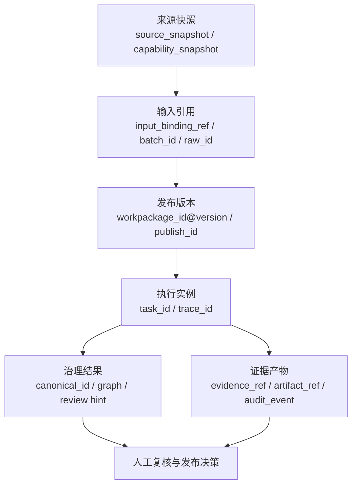

# 数据血缘与可追溯设计

> 文档状态：当前有效
> 角色：Runtime 执行链的数据血缘与回放设计
> 适用范围：输入来源、执行上下文、输出结果、证据产物和人工复核对象之间的可追溯关系
> 关联文档：
> - `docs/04_系统组件设计/03_Runtime执行/Runtime调度与任务系统.md`
> - `docs/04_系统组件设计/03_Runtime执行/数据处理引擎.md`
> - `docs/05_数据模型设计/数据库分域设计.md`
> - `docs/05_数据模型设计/核心表结构设计.md`

## 1. 为什么 Runtime 必须有血缘设计

工业级数据治理系统不能只回答“结果是什么”，还必须回答：

1. 输入来自哪里。
2. 这次执行使用了哪个工作包版本。
3. 哪些可信数据、快照和外部能力参与了判断。
4. 输出结果和证据对应哪一次执行、哪一个 trace、哪一个人工结论。

这就是 Runtime 血缘设计的职责。

## 2. 血缘主链图

图说明：这张图按“输入来源 -> 工作包版本 -> 任务执行 -> 输出结果 -> 证据回放”展开，帮助读者看清一条治理结果应该如何被追溯。

## 3. Runtime 血缘最小对象集

| 对象 | 作用 | 典型载体 |
|---|---|---|
| `source_snapshot_id` | 说明当时依赖了哪个来源快照 | `trust_meta.source_snapshot` |
| `input_binding_ref` | 说明这次输入从哪里读取 | 工作包 binding + 任务提交上下文 |
| `batch_id / raw_id` | 说明处理了哪一批、哪一条原始记录 | `governance.raw_record` |
| `workpackage_id@version` | 说明执行了哪个工作包版本 | `runtime.publish_record` |
| `publish_id` | 说明这次执行基于哪次发布 | `runtime.publish_record` |
| `task_id` | 说明这次具体执行实例 | `control_plane.task_state` |
| `trace_id` | 说明跨组件回放链路 | `control_plane.evidence_records` / observability |
| `canonical_id` | 说明输出结果对象 | `governance.canonical_record` |
| `evidence_ref` | 说明有哪些证据文件或记录 | `control_plane.evidence_records` / `output/` |
| `review_id` | 说明是否进入人工复核 | `governance.review` |

## 4. 血缘写入责任

### 4.1 Factory Agent 写什么

1. 提交时写入 `workpackage_id@version`
2. 写入 `publish_id`
3. 写入输入引用和门禁上下文

### 4.2 Runtime 写什么

1. 创建 `task_id`
2. 生成或接收 `trace_id`
3. 记录状态转移和执行证据

### 4.3 Bundle 写什么

1. 输入记录到结果记录的映射关系
2. 外部能力调用摘要
3. 主结果和证据产物引用

### 4.4 审核与回放层写什么

1. `review_id`
2. 人工裁决结论
3. 与 `task_id / trace_id / evidence_ref` 的关联

## 5. 血缘查询的四个维度

### 5.1 从结果回查输入

需要支持：

1. 从 `canonical_id` 回查 `raw_id`
2. 从 `raw_id` 回查 `batch_id`
3. 从结果回查使用过的来源快照和外部能力

### 5.2 从任务回查版本

需要支持：

1. 从 `task_id` 回查 `workpackage_id@version`
2. 从 `task_id` 回查 `publish_id`
3. 从 `task_id` 回查完整状态序列和证据序列

### 5.3 从证据回查执行

需要支持：

1. 从 `evidence_ref` 回查 `task_id`
2. 从 `trace_id` 重建执行时间线

### 5.4 从人工结论回查自动链路

需要支持：

1. 从 `review_id` 回查对应结果对象
2. 从 `review_id` 回查触发复核的原因和证据

## 6. 正式边界

1. 血缘是正式对象，不是临时日志。
2. 血缘索引不应只存在于 `output/` 文件中，也不能只存在于单张业务表里。
3. 页面、API、回放工具都应通过正式对象查询，而不是拼接临时文件名猜测关系。

## 7. 与数据库模型的关系

血缘关系分散落在多类表中是合理的，但查询模型必须收敛：

1. 控制态和证据走 `control_plane.*`
2. 发布与版本走 `runtime.*`
3. 业务结果和人工复核走 `governance.*`
4. 来源快照走 `trust_meta.*`
5. 审计走 `audit.*`
6. 大对象证据和中间产物走 `output/` 或对象存储

## 8. 工业化要求

1. 没有 `task_id / trace_id / workpackage_id@version` 的执行，视为不可追溯执行。
2. 没有 `evidence_ref` 或等价证据引用的关键结果，不能进入正式验收。
3. 人工裁决必须能够回查自动链路，而不是只留下结论文本。
