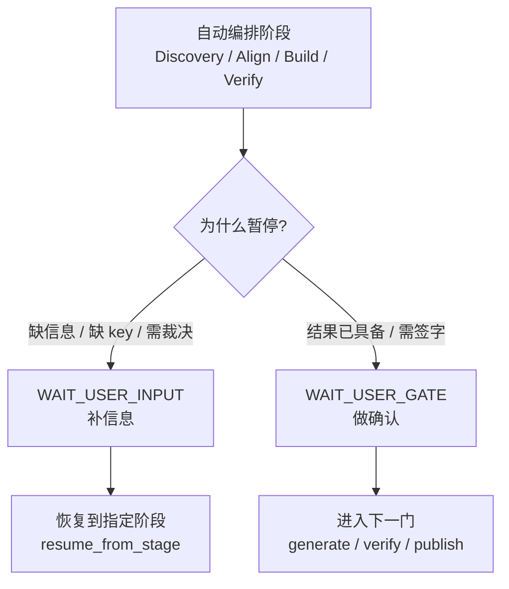

# 人工审核与门禁系统

> 文档状态：当前有效
> 角色：人工输入、人工签字、阻塞恢复的系统设计说明
> 关联文档：
> - `docs/04_系统组件设计/01_工厂Agent编排/工厂Agent状态机.md`
> - `docs/04_系统组件设计/01_工厂Agent编排/编排记忆与恢复设计.md`
> - `docs/05_数据模型设计/审核与反馈模型.md`

## 1. 这份文档强调什么

本系统里的“人工审核”不是单一审核页面，而是两类人机协作能力的组合：

1. 人工补输入 `WAIT_USER_INPUT`
2. 人工做门禁确认 `WAIT_USER_GATE`

它们分别解决：

1. 问题尚未收敛。
2. 问题已经收敛，只差人工签字。

## 2. 人工介入分流图

图说明：这张图强调的是“为什么会找人”，不是完整状态机。

## 3. 两类人工介入的职责差异

| 类型 | 触发原因 | 用户动作 | 恢复方式 |
|---|---|---|---|
| `WAIT_USER_INPUT` | 目标歧义、binding 未定、缺能力、缺 key | 补字段、补依赖、确认范围、做技术裁决 | 回到 `resume_from_stage` |
| `WAIT_USER_GATE` | 生成完成、dryrun 通过、发布待确认 | 点击确认或拒绝 | 进入下一步或终止 |

## 4. 必须保留的结构化字段

人工介入不能只靠一段中文提示，至少要保留下面这些字段：

1. `current_stage`
2. `status`
3. `reason_code`
4. `retry_count`
5. `max_retry`
6. `resume_from_stage`
7. `next_action`
8. `user_actions`
9. `resume_condition`

其中：

1. 前 7 项通常落在 `interaction_state`
2. 后 2 项通常落在 `blocker_ticket`

## 5. 人工输入与人工签字为什么不能混

如果混在一起，会出现两个严重问题：

1. UI 不知道应该展示“补资料表单”还是“确认按钮”。
2. 系统不知道用户操作后要“回到上一步继续求解”，还是“直接推进下一门”。

所以这两类状态必须在模型层、UI 层、日志层同时分开。

## 6. 与审核结果相关的主要数据

人工审核与门禁结果当前主要会影响：

1. `governance.review`
2. `governance.change_request`
3. `audit.event_log`
4. `control_plane.task_state`
5. `control_plane.evidence_records`
6. `runtime.publish_record`

这说明人工动作既影响业务结果，也影响执行控制态和审计态。

## 7. 设计原则

1. 不能把人工介入设计成“纯页面行为”，它必须进入状态机。
2. 不能把人工确认设计成“只有前端按钮”，它必须留结构化审计。
3. 不能把阻塞恢复设计成“人工口头协商”，它必须有恢复条件和恢复点。
