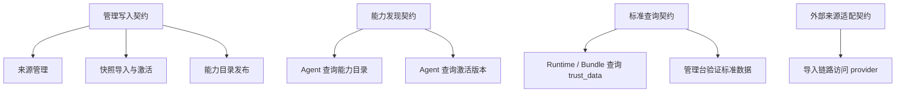

# 可信数据API调用契约

> 文档状态：当前有效
> 角色：可信数据管理模块北向 / 南向 API 调用契约
> 适用范围：Factory Agent、Runtime / Bundle、管理台、外部来源适配
> 关联文档：
> - `docs/02_总体架构/系统技术上下文与基础设施.md`
> - `docs/04_系统组件设计/04_数据与人工介入/可信数据管理模块设计.md`
> - `docs/04_系统组件设计/02_工作包协议/工作包协议与IO绑定.md`
> - `docs/05_数据模型设计/可信数据数据库契约设计.md`

## 1. 这份文档回答什么

这份文档不定义某个具体 HTTP 路由实现，而是定义可信数据管理模块的正式调用边界：

1. 谁可以调用什么能力
2. 调用最少需要带哪些主键和上下文
3. 哪些调用方式属于越界

## 2. 调用分类图

图说明：这张图按“管理写入、能力发现、标准查询”三类北向契约展开。真正的第三方 provider 细节必须被模块吸收，不能直接暴露给页面和主流程调用方。

## 3. 正式调用矩阵

| 调用方 | 被调方 | 契约类型 | 最低输入 | 最低输出 | 禁止事项 |
|---|---|---|---|---|---|
| Factory Agent | 可信数据管理模块 | 能力发现 | `scene_id`、`goal`、`required_capabilities` | `capability_id`、来源、状态、激活版本、限制条件 | 直查 provider 配置、直读 `trust_db.*` |
| 工作包生成器 | 可信数据管理模块 | 能力发现 | `capability_id` 或 `source_id` | `interface_id`、约束、认证要求、可用状态 | 手写未注册能力 |
| Runtime / Bundle | 可信数据管理模块 | 标准查询 | `task_id`、查询条件、期望数据域 | 标准查询结果、`source_snapshot_id`、证据摘要 | 把查询结果回写到 `trust_data.*` |
| 可信数据管理台 | 可信数据管理模块 | 管理写入 | 来源信息、快照信息、激活说明、能力定义 | 发布回执、审计引用、状态 | 绕开管理 API 直写数据库 |
| 导入链路 | 外部来源 / Provider | 南向适配 | 来源配置、认证、抓取策略 | 原始快照、元数据、校验摘要 | 让页面或 Agent 直调第三方接口 |

## 4. 接口面与数据库域对应关系

| 接口面 | 对应数据库域 | 主要服务 | 说明 |
|---|---|---|---|
| 来源管理接口 | `trust_meta.source_registry` | 可信数据管理模块 | 页面和管理员只走这里 |
| 快照与激活接口 | `trust_meta.source_snapshot`、`active_release` | 导入链路 / 发布流程 | 负责版本切换 |
| 能力发现接口 | `trust_meta.capability_registry` | 可信数据管理模块 | Agent 和生成器读能力目录 |
| 标准查询接口 | `trust_data.*` | 标准查询服务 | Runtime / Bundle 只走这里读正式数据 |
| 审计 / 回放接口 | `audit.*` + 证据产物引用 | 审计查询 / 回放服务 | 回看谁在何时用了哪个快照或能力 |

## 5. 与 `workpackage_schema.v1` 的绑定规则

### 5.1 `api_plan.registered_apis_used`

工作包蓝图中的 `api_plan.registered_apis_used` 必须满足：

1. `interface_id` 必须能在 `trust_meta.capability_registry` 找到正式定义。
2. 调用约束必须来自当前激活版本或正式能力目录，而不是人工手写“猜测接口”。
3. 若某能力来自可信数据管理模块的标准查询域，应优先走 `trust_data.*` 查询契约，而不是额外再走外部 provider。

### 5.2 `input_bindings / output_bindings`

若工作包依赖可信数据查询：

1. 可以在 `input_bindings` 中声明需要的标准查询上下文
2. 但不把 `trust_data.*` 当工作包输出绑定
3. 输出结果仍应回到 `governance.*`、`control_plane.*` 或证据产物域

## 6. 关键调用约束

### 6.1 Agent 调用约束

1. Agent 只能读：
   - `capability_registry`
   - `active_release`
   - `source_snapshot` 摘要
2. Agent 不能改写：
   - 来源登记
   - 激活版本
   - 标准查询数据

### 6.2 Runtime / Bundle 调用约束

1. Runtime / Bundle 只能读正式查询域和受控能力元数据。
2. Runtime / Bundle 不能把可信数据模块当治理结果写入域。
3. Runtime / Bundle 不得跳过模块封装，直接调用未登记 provider 接口。

### 6.3 页面调用约束

1. 页面只通过管理 API 或正式查询 API 调可信数据模块。
2. 页面不直连数据库。
3. 页面不直接消费 provider 差异字段。

## 7. review 刷新结论

当前与可信数据管理模块相关的正式 API 契约应统一为：

1. 管理写入和标准查询分离
2. 能力发现和标准查询分离
3. 第三方 provider 适配只留在模块内部
4. `trust_db.*` 不进入任何新 API 的正式输入输出契约
5. 能力发现接口默认读 `trust_meta.*`
6. 标准查询接口默认读 `trust_data.*`
7. 页面、Agent、Runtime 都不直面 Provider 差异字段

## 8. 继续阅读

1. [可信数据管理模块设计](可信数据管理模块设计.md)
2. [可信数据数据库契约设计](../../05_数据模型设计/可信数据数据库契约设计.md)
