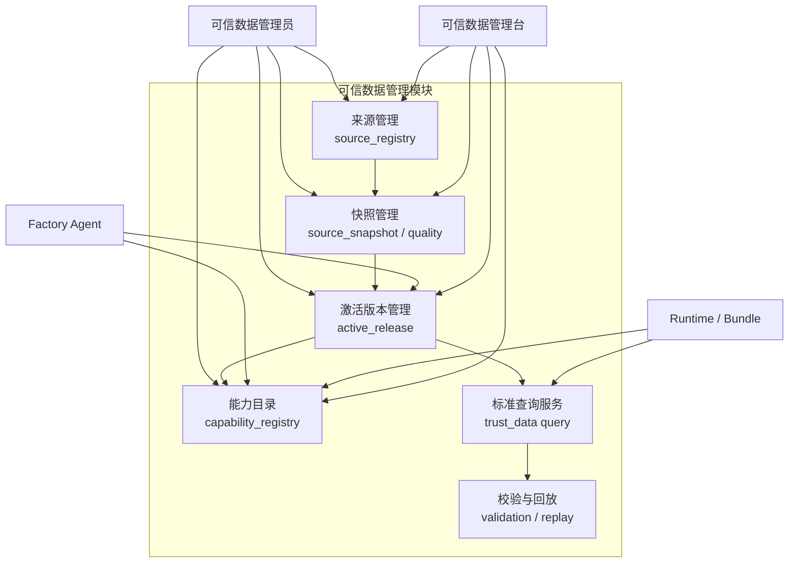
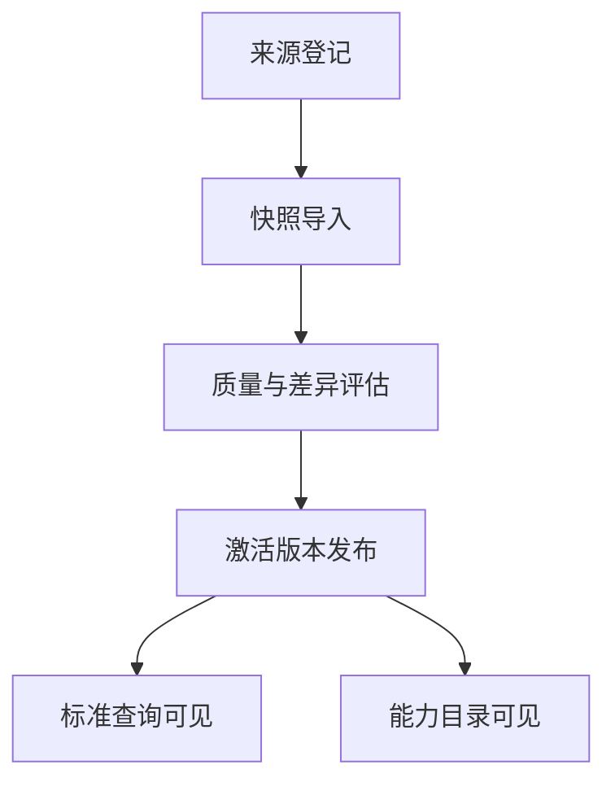

# 可信数据管理模块设计

> 文档状态：当前有效
> 角色：可信数据管理模块正式设计
> 适用范围：来源管理、快照管理、激活版本、能力目录、标准查询数据
> 关联文档：
> - `docs/02_总体架构/系统技术上下文与基础设施.md`
> - `docs/03_数据处理工艺/地址治理处理架构.md`
> - `docs/04_系统组件设计/01_工厂Agent编排/工厂Agent编排系统.md`
> - `docs/04_系统组件设计/03_Runtime执行/数据湖与执行技术架构.md`
> - `docs/05_数据模型设计/可信数据数据库契约设计.md`
> - `docs/04_系统组件设计/04_数据与人工介入/可信数据API调用契约.md`

## 1. 模块定位

可信数据管理模块是 Trust Hub 的正式化落点。  
它负责把“可信来源、标准查询数据、能力目录”做成一个可管理、可发布、可被 Agent / Runtime 正式消费的模块。

它解决的不是“临时查一下外部数据”，而是三件系统级问题：

1. 系统当前可信依赖到底有哪些。
2. 当前激活版本到底是什么。
3. 哪些能力和标准数据可以进入正式主链路。

## 2. 模块在系统技术上下文中的位置

可信数据管理模块在系统里不是一个“随便查外部数据的工具”，而是正式技术上下文中的三个承重点：

1. 它承接 `trust_meta` 元数据域。
2. 它承接 `trust_data` 标准查询域。
3. 它屏蔽第三方 provider 差异，对外只暴露正式能力目录和标准查询契约。

## 3. 模块架构图

图说明：这张图只表达可信数据管理模块自身的结构，重点看元数据管理、快照管理、能力目录、标准查询和外部消费者的关系。

## 4. 模块职责

### 4.1 负责什么

1. 管理可信来源与采集策略
2. 管理来源快照、质量报告与激活版本
3. 管理能力目录及其对外可见状态
4. 提供标准查询数据给 Agent / Runtime / 管理台
5. 记录可信数据发布与调用所需的审计和回放线索

### 4.2 不负责什么

1. 不负责治理业务结果的写入
2. 不负责 Runtime 控制态推进
3. 不负责页面直接拼装主业务状态
4. 不允许任何调用方把它当作“可随便写的公共数据库”

## 5. 模块依赖的基础设施与数据库域

| 层 | 当前正式依赖 | 作用 |
|---|---|---|
| 元数据数据库域 | `trust_meta.*` | 来源、快照、激活版本、能力目录 |
| 标准查询数据库域 | `trust_data.*` | 行政区、道路、POI、地名、样本等标准查询 |
| 过渡底座 | `trust_db.*` | 历史底座，只作为收敛背景 |
| 审计域 | `audit.*` | 导入、发布、激活和调用审计 |
| 对象 / 文件产物层 | 快照包、校验报告、导入产物 | 大对象和导入证据 |
| 外部 Provider | 地图源、地址核验源、样本来源 | 南向抓取与能力适配 |

## 6. 对外提供的三类能力

| 能力类别 | 主要消费者 | 作用 |
|---|---|---|
| 能力发现 | Factory Agent、工作包生成器 | 提供可用能力、来源、激活版本和调用约束 |
| 标准查询 | Runtime / Bundle、管理台 | 提供 `trust_data.*` 的正式读取入口 |
| 管理发布 | 可信数据管理员、管理台 | 提供来源登记、快照导入、能力发布和激活版本管理 |

## 7. 核心流程

### 7.1 来源到激活版本

图说明：可信来源只有经过登记、导入、质量判断、激活发布后，才能进入正式消费口径。

### 7.2 能力目录发布

1. 能力必须有来源归属。
2. 能力必须绑定激活版本或清晰的来源快照。
3. Agent 和工作包生成只能消费已发布、可用状态的能力。

### 7.3 Runtime 正式查询

1. Bundle / Worker 正式读取入口是 `trust_data.*`。
2. 查询链路必须能反推出当前激活版本和来源快照。
3. 结果摘要和关键引用要能进入证据 / 血缘链。

## 8. 模块对外接口面

| 接口面 | 主要消费者 | 主要内容 |
|---|---|---|
| 管理写入接口 | 可信数据管理台、数据管理员 | 来源管理、快照导入、激活版本、能力目录发布 |
| 能力发现接口 | Factory Agent、工作包生成器 | 查询可用能力、激活版本、限制条件 |
| 标准查询接口 | Runtime / Bundle、管理台 | 查询 `trust_data.*` 的正式标准数据 |
| 校验与回放接口 | 数据管理员、运维、回放工具 | 查看快照质量、差异和重放结果 |

## 9. 契约 review 结论

### 9.1 数据库契约

当前正式口径应固定为：

1. `trust_meta.*`
   - 由可信数据管理模块拥有写入权
2. `trust_data.*`
   - 由可信数据导入链路拥有写入权
3. `trust_db.*`
   - 仅作为过渡底座保留，不再是正式消费入口

### 9.2 API 调用契约

当前正式口径应固定为：

1. Agent 只读能力目录、激活版本和来源快照摘要
2. Runtime / Bundle 只读标准查询数据和受控能力元数据
3. 页面通过管理 API 操作来源、快照、激活版本和能力目录
4. 页面、Agent、Runtime 都不允许直连第三方 provider 配置细节

## 10. 模块边界规则

1. 可信数据管理模块不能直接写 `governance.*`、`runtime.*`。
2. Agent、Worker、页面不能直接改写 `trust_meta.*`、`trust_data.*`。
3. 可信能力发布必须是显式动作，不能靠“查到了就算可用”。

## 11. 继续阅读

1. [可信数据API调用契约](可信数据API调用契约.md)
2. [可信数据数据库契约设计](../../05_数据模型设计/可信数据数据库契约设计.md)
3. [数据库分域设计](../../05_数据模型设计/数据库分域设计.md)
