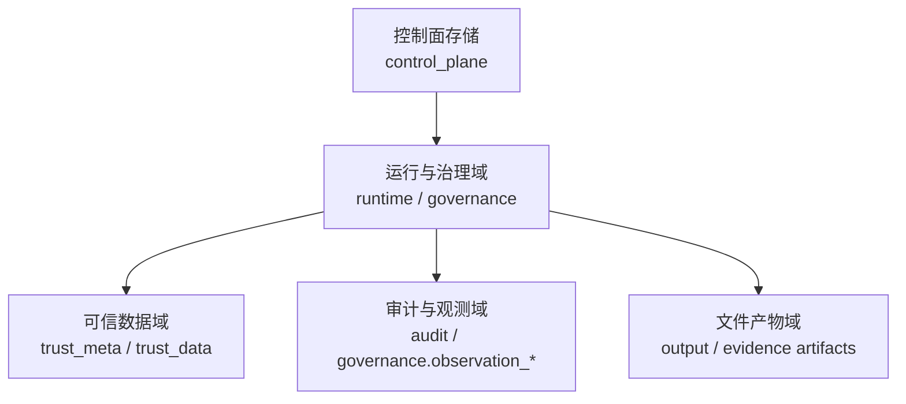
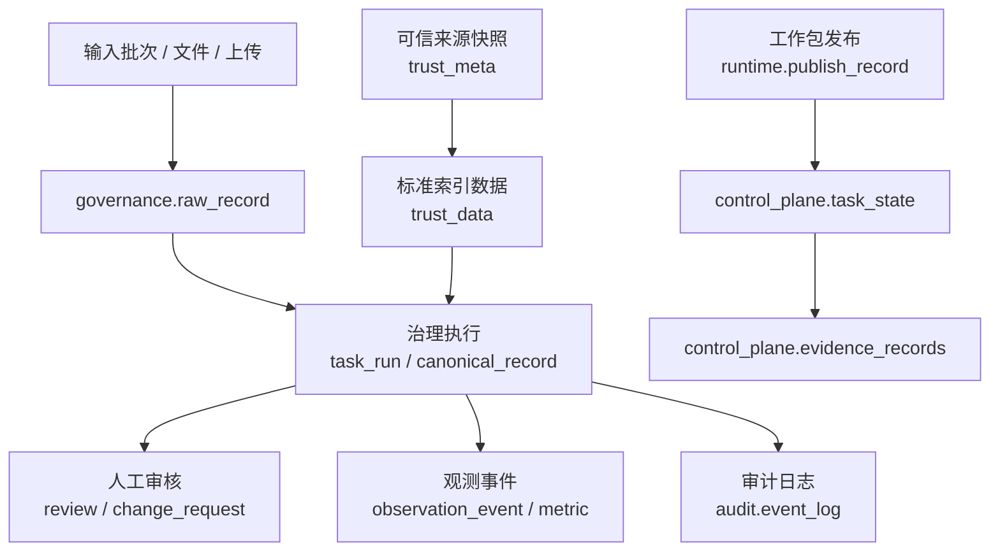

# 数据存储体系设计

> 文档状态：当前有效
> 角色：系统级数据设计总览
> 适用范围：治理结果、运行记录、可信数据、审计、控制面状态、证据产物
> 关联文档：
> - `docs/02_总体架构/系统总览.md`
> - `docs/07_系统运行与运维/系统可观测性能力设计.md`
> - `docs/04_系统组件设计/03_Runtime执行/Runtime调度与任务系统.md`
> - `docs/04_系统组件设计/04_数据与人工介入/可信数据管理模块设计.md`
> - `docs/05_数据模型设计/数据模型总览.md`
> - `docs/05_数据模型设计/数据库分域设计.md`
> - `docs/05_数据模型设计/可信数据数据库契约设计.md`
> - `docs/05_数据模型设计/核心表结构设计.md`

## 1. 数据存储在系统里承担什么角色

本项目的数据存储不是一张“大表汇总”，而是按职责拆成多个 schema：

1. 治理业务结果
2. Runtime 发布与执行
3. 可信来源元数据与可信查询数据
4. 全链路审计与观测
5. 控制面任务状态与证据

这样拆分的目的不是形式化，而是明确：

1. 谁是业务真相源。
2. 谁是执行真相源。
3. 谁是证据真相源。
4. 哪些表允许被页面直接消费，哪些不允许。

## 2. 存储分层图

图说明：这张图展示的是“职责分层”，不是物理部署图。

## 3. 这份文档和数据模型文档怎么分工

本文件讲“存在哪里、谁是真相源、谁负责什么”。  
数据库 Schema 与核心表结构设计已经拆到 `05_数据模型设计/`：

1. `数据库分域设计`
2. `可信数据数据库契约设计`
3. `核心表结构设计`

具体业务模型继续拆到 `05_数据模型设计/`：

1. `数据模型总览`
2. `工单与任务模型`
3. `数据处理阶段模型`
4. `审核与反馈模型`

也就是说：

1. 看存储层和域边界，先读这份文档。
2. 看 schema 分域和正式消费边界，再读 `数据库分域设计`。
3. 看核心表字段分组和主键关系，再读 `核心表结构设计`。
4. 看模型生命周期和业务对象关系，再读其他 `05_数据模型设计/` 文档。

## 4. 当前正式 schema 总表

| schema | 当前角色 | 主要对象 | 当前物理状态 |
|---|---|---|---|
| `governance` | 治理业务主域 | `batch`、`task_run`、`raw_record`、`canonical_record`、`review`、`ruleset`、`change_request`、`observation_*`、`alert_event` | Alembic 物理表 |
| `runtime` | 工作包发布主域 | `publish_record` | Alembic 物理表 |
| `trust_meta` | 可信来源与能力元数据 | `source_registry`、`source_schedule`、`source_snapshot`、`snapshot_quality_report`、`snapshot_diff_report`、`active_release`、`validation_replay_run`、`capability_registry`、`audit_event` | 迁移物理表 + bootstrap 补齐 |
| `trust_data` | 可信查询与标准索引数据 | `admin_division`、`road_index`、`poi_index`、`place_name_index`、`sample_data` | 兼容视图 + bootstrap 物理表并存 |
| `audit` | 审计主域 | `event_log`、`api_audit_log` | Alembic 物理表 |
| `control_plane` | 执行状态与证据 | `task_state`、`evidence_records` | Runtime bootstrap 物理表 |

## 5. 各 schema 负责什么

### 5.1 `governance`

`governance` 负责治理业务本身，当前物理表已经在迁移脚本中明确落地：

1. `batch`
   - 批次主记录。
2. `task_run`
   - 某次治理任务执行记录。
3. `raw_record`
   - 原始输入记录。
4. `canonical_record`
   - 规范化后的结果记录。
5. `review`
   - 人工审核闭环。
6. `ruleset`
   - 规则集配置。
7. `change_request`
   - 规则变更与对比审批。
8. `observation_event`、`observation_metric`、`alert_event`
   - 运行观测事件、指标、告警。

### 5.2 `runtime`

当前稳定主表是 `runtime.publish_record`，它负责：

1. 记录哪个 `workpackage_id + version` 已进入 Runtime。
2. 记录 bundle 路径和证据引用。
3. 记录发布人与确认人信息。

它解决的不是“任务执行细节”，而是“工作包版本发布真相源”。

### 5.3 `trust_meta`

`trust_meta` 负责可信来源和能力目录，例如：

1. 来源登记 `source_registry`
2. 来源调度 `source_schedule`
3. 快照、质量、差异与回放 `source_snapshot`、`snapshot_quality_report`、`snapshot_diff_report`、`validation_replay_run`
4. 激活版本 `active_release`
5. 能力目录 `capability_registry`
6. 域内审计 `audit_event`

Factory Agent 做能力盘点时，首先看的就是这层。

### 5.4 `trust_data`

`trust_data` 负责可查询、可消费的可信标准数据，例如：

1. 行政区划 `admin_division`
2. 道路索引 `road_index`
3. POI 索引 `poi_index`
4. 地名索引 `place_name_index`
5. 示例数据 `sample_data`

这些表的角色是“为治理链路提供标准查询接口”，不是承接治理运行结果。

### 5.5 `audit`

`audit` 负责跨系统、跨阶段的审计动作留痕：

1. `event_log`
2. `api_audit_log`

它回答的是：

1. 谁在什么时候做了什么动作。
2. 哪次 API 调用影响了哪条治理链路。

### 5.6 `control_plane`

`control_plane` 当前承接 Runtime 的控制态数据：

1. `task_state`
2. `evidence_records`

它更偏执行控制和证据索引，而不是治理业务主域。

## 6. 数据流转图

图说明：这张图回答“数据从哪里来，最终进了哪里”。

## 7. 关键表设计口径

### 7.1 治理业务主链路

一条典型的地址治理链路，数据落点如下：

1. 输入批次建立到 `governance.batch`
2. 原始地址落到 `governance.raw_record`
3. 执行过程记录到 `governance.task_run`
4. 标准化结果落到 `governance.canonical_record`
5. 人工复核落到 `governance.review`
6. 规则差异和审批落到 `governance.change_request`

### 7.2 工作包发布主链路

一条工作包发布链路，数据落点如下：

1. 发布记录落到 `runtime.publish_record`
2. Runtime 执行状态落到 `control_plane.task_state`
3. 执行证据落到 `control_plane.evidence_records`
4. 业务执行结果再回写到 `governance.*`

### 7.3 可信数据增强主链路

一条可信查询链路，数据落点如下：

1. 来源与能力定义在 `trust_meta.*`
2. 标准索引与样本数据在 `trust_data.*`
3. 治理链路在运行时读取 `trust_data.*`
4. 读取行为和结果摘要进入观测与审计域

## 8. 禁止跨界访问清单

| 越界场景 | 明确禁止 | 原因 |
|---|---|---|
| 页面/API 直连 `trust_db.*` | 禁止 | `trust_db` 是过渡底座，不是正式入口 |
| 页面/API 把 `control_plane.task_state/evidence_records` 当治理结果主表 | 禁止 | 控制态和证据态不等于业务结果态 |
| Worker 直接改写 `runtime.publish_record` 作为执行结果 | 禁止 | 发布域和执行域职责混淆 |
| Agent 直接写 `governance.canonical_record/review` | 禁止 | 编排域不拥有治理结果域 |
| Trust Hub 直接写 `governance.*` 或 `runtime.*` | 禁止 | 可信数据域不拥有治理域和发布域 |
| 用 `audit.*` 驱动页面主状态或业务状态机 | 禁止 | 审计域只负责留痕 |
| 用目录扫描、临时 JSON 替代正式表 | 禁止 | 文件产物不是数据库真相源 |

## 9. 当前设计约束

1. 主链路默认走 PostgreSQL，禁止运行时隐式回退到内存或 SQLite。
2. 数据访问应收敛到 Repository / DAO / Service 边界。
3. 页面不应把文件目录扫描当作唯一真相源。
4. 兼容视图可以存在，但正式写路径必须指向域内物理表。

## 10. 当前已明确、但还需持续收敛的点

1. `runtime.publish_record` 已是当前稳定物理主表。
2. `control_plane.task_state/evidence_records` 已表达执行控制态和证据态。
3. `trust_data` 当前仍处在正式读取口径已确定、物理收敛仍在推进的阶段。
4. 主题文档里仍存在更宽的 runtime 域设计设想；若后续新增物理表，应继续在本文件归口更新。

## 11. 本文档的使用方式

1. 看存储层和模型层怎么分工，用第 3 节。
2. 看具体 schema 分工，用第 4 节和第 5 节。
3. 看一条数据链路怎么落库，用第 6 节和第 7 节。
4. 做页面、API、报表时，先看第 8 节禁止跨界清单，避免误把域边界打穿。
5. 需要系统化判断越界时，继续看 `数据库跨界约束`。
6. 可信数据相关设计和 review，继续看 `可信数据管理模块设计` 与 `可信数据数据库契约设计`。
7. 继续补数据库设计时，优先更新 `数据库分域设计`、`数据库跨界约束`、`可信数据数据库契约设计` 和 `核心表结构设计`，再回到本文件更新总览口径。
