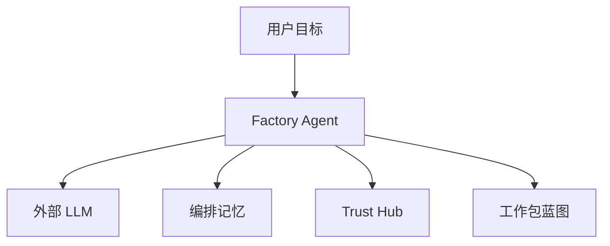

# AI能力组件

> 角色：AI 组件说明
> 来源：`docs/04_系统组件设计/01_工厂Agent编排/工厂Agent编排系统.md`

## 1. AI 组件图

图说明：AI 组件不是单独工作，而是围绕 Factory Agent 提供生成、记忆和能力发现支持。

## 2. 组件职责

| 组件 | 作用 |
|---|---|
| Factory Agent | 目标对齐、蓝图生成、门禁编排 |
| 外部 LLM | 生成候选方案，不直接决定是否通过 |
| 编排记忆 | 保存上下文、轮次、阻塞、恢复点 |
| Trust Hub | 提供真实可用能力快照 |

## 3. 当前约束

1. 真实链路默认用外部 LLM。
2. 失败不能被 mock 成成功。
3. LLM 只生成候选结果，最终仍要过 schema 和门禁。
