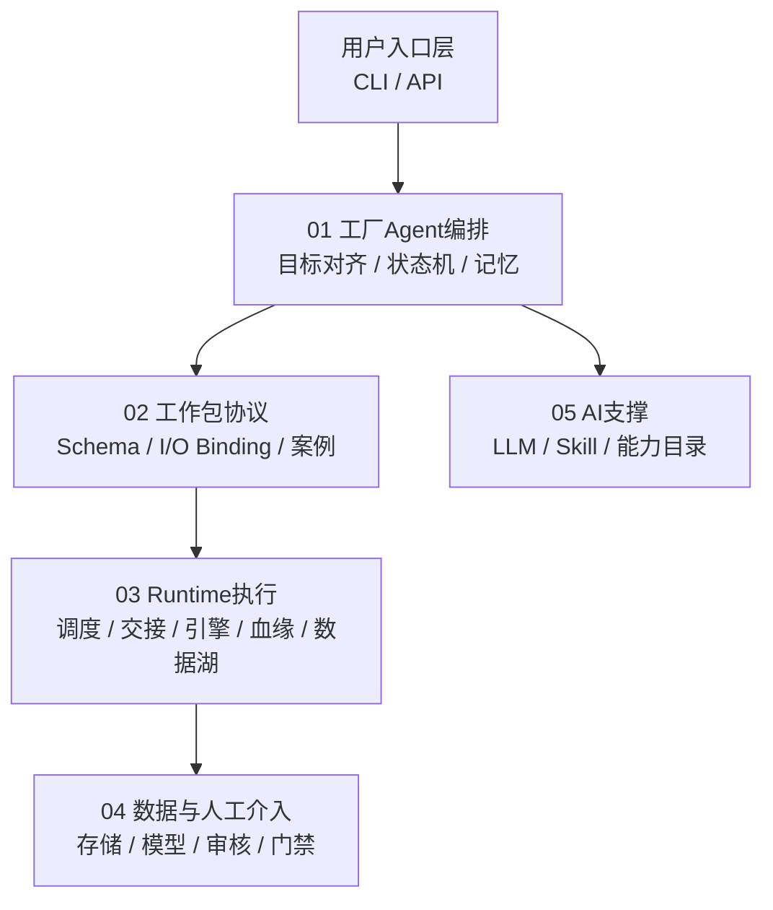

# 系统组件总览

> 文档状态：当前有效
> 角色：`04_系统组件设计/` 目录导航
> 适用范围：帮助读者快速定位“工厂 Agent、工作包协议、Runtime 执行、数据与人工介入、AI 支撑”五类组件设计
> 关联真相源：
> - `docs/02_总体架构/系统总览.md`
> - `docs/02_总体架构/数据工厂技术架构.md`
> - `docs/02_总体架构/系统技术上下文与基础设施.md`
> - `docs/02_总体架构/模块边界.md`

## 1. 目录怎么读

`04_系统组件设计/` 按职责分成 5 组：

1. `01_工厂Agent编排/`
2. `02_工作包协议/`
3. `03_Runtime执行/`
4. `04_数据与人工介入/`
5. `05_AI支撑/`

如果你第一次看组件层，建议按下面顺序读：

1. [工厂Agent编排系统](01_工厂Agent编排/工厂Agent编排系统.md)
2. [工厂Agent状态机](01_工厂Agent编排/工厂Agent状态机.md)
3. [编排记忆与恢复设计](01_工厂Agent编排/编排记忆与恢复设计.md)
4. [工作包Schema设计](02_工作包协议/工作包Schema设计.md)
5. [工作包协议与IO绑定](02_工作包协议/工作包协议与IO绑定.md)
6. [Runtime调度与任务系统](03_Runtime执行/Runtime调度与任务系统.md)
7. [Agent与Runtime交接契约](03_Runtime执行/Agent与Runtime交接契约.md)
8. [数据处理引擎](03_Runtime执行/数据处理引擎.md)
9. [数据血缘与可追溯设计](03_Runtime执行/数据血缘与可追溯设计.md)
10. [数据湖与执行技术架构](03_Runtime执行/数据湖与执行技术架构.md)
11. [数据存储体系设计](04_数据与人工介入/数据存储体系设计.md)
12. [可信数据管理模块设计](04_数据与人工介入/可信数据管理模块设计.md)
13. [可信数据API调用契约](04_数据与人工介入/可信数据API调用契约.md)
14. [数据库分域设计](../05_数据模型设计/数据库分域设计.md)
15. [可信数据数据库契约设计](../05_数据模型设计/可信数据数据库契约设计.md)
16. [数据库跨界约束](../05_数据模型设计/数据库跨界约束.md)
17. [核心表结构设计](../05_数据模型设计/核心表结构设计.md)
18. [人工审核与门禁系统](04_数据与人工介入/人工审核与门禁系统.md)

如果你这次主要关心“系统支持哪些输入输出、依赖什么基础设施、数据库域归哪些服务和接口承接”，请先回到：

1. [系统技术上下文与基础设施](../02_总体架构/系统技术上下文与基础设施.md)
2. 再回到当前目录的 Runtime、可信数据和数据库章节

## 2. 组件分组图

图说明：这张图不是代码调用图，而是“阅读导航图”。重点看五组组件分别解释哪一层职责，以及 Runtime 执行组内部为什么要再拆成调度、交接、引擎、血缘和技术栈。



## 3. 当前正式组件文档怎么分

### 3.1 `01_工厂Agent编排`

1. [工厂Agent编排系统](01_工厂Agent编排/工厂Agent编排系统.md)
   - 解释 Factory Agent 如何引导用户、约束 LLM、形成工作包。
2. [工厂Agent状态机](01_工厂Agent编排/工厂Agent状态机.md)
   - 解释状态集合、跳转标准、用户介入和恢复点。
3. [编排记忆与恢复设计](01_工厂Agent编排/编排记忆与恢复设计.md)
   - 解释“记忆”存什么、何时写、如何恢复。

### 3.2 `02_工作包协议`

1. [工作包Schema设计](02_工作包协议/工作包Schema设计.md)
   - 解释 `workpackage_schema.v1` 的整体结构、对象边界和系统位置。
2. [工作包协议与IO绑定](02_工作包协议/工作包协议与IO绑定.md)
   - 解释 `workpackage_schema.v1` 如何定义格式、绑定、步骤和脚本映射。
3. [工作包协议案例：地址治理](02_工作包协议/工作包协议案例：地址治理.md)
   - 用地址治理示例解释协议如何落地成实际工作包。

### 3.3 `03_Runtime执行`

1. [Runtime调度与任务系统](03_Runtime执行/Runtime调度与任务系统.md)
   - 解释 Runtime 框架如何接收任务、推进状态、记录证据。
2. [Agent与Runtime交接契约](03_Runtime执行/Agent与Runtime交接契约.md)
   - 解释上游 `Factory Agent` 如何把发布与执行请求交给 Runtime。
3. [数据处理引擎](03_Runtime执行/数据处理引擎.md)
   - 解释工作包内部的数据处理逻辑如何被运行时承载。
4. [数据血缘与可追溯设计](03_Runtime执行/数据血缘与可追溯设计.md)
   - 解释 `task_id / trace_id / workpackage_id@version` 如何形成正式血缘链。
5. [数据湖与执行技术架构](03_Runtime执行/数据湖与执行技术架构.md)
   - 解释 PG、对象产物层、执行栈、工作流语言和处理模式。

### 3.4 `04_数据与人工介入`

1. [数据存储体系设计](04_数据与人工介入/数据存储体系设计.md)
   - 解释 `governance / runtime / trust_meta / trust_data / audit / control_plane` 的职责边界。
2. [数据库分域设计](../05_数据模型设计/数据库分域设计.md)
   - 解释数据库 Schema 分域、域归属和过渡态口径。
3. [可信数据管理模块设计](04_数据与人工介入/可信数据管理模块设计.md)
   - 解释 Trust Hub 的正式模块边界、来源发布、能力目录和标准查询。
4. [可信数据API调用契约](04_数据与人工介入/可信数据API调用契约.md)
   - 解释 Agent、Runtime、页面和导入链路如何调用可信数据模块。
5. [可信数据数据库契约设计](../05_数据模型设计/可信数据数据库契约设计.md)
   - 解释 `trust_meta / trust_data / trust_db` 的数据库契约和 review 结论。
6. [数据库跨界约束](../05_数据模型设计/数据库跨界约束.md)
   - 解释哪些 schema 和表不能被跨界直连或误用。
7. [核心表结构设计](../05_数据模型设计/核心表结构设计.md)
   - 解释核心表的主键、字段分组和逻辑关系。
8. [人工审核与门禁系统](04_数据与人工介入/人工审核与门禁系统.md)
   - 解释人工输入、人工签字、阻塞恢复的职责分界。

### 3.5 `05_AI支撑`

1. [AI能力组件](05_AI支撑/AI能力组件.md)
   - 解释 LLM、能力目录、技能与可信 API 如何进入主链路。

## 4. 当前目录树

```text
04_系统组件设计/
├── 系统组件总览.md
├── 01_工厂Agent编排/
│   ├── 工厂Agent编排系统.md
│   ├── 工厂Agent状态机.md
│   └── 编排记忆与恢复设计.md
├── 02_工作包协议/
│   ├── 工作包Schema设计.md
│   ├── 工作包协议与IO绑定.md
│   └── 工作包协议案例：地址治理.md
├── 03_Runtime执行/
│   ├── Runtime调度与任务系统.md
│   ├── Agent与Runtime交接契约.md
│   ├── 数据处理引擎.md
│   ├── 数据血缘与可追溯设计.md
│   └── 数据湖与执行技术架构.md
├── 04_数据与人工介入/
│   ├── 数据存储体系设计.md
│   ├── 可信数据管理模块设计.md
│   ├── 可信数据API调用契约.md
│   └── 人工审核与门禁系统.md
└── 05_AI支撑/
    └── AI能力组件.md
```

## 5. 组件职责总表

| 组件域 | 核心对象 | 负责什么 | 不负责什么 |
|---|---|---|---|
| 工厂Agent编排 | `factory_agent` | 目标收敛、蓝图生成、门禁编排 | 直接执行治理算法 |
| 工作包协议 | `workpackage_schema` | 定义工作包契约、记忆契约 | 承载 runtime 业务逻辑 |
| Runtime执行 | `runtime_orchestrator`、`governance_worker` | 调度任务、执行 bundle、回写结果、沉淀血缘 | 自己发明工作包内容 |
| 数据与人工介入 | `governance/runtime/trust/audit/control_plane` | 持久化任务、结果、证据、能力数据、审核对象，并提供可信数据管理边界 | 直接承载页面交互逻辑 |
| AI支撑 | `LLM / Skill / Capability Catalog` | 能力增强、人工协作、生成约束 | 替代主流程状态机 |

## 6. 这次重组后的设计原则

1. 组件文档按“系统职责”组织，而不是按临时专题堆叠。
2. Runtime 执行不再只有“调度”一篇，而是拆成：
   - 调度与任务系统
   - Agent 交接契约
   - 数据处理引擎
   - 数据血缘与可追溯
   - 数据湖与执行技术架构
3. 数据模型放到独立 `05_数据模型设计/`，避免“存储层”和“业务模型层”混写。
4. 图都以中文说明为主，英文术语只保留关键状态名和契约名，方便页面阅读。
