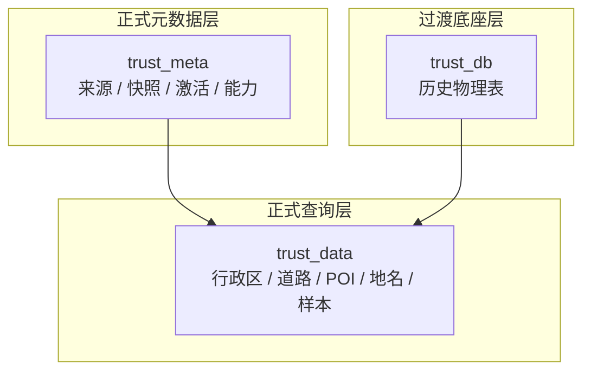

# 可信数据数据库契约设计

> 文档状态：当前有效
> 角色：可信数据管理模块数据库契约与 review 入口
> 适用范围：`trust_meta`、`trust_data`、`trust_db` 相关表与写入/读取边界
> 关联文档：
> - `docs/02_总体架构/系统技术上下文与基础设施.md`
> - `docs/05_数据模型设计/数据库分域设计.md`
> - `docs/05_数据模型设计/数据库跨界约束.md`
> - `docs/05_数据模型设计/核心表结构设计.md`
> - `docs/04_系统组件设计/04_数据与人工介入/可信数据管理模块设计.md`

## 1. 这份文档回答什么

数据库分域设计已经说明了可信数据域的总体边界，但可信数据管理模块还需要一份更细的数据库契约说明，回答：

1. `trust_meta / trust_data / trust_db` 各自是什么角色
2. 哪些表组由谁拥有写入权
3. 哪些主键和版本引用构成可信数据正式链路
4. 当前哪些地方仍处在过渡态

## 2. 可信数据域分层图

图说明：这张图强调“元数据层、查询数据层、过渡底座层”三层分工。重点是正式消费口径已经确定，但物理收敛仍需明确标识。

## 3. 表组契约总表

| 表组 | 正式角色 | 主要写入方 | 主要读取方 | 正式消费口径 |
|---|---|---|---|---|
| `trust_meta.source_registry` | 来源登记 | 可信数据管理模块 | 管理台、Agent | 正式元数据入口 |
| `trust_meta.source_snapshot` | 快照版本 | 导入链路 | 管理台、Agent、回放 | 正式快照入口 |
| `trust_meta.active_release` | 激活版本 | 发布流程 | Agent、Runtime、查询服务 | 正式激活口径 |
| `trust_meta.capability_registry` | 能力目录 | 可信数据管理模块 | Agent、工作包生成器、Runtime | 正式能力口径 |
| `trust_data.*` | 标准查询数据 | 导入链路 / bootstrap | Runtime、Bundle、管理台 | 正式查询入口 |
| `trust_db.*` | 历史物理底座 | 旧导入链路 | 兼容视图 / 迁移脚本 | 非正式消费入口 |

## 4. 正式主键与版本引用

| 对象 | 正式标识 | 关键引用关系 |
|---|---|---|
| 来源 | `namespace_id + source_id` | 来源是快照、能力和发布链的根 |
| 快照 | `namespace_id + snapshot_id` | 快照关联来源，并被 `active_release`、质量报告引用 |
| 激活版本 | `namespace_id (+ source_id)` | 激活版本指向当前正式快照 |
| 能力 | `capability_id` | 能力关联 `source_id`，并应能追溯到激活版本 |
| 标准数据记录 | `namespace_id / source_id / snapshot_id + 业务键` | 查询结果必须可追溯到来源和快照 |

## 5. 写入与读取边界

### 5.1 允许写入

| 写入方 | 允许写入 |
|---|---|
| 可信数据管理模块 | `trust_meta.source_registry`、`trust_meta.capability_registry` |
| 导入链路 | `trust_meta.source_snapshot`、`trust_data.*` |
| 发布流程 | `trust_meta.active_release` |

### 5.2 禁止写入

| 写入方 | 禁止写入 |
|---|---|
| Factory Agent | `trust_meta.*`、`trust_data.*` |
| Runtime / Worker / Bundle | `trust_meta.*`、`trust_data.*` |
| 页面 | 所有可信数据域表，页面只允许通过 API 间接写入 |

### 5.3 正式读取

| 读取方 | 正式读取口径 |
|---|---|
| Factory Agent | `trust_meta.capability_registry`、`trust_meta.active_release`、快照摘要 |
| Runtime / Bundle | `trust_data.*`、必要的能力元数据 |
| 管理台 | `trust_meta.*`、`trust_data.*` |

## 6. 表组到服务与接口的 review 刷新

| 表组 / 域 | 正式服务 | 正式接口面 | review 结论 |
|---|---|---|---|
| `trust_meta.source_registry` | 可信数据管理模块 | 来源管理接口 | 页面和管理员只能经由管理接口写入 |
| `trust_meta.source_snapshot` | 导入链路 / 发布流程 | 快照与激活接口 | Agent 只读摘要，不直写 |
| `trust_meta.active_release` | 发布流程 | 激活版本接口 | Runtime 和 Agent 只读正式激活口径 |
| `trust_meta.capability_registry` | 可信数据管理模块 | 能力发现接口 | 是所有正式能力调用的入口目录 |
| `trust_data.*` | 标准查询服务 | 标准查询接口 | Runtime / Bundle 只读这里的正式数据 |
| `trust_db.*` | 过渡兼容链路 | 无新正式接口 | 不再暴露给新设计 |

## 7. 过渡态 review

### 7.1 `trust_db.*`

当前结论：

1. `trust_db.*` 仍可能作为兼容视图的物理来源存在。
2. 但它不再是新设计、新 Story、新页面、新 API 的正式入口。
3. 只要文档和接口口径涉及可信数据消费，一律优先引用 `trust_data.*`。

### 7.2 `trust_data` 物理收敛

当前结论：

1. `trust_data.*` 的正式消费口径已经固定。
2. 其物理实现仍处在“兼容视图 + bootstrap 物理表并存”的收敛阶段。
3. 这不影响它作为正式查询入口的设计地位，但必须在数据库与 API 文档里显式说明。

## 8. 数据库契约 review 结论

当前与可信数据管理模块相关的数据库契约，应统一为：

1. `trust_meta` 是正式元数据域
2. `trust_data` 是正式查询域
3. `trust_db` 是历史底座，不再是正式消费域
4. Agent、Runtime、页面都不拥有可信数据域写入权
5. 标准查询结果必须能回溯到来源和快照版本
6. 可信数据正式接口默认只对应两类数据库域：
   - `trust_meta` 元数据与能力目录
   - `trust_data` 标准查询数据
7. 任何新 API 设计若仍引用 `trust_db.*`，应视为未收敛完成

## 9. 继续阅读

1. [数据库分域设计](数据库分域设计.md)
2. [数据库跨界约束](数据库跨界约束.md)
3. [核心表结构设计](核心表结构设计.md)
