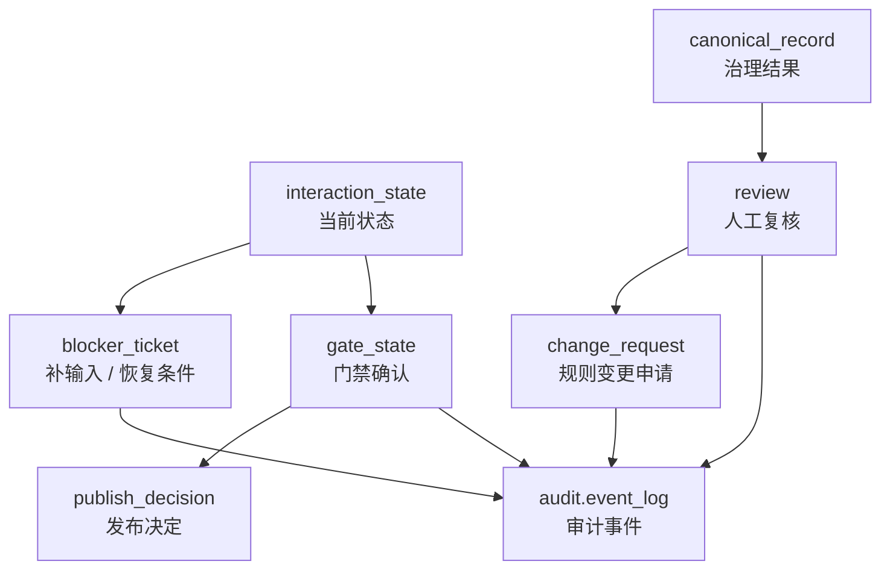

# 审核与反馈模型

> 文档状态：当前有效
> 角色：人工审核、阻塞恢复、规则反馈模型说明
> 适用范围：Factory Agent 人机协同、治理人工审核、发布门禁
> 关联文档：
> - `docs/04_系统组件设计/04_数据与人工介入/人工审核与门禁系统.md`
> - `docs/04_系统组件设计/01_工厂Agent编排/工厂Agent状态机.md`
> - `docs/04_系统组件设计/01_工厂Agent编排/编排记忆与恢复设计.md`

## 1. 审核与反馈不止一层

本项目里至少有三类“人工动作”：

1. 编排态补输入
   - 例如补 key、补 binding、裁剪范围
2. 编排态门禁确认
   - 例如 `confirm_generate`、`confirm_publish`
3. 业务态审核反馈
   - 例如人工修正标准地址、批准规则变更

如果把这三类动作混在一起，模型就会失真。

## 2. 模型关系图

图说明：这张图把“编排态反馈”和“业务态反馈”放在同一张图里，帮助区分它们分别写到哪里。

## 3. 编排态反馈模型

| 模型 | 作用 | 关键字段 |
|---|---|---|
| `interaction_state` | 记录当前阶段、原因码、恢复点 | `current_stage`、`status`、`resume_from_stage` |
| `blocker_ticket` | 记录为什么必须用户介入 | `code`、`summary`、`user_actions`、`resume_condition` |
| `gate_state` | 记录正常门禁确认状态 | `pending_gate`、`confirm_generate`、`confirm_publish` |
| `publish_decision` | 记录最终发布确认 | `publish_id`、`approver`、`decision` |

## 4. 业务态反馈模型

| 模型 | 作用 | 关键字段 |
|---|---|---|
| `governance.review` | 对单条治理结果进行复核 | `review_status`、`final_canon_text`、`reviewer` |
| `governance.change_request` | 对规则和策略做变更审批 | `from_ruleset_id`、`to_ruleset_id`、`recommendation`、`status` |
| `audit.event_log` | 对人工动作做全链路留痕 | `event_type`、`caller`、`payload` |

## 5. 什么时候应该查哪一层

| 场景 | 应该查什么 |
|---|---|
| 为什么 Agent 现在停住了 | `interaction_state + blocker_ticket` |
| 当前是不是只差用户签字 | `gate_state` |
| 哪个人确认发布了某个工作包 | `publish_decision` |
| 某条地址最后被人工改成什么 | `governance.review` |
| 某次规则调整是否被批准 | `governance.change_request` |

## 6. 建模约束

1. `WAIT_USER_INPUT` 和 `WAIT_USER_GATE` 必须分模型表达，不能只靠一个通用状态字段。
2. 业务审核结果必须进 `governance.review`，不能只写在页面备注或日志里。
3. 规则变更必须走 `change_request`，不能把人工意见直接覆盖主规则集。
4. 关键人工动作必须同步进入 `audit.event_log`。
