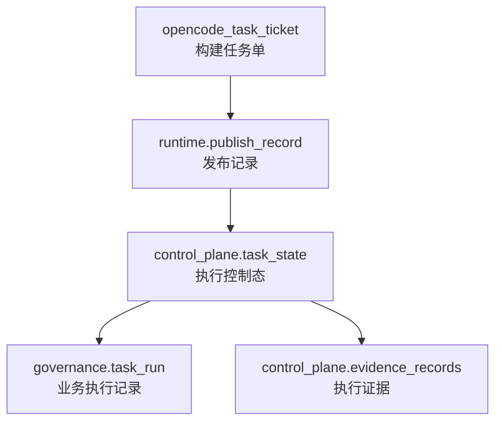

# 工单与任务模型

> 文档状态：当前有效
> 角色：工作包发布与执行实例模型说明
> 适用范围：Factory Agent、Runtime、页面查询、验收口径
> 关联文档：
> - `docs/04_系统组件设计/03_Runtime执行/Runtime调度与任务系统.md`
> - `docs/04_系统组件设计/01_工厂Agent编排/工厂Agent编排系统.md`

## 1. 先分清四类对象

系统里最容易混淆的是这四类对象：

1. `opencode_task_ticket`
   - 编排阶段发给构建器的任务单
2. `runtime.publish_record`
   - 工作包发布记录，关注 `workpackage_id + version`
3. `control_plane.task_state`
   - Runtime 里的执行控制态，关注 `task_id`
4. `governance.task_run`
   - 业务执行记录，关注治理处理结果

## 2. 模型关系图

图说明：这张图强调的是“同一次工作包链路里，不同任务对象各自扮演什么角色”。

## 3. 主键与关联关系

| 模型 | 主键/唯一键 | 主要关联 | 说明 |
|---|---|---|---|
| `opencode_task_ticket` | `ticket_id` | `bundle_name` | 编排阶段内部对象，不是 Runtime 主键 |
| `runtime.publish_record` | `publish_id`，唯一 `workpackage_id + version` | `bundle_path`、`evidence_ref` | 表示某个工作包版本已发布 |
| `control_plane.task_state` | `task_id` | `payload_json` 内可引用 `workpackage_id@version` | 表示某次执行当前到了哪个状态 |
| `governance.task_run` | `task_id` | `batch_id`、`trace_id` | 表示某次治理执行的业务结果 |

## 4. 为什么要分成两类“任务”

### 4.1 工作包任务

工作包任务回答的是：

1. 哪个 bundle 被生成和发布了。
2. 它对应哪个 `workpackage_id@version`。

### 4.2 运行时任务

运行时任务回答的是：

1. 某一次执行实例当前处于什么状态。
2. 它执行时产生了哪些证据和结果。

因此：

1. `publish_record` 是“版本态”
2. `task_state / task_run` 是“实例态”

## 5. 典型查询口径

| 问题 | 应查询的模型 |
|---|---|
| 某个工作包版本是否已发布 | `runtime.publish_record` |
| 某次执行当前是否还在跑 | `control_plane.task_state` |
| 某次执行最终结果如何 | `governance.task_run` |
| 这次执行为什么失败 | `control_plane.evidence_records` |

## 6. 建模约束

1. 页面不能把 `bundle_path` 当成唯一真相源，必须先查 `runtime.publish_record`。
2. `task_id` 只能代表一次执行实例，不能拿来代替 `workpackage_id@version`。
3. 编排态对象如 `opencode_task_ticket` 不应直接替代 Runtime 主模型。
