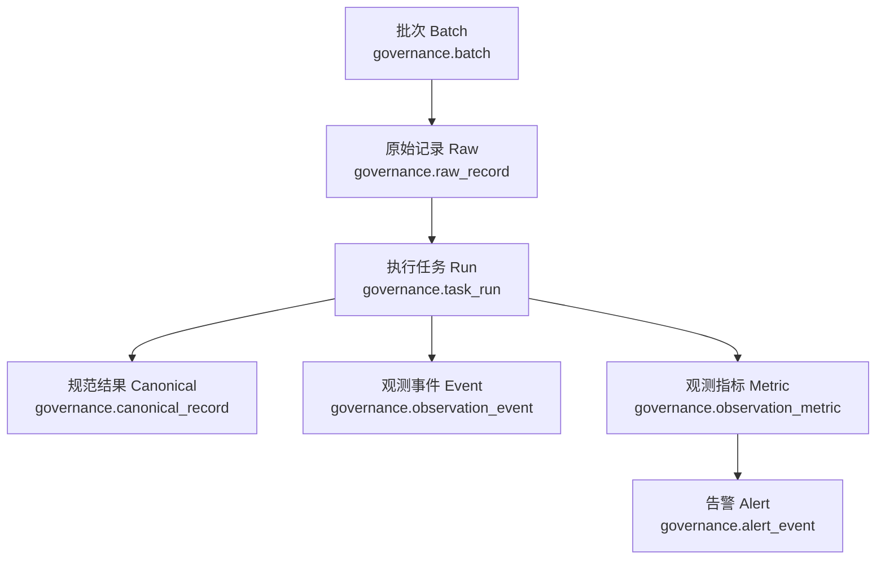

# 数据处理阶段模型

> 文档状态：当前有效
> 角色：治理数据处理生命周期模型说明
> 适用范围：批次导入、治理执行、结果产出、观测回写
> 关联文档：
> - `docs/04_系统组件设计/03_Runtime执行/数据处理引擎.md`
> - `docs/04_系统组件设计/04_数据与人工介入/数据存储体系设计.md`

## 1. 处理阶段看什么

一条地址治理链路最重要的不是“算法叫什么”，而是数据在不同阶段的形态和落点：

1. 批次建立
2. 原始记录导入
3. 任务执行
4. 规范结果产出
5. 观测与告警回写

## 2. 阶段模型图

图说明：这张图按处理阶段展开，强调每个阶段的主模型是什么。

## 3. 各阶段主模型

| 阶段 | 主模型 | 关键字段 | 作用 |
|---|---|---|---|
| 批次建立 | `governance.batch` | `batch_id`、`batch_name`、`status` | 管理一次数据处理批次 |
| 原始导入 | `governance.raw_record` | `raw_id`、`batch_id`、`raw_text`、`raw_hash` | 保存原始输入记录 |
| 执行运行 | `governance.task_run` | `task_id`、`batch_id`、`status`、`trace_id` | 表示一次治理执行实例 |
| 结果产出 | `governance.canonical_record` | `canonical_id`、`raw_id`、`canon_text`、`confidence`、`strategy` | 保存规范化结果 |
| 观测回写 | `governance.observation_*` | `trace_id`、`metric_name`、`status` | 支撑运行态观测和告警 |

## 4. 输入输出关系

### 4.1 输入侧

1. `batch` 管“这批数据是什么”
2. `raw_record` 管“原始记录长什么样”

### 4.2 输出侧

1. `canonical_record` 管“标准化结果是什么”
2. `review` 管“人工最终确认结果是什么”

### 4.3 伴随侧

1. `task_run` 管“这次执行本身”
2. `observation_*` 管“执行过程中发生了什么”

## 5. 常见误连方式

1. 直接从 `task_run` 反推出所有结果字段
   - 不对，结果主表是 `canonical_record`
2. 直接用日志文本做运行态指标
   - 不对，应优先使用 `observation_event / observation_metric`
3. 把 `review` 当作原始结果
   - 不对，`review` 是人工反馈层，不是原始规范结果层

## 6. 设计约束

1. 原始记录与规范结果必须保持一对一或一对多的清晰引用。
2. 观测模型服务于可观测和告警，不应反向承载主业务结果。
3. 页面如果展示“治理结果”，应以 `canonical_record + review` 为主，而不是拼装日志。
