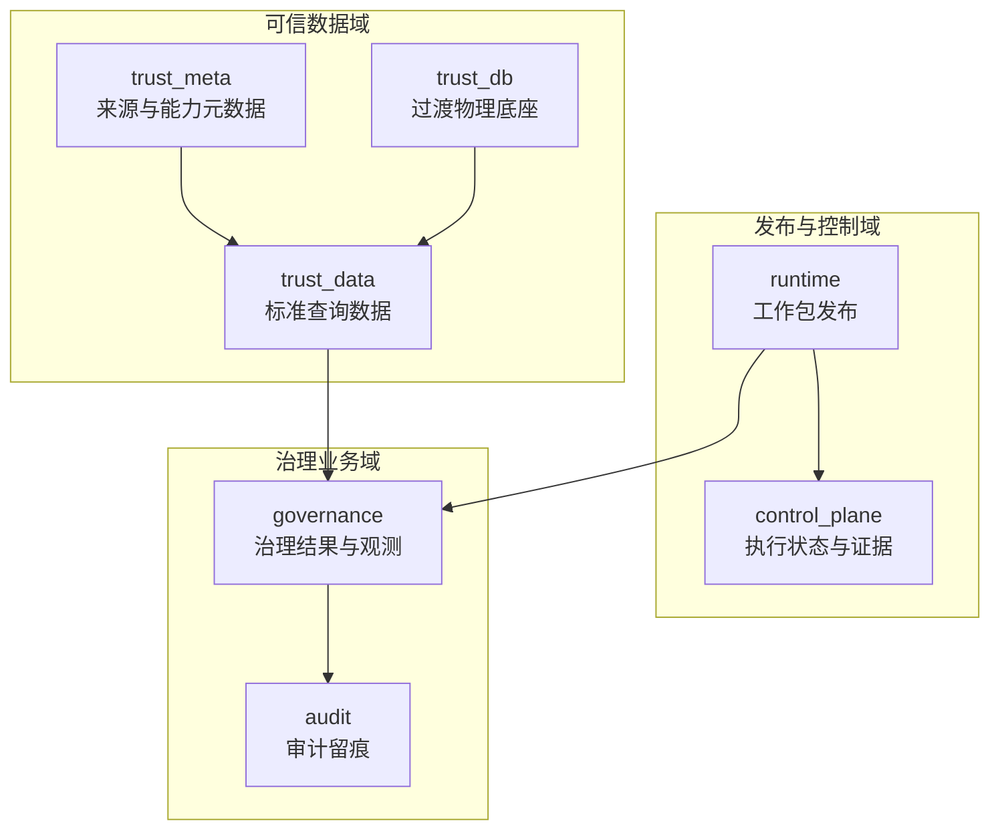
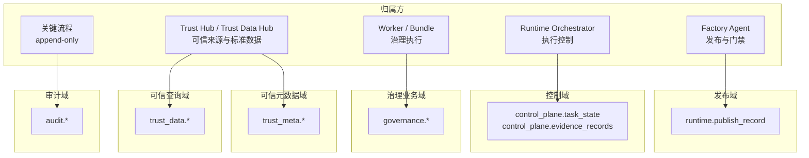
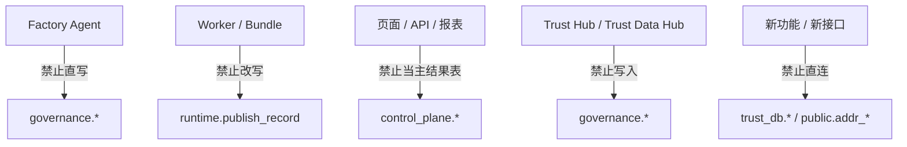

# 数据库分域设计

> 文档状态：当前有效
> 角色：系统正式数据库 Schema 设计入口
> 适用范围：`governance / runtime / control_plane / trust_meta / trust_data / audit`
> 关联文档：
> - `docs/02_总体架构/系统技术上下文与基础设施.md`
> - `docs/04_系统组件设计/04_数据与人工介入/数据存储体系设计.md`
> - `docs/04_系统组件设计/04_数据与人工介入/可信数据管理模块设计.md`
> - `docs/05_数据模型设计/核心表结构设计.md`
> - `docs/05_数据模型设计/可信数据数据库契约设计.md`
> - `docs/04_系统组件设计/03_Runtime执行/Runtime调度与任务系统.md`

## 1. 这份文档回答什么

这份文档不再停留在“有几个库、几类表”的概念层，而是明确三件事：

1. 当前 PostgreSQL 里到底有哪些正式 schema。
2. 每个 schema 的职责、归属方和禁止跨界边界是什么。
3. 哪些结构已经是正式物理表，哪些仍处在兼容视图或运行时 bootstrap 的过渡态。

## 2. 当前数据库分域全景

图说明：这张图强调的是“数据库域的职责分层”，不是部署拓扑。箭头表达合法归属关系，不代表可以任意跨域直连。

## 3. 当前数据库不是单一收敛态

当前数据库结构已经能支撑主链路，但不是所有 schema 都处在同一种成熟度：

1. `governance / runtime / audit`
   - 已经由 Alembic 迁移显式创建正式物理表。
2. `control_plane`
   - 由 Runtime 存储组件在启动时确保创建，属于代码内 bootstrap 管理表。
3. `trust_meta`
   - 一部分来自迁移脚本，一部分由 `trust_data_hub` 的 schema bootstrap 做字段补齐和增量建表。
4. `trust_data`
   - 当前既有“兼容视图”口径，也有 bootstrap 直接确保物理表的口径。
5. `trust_db`
   - 仍是可信数据域的过渡物理底座之一，不应继续作为正式消费入口扩散。

因此，数据库设计文档必须同时表达：

1. 当前正式消费口径是什么。
2. 当前真实物理落点是什么。
3. 哪些仍属于过渡态。

## 4. Schema 角色总表

| Schema | 当前角色 | 当前物理状态 | 域归属方 | 禁止跨界示例 |
|---|---|---|---|---|
| `governance` | 治理业务主域 | Alembic 物理表 | Worker / Bundle / 治理 API | Agent 不能把它当编排状态表 |
| `runtime` | 工作包发布主域 | Alembic 物理表 | Factory Agent / 发布流程 | Worker 不能把它当执行结果表 |
| `control_plane` | 执行控制与证据域 | Runtime bootstrap 物理表 | Runtime Orchestrator | 页面不能把它当业务结果表 |
| `trust_meta` | 可信来源与能力元数据域 | 迁移物理表 + bootstrap 补齐 | Trust Hub / Trust Data Hub | 治理链路不能直接改写 |
| `trust_data` | 标准查询数据域 | 兼容视图 + bootstrap 物理表并存 | Trust Data Hub / 数据导入链路 | 不能把它当治理结果回写域 |
| `audit` | 审计主域 | Alembic 物理表 | 关键流程 append-only | 不能把它当主状态表 |
| `trust_db` | 可信数据过渡底座 | 历史物理表 | 旧数据导入链路 | 新功能不得直接依赖 |
| `public.addr_*` | 历史兼容层 | 兼容视图 | 兼容层 | 新文档、新 Story 不得当正式入口 |

## 5. Schema 到服务与接口的归口

| Schema | 正式拥有方 | 主要服务 | 正式接口 / 能力 |
|---|---|---|---|
| `governance` | 治理处理链路 | Worker / Bundle、治理 API、审核服务 | 结果查询、复核、反馈 |
| `runtime` | 发布与版本链路 | Factory Agent、Runtime 发布服务 | 发布记录、版本解析 |
| `control_plane` | 任务控制链路 | Runtime Orchestrator、观测聚合 | 状态查询、证据查询、回放 |
| `trust_meta` | 可信数据管理链路 | Trust Hub / Trust Data Hub | 来源管理、激活版本、能力发现 |
| `trust_data` | 标准查询链路 | Trust Data Hub / 标准查询服务 | 标准查询 |
| `audit` | 审计写入链路 | API、Agent、Runtime、可信数据管理模块 | 审计查询、签字追溯 |
| `trust_db` | 过渡兼容链路 | 旧导入链路、兼容视图 | 不再提供新正式接口 |

## 6. 各 Schema 设计说明

### 6.1 `governance`

`governance` 是治理业务真相源，回答的是：

1. 这批数据是什么。
2. 这次治理任务跑得怎么样。
3. 最终标准化结果是什么。
4. 人工复核和规则变更是什么。
5. 运行观测与告警发生了什么。

当前主表包括：

1. `batch`
2. `task_run`
3. `raw_record`
4. `canonical_record`
5. `review`
6. `ruleset`
7. `change_request`
8. `observation_event`
9. `observation_metric`
10. `alert_event`

设计约束：

1. 页面查询治理结果，优先读 `governance.*`，不能把文件产物目录当真相源。
2. Worker 写业务结果时，应回写 `governance.*`，而不是只留在 `control_plane`。

### 6.2 `runtime`

`runtime` 当前最核心的正式表是 `publish_record`。它回答的是：

1. 哪个 `workpackage_id@version` 已经进入 Runtime。
2. 对应的 bundle 路径和证据引用是什么。
3. 发布确认是谁做的。

它是“版本态真相源”，不是“执行实例真相源”。

### 6.3 `control_plane`

`control_plane` 承接 Runtime 的控制态和证据态：

1. `task_state`
2. `evidence_records`

它们当前由 `PGStateStore` 和 `PGEvidenceStore` 在启动时确保创建。  
这类表虽然不是 Alembic 主迁移管理，但已经是正式主链路结构，不能再被当作临时缓存。

### 6.4 `trust_meta`

`trust_meta` 负责可信来源和能力目录，主要包括：

1. `source_registry`
2. `source_schedule`
3. `source_snapshot`
4. `snapshot_quality_report`
5. `snapshot_diff_report`
6. `active_release`
7. `validation_replay_run`
8. `capability_registry`

其中：

1. `source_registry / source_snapshot / active_release`
   - 负责来源、快照、启用版本。
2. `capability_registry`
   - 负责 Agent 和工作包生成阶段读取的能力目录。
3. `validation_replay_run`
   - 负责可信数据校验重放。

### 6.5 `trust_data`

`trust_data` 是正式标准查询域，应该被理解为：

1. 治理链路的正式可信数据读取入口。
2. 不是治理结果回写域。

当前主要对象包括：

1. `admin_division`
2. `road_index`
3. `poi_index`
4. `place_name_index`
5. `sample_data`

但这里有一个必须明确写出的现实：

1. 迁移脚本里，`trust_data.admin_division / road_index / poi_index / place_name_index` 起初是基于 `trust_db.*` 的兼容视图。
2. `trust_data_hub` 的 schema bootstrap 现在又会直接确保 `trust_data.*` 物理表存在，并继续做字段补齐。

因此，`trust_data` 当前是“正式读取口径已确定，但物理收敛仍在推进”的状态。

### 6.6 `audit`

`audit` 负责跨阶段审计留痕，当前主表是：

1. `event_log`
2. `api_audit_log`

它回答的是：

1. 谁在什么时候做了什么动作。
2. 哪次 API 调用影响了哪条治理链路。

### 6.7 `trust_db`

`trust_db` 仍然是可信数据域的重要历史物理底座，但它不应继续被当作正式消费口径写入新文档、新接口或新查询逻辑。

当前定位应该固定为：

1. 历史底座
2. 兼容视图来源
3. 收敛过程中的过渡物理层

## 7. 数据库归属与禁止跨界图

### 7.1 数据库归属图

图说明：这张图只回答“每个数据库域归谁负责”。它不表达跨域聚合，也不表达所有读取关系，目的是先把域边界框清楚。

### 7.2 典型禁止跨界图

图说明：这张图只画最典型的越界示例。完整禁止项以《数据库跨界约束》为准，这里不再试图穷举全部情况。

## 8. 当前最需要读者知道的过渡事实

### 8.1 `trust_db` 与 `trust_data` 并存

这是当前数据库设计里最容易被忽略的问题：

1. 文档口径已经把 `trust_data` 定成正式读取域。
2. 但迁移和 bootstrap 仍同时保留了 `trust_db` 与 `trust_data` 的并存现实。

因此：

1. 新设计、新 Story、新查询文档都应优先引用 `trust_data.*`。
2. 需要解释历史落点时，再说明其底层可能仍来自 `trust_db.*`。

### 8.2 `control_plane` 不是“临时表”

`task_state` 和 `evidence_records` 虽然由代码在运行时确保创建，但它们已经是正式主链路结构：

1. `task_state` 是 Runtime 执行控制态真相源。
2. `evidence_records` 是 Runtime 执行证据真相源。

### 8.3 `public.addr_*` 只是兼容层

`public.addr_batch`、`public.addr_workpackage_publish` 这类对象现在只适合被理解为历史兼容层，不应继续写进正式数据库设计的主链路说明中。

## 9. 数据库禁止跨界约束

1. 新页面和新 API 不得再从 `trust_db.*` 直接起查询。
2. 新功能不能把文件目录扫描结果当正式数据库真相源。
3. 新运行时状态记录不得绕开 `control_plane.*`。
4. 新治理结果不得只写日志，不回写 `governance.*`。
5. 兼容视图可以保留，但正式写路径必须明确指向域内物理表或受控 bootstrap 表。
6. 任何模块不得把 `audit.*` 当主业务状态表。
7. 任何页面和 API 不得把 `control_plane.*` 当治理结果主表。

## 10. 继续阅读

1. 看 [数据库跨界约束](数据库跨界约束.md)，理解哪些动作属于越界。
2. 看 [核心表结构设计](核心表结构设计.md)，了解主表字段分组与主键关系。
3. 看 [可信数据数据库契约设计](可信数据数据库契约设计.md)，理解 `trust_meta / trust_data / trust_db` 的正式口径。
4. 看 [数据存储体系设计](../04_系统组件设计/04_数据与人工介入/数据存储体系设计.md)，理解存储层与模型层分工。
5. 看 [工单与任务模型](工单与任务模型.md)，理解 `publish_record / task_state / task_run` 的差异。
