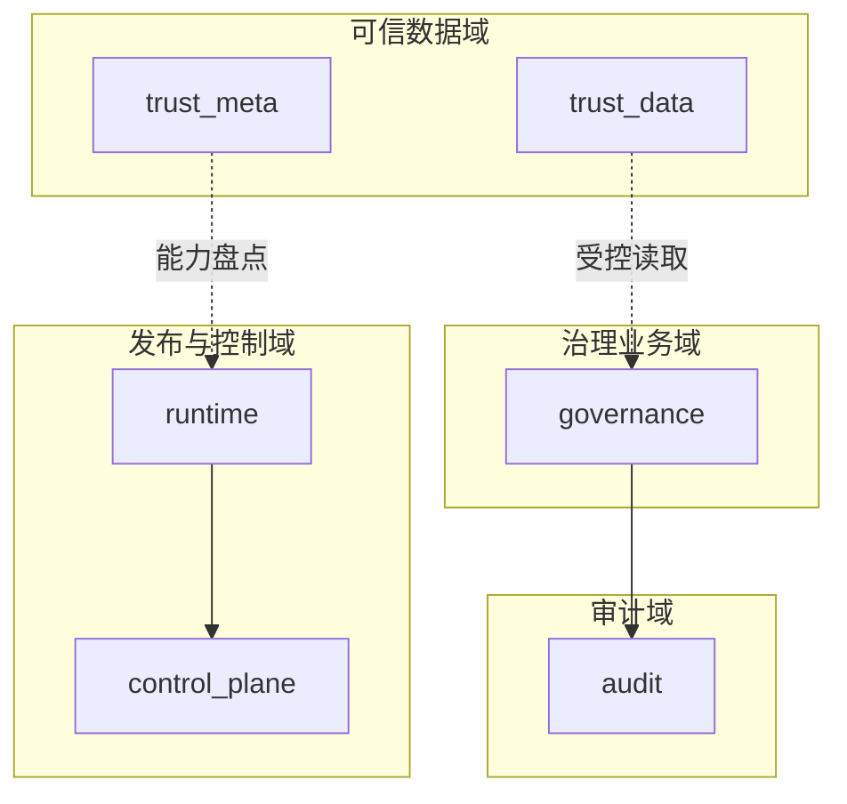

# 数据库跨界约束

> 文档状态：当前有效
> 角色：数据库边界与禁止跨界规则
> 适用范围：页面、API、Factory Agent、Runtime、Worker、Trust Hub、报表、观测
> 关联文档：
> - `docs/05_数据模型设计/数据库分域设计.md`
> - `docs/05_数据模型设计/核心表结构设计.md`
> - `docs/02_总体架构/模块边界.md`
> - `docs/02_总体架构/依赖关系.md`

## 1. 这份文档不回答“查哪里”，只回答“不能跨哪里”

数据库分域不是阅读上的整理方式，而是工程边界。  
这份文档只回答一件事：

1. 哪些 schema 和表不能被跨界直连、跨界写入、跨界当真相源。

## 2. 四条硬约束

1. 一个 schema 代表一个职责域，不是开放共享表池。
2. 一个核心表必须有清晰归属方，其他模块不能把它当自己的内部状态表来用。
3. 跨域关联可以存在，但不能演变成默认直连、默认跨 schema SQL 拼接、默认双向写入。
4. 历史兼容层不是正式入口，不能继续扩散到新设计、新 Story、新代码。

## 3. 数据库边界图

图说明：这张图强调“域边界”和“禁止横向穿透”。实线表示域内主责任；虚线表示受控读取，不代表可以任意跨域拼表。

## 4. 域归属总表

| 域 | 核心对象 | 归属方 | 明确禁止的跨界动作 |
|---|---|---|---|
| `governance` | `batch`、`task_run`、`raw_record`、`canonical_record`、`review` | 治理 API、Worker、Bundle | 被 Agent 当作编排状态表；被 Runtime 当作控制态表；被 Trust Hub 当作来源目录表 |
| `runtime` | `publish_record` | Factory Agent、发布门禁 | 被 Worker 当作执行结果表；被页面当作治理结果总表 |
| `control_plane` | `task_state`、`evidence_records` | Runtime Orchestrator | 被页面当作业务结果表；被 Worker 当作长期业务主表；被 Agent 当作编排记忆主表 |
| `trust_meta` | `source_registry`、`source_snapshot`、`capability_registry` | Trust Hub、Trust Data Hub | 被治理业务链路直接改写；被 Runtime 当作任务依赖表 |
| `trust_data` | `admin_division`、`road_index`、`poi_index`、`sample_data` | Trust Data Hub | 被 Worker 当作治理结果回写表；被页面拿来替代治理结果表 |
| `audit` | `event_log`、`api_audit_log` | 所有关键流程 append-only | 被任何模块当作主业务状态表或结果表 |
| `trust_db`、`public.addr_*` | 历史物理底座、兼容视图 | 兼容迁移层 | 被新功能、新 Story、新接口当正式入口 |

## 5. 按角色看的禁止跨界

### 5.1 `Factory Agent`

禁止：

1. 直接写 `governance.raw_record / canonical_record / review / task_run`
2. 直接把 `control_plane.task_state` 当作编排记忆主表
3. 直接从 `trust_db.*` 或 `public.addr_*` 起查询

原因：

1. Agent 负责编排和发布，不拥有治理业务结果域。

### 5.2 `Runtime Orchestrator`

禁止：

1. 用 `governance.task_run` 代替 `control_plane.task_state`
2. 直接改写 `trust_meta.*`、`trust_data.*`
3. 把 `audit.*` 当作状态机驱动表

原因：

1. Runtime 负责执行控制态，不拥有业务结果域和可信数据域。

### 5.3 `Worker / Bundle`

禁止：

1. 直接写 `runtime.publish_record`
2. 直接改写 `trust_meta.source_registry / capability_registry / active_release`
3. 把 `control_plane.evidence_records` 当作业务结果主表

原因：

1. Worker 负责执行和结果回写，不拥有发布域和可信元数据域。

### 5.4 `Trust Hub / Trust Data Hub`

禁止：

1. 直接写 `governance.canonical_record / review / change_request`
2. 直接改写 `runtime.publish_record`
3. 通过 `audit.*` 反向驱动主业务状态

原因：

1. 可信数据域只负责来源和标准查询数据，不负责治理结果和发布状态。

### 5.5 页面、API、报表

禁止：

1. 把 `control_plane.task_state` 当治理结果表
2. 把 `audit.event_log` 当页面主数据源
3. 把 `trust_data.*` 当地址治理结果表
4. 把 `runtime.publish_record` 当任务执行明细表

原因：

1. 展示层可以聚合信息，但不能混淆域真相源。

## 6. 明确禁止的跨界 SQL 模式

下列模式在正式设计里都应视为越界：

| 越界模式 | 为什么禁止 |
|---|---|
| 页面接口直接用一条 SQL 把 `runtime.publish_record + control_plane.task_state + governance.canonical_record` 拼成主结果页 | 把版本态、控制态、业务态混成一个默认共享查询模型 |
| 用 `control_plane.evidence_records` 直接推导治理结果 | 证据表不是业务主结果表 |
| 用 `audit.event_log` 直接驱动页面状态 | 审计是留痕，不是主状态机 |
| 新接口直接从 `trust_db.*` 查标准数据 | `trust_db` 是过渡底座，不是正式消费口径 |
| Worker 在执行时直接更新 `runtime.publish_record.status` 表示任务结果 | 发布域和执行域职责混淆 |

## 7. 跨域聚合的唯一合法方式

跨域聚合不是完全禁止，但必须满足这三个条件：

1. 先保留各域自己的真相源，不得覆盖原域职责。
2. 在应用服务层、专用读模型层或报表层显式声明“这是跨域聚合视图”，不能伪装成单域表。
3. 不允许为了省事，把跨域聚合反向写回任一主域表。

## 8. 兼容层约束

以下对象只允许保留兼容用途，不允许扩散：

1. `trust_db.*`
2. `public.addr_*`
3. 目录扫描得到的文件产物
4. 临时 JSON 缓存

新文档、新 Story、新实现如果继续把这些对象写成正式入口，应视为架构回退。

## 9. 对 Story、PR、评审的强制要求

涉及数据库访问的 Story 和 PR，至少要回答：

1. 这次访问属于哪个数据库域。
2. 是否新增了跨域直连。
3. 是否误用了兼容层。
4. 是否把控制态、业务态、审计态、可信数据态混写。

只要这四个问题有一个答不清，就不应进入实现。

## 10. 继续阅读

1. 看 [数据库分域设计](数据库分域设计.md)，理解 schema 分域与域归属。
2. 看 [核心表结构设计](核心表结构设计.md)，理解关键表的所有权与字段分组。
3. 看 [可信数据数据库契约设计](可信数据数据库契约设计.md)，把可信数据域的正式口径和过渡态看清楚。
4. 看 [模块边界](../02_总体架构/模块边界.md)，把数据库边界和模块边界一起看。
